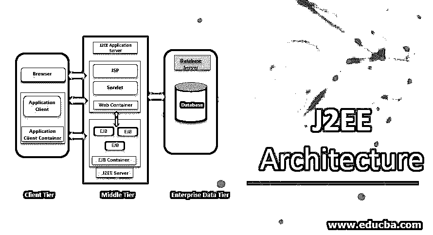

# J2EE 建筑

> 原文：<https://www.educba.com/j2ee-architecture/>

## J2EE 建筑介绍

J2EE 可以扩展为 Java 2 企业版，它为企业应用程序的创建和实现提供了一个开发环境。J2EE 体系结构由三层组成，如用作最终用户或客户端交互媒介的客户端层，由 web 客户端和应用程序客户端组成；中间层，用于定义逻辑功能单元，由 web 组件和 EJB 组件组成；企业数据层，以关系数据库的形式用于存储目的，由容器、组件和服务组成。

**J2EE 使用三层:**

<small>网页开发、编程语言、软件测试&其他</small>

*   **客户层:**客户层由用户程序组成，它与用户交互请求和响应。
*   **中间层:**中间层通常包含企业 beans 和 [web 服务](https://www.educba.com/architecture-of-web-services/)，它们为应用程序分发业务逻辑。
*   **企业数据层:**企业数据存储在[关系数据库](https://www.educba.com/relational-database/)中。这一层包含容器、组件和服务。

### J2EE 建筑的图示

通常，J2EE 体系结构由四层组成:客户层、Web 层、Enterprise JavaBean 层和企业信息层。中间层由 Web 层+EJB 层组成。

#### 1.客户端层

客户端层由与用户交互的程序或应用程序组成。通常，它们与服务器位于不同的机器上。客户端层提示用户将输入转化为用户请求，然后转发给 J2EE 服务器，再将处理后的结果返回给客户端。客户端可以是运行在不同机器上的 web 浏览器、独立应用程序或服务器。

客户端可以分为 Web 客户端和应用程序客户端。

##### 网络客户端

Web 客户端由各种标记语言的动态网页组成，这些动态网页由运行在 web 层或 web 浏览器中的 web 组件生成，这些 web 组件呈现从服务器接收的页面。Web 客户端也称为瘦客户端，通常不执行查询数据库、执行业务规则等操作。使用瘦客户机时，繁重的操作被卸载到在 J2EE 服务器中执行的企业 beans 上。

**小程序:**从 web 层收到的网页嵌入了一个[小程序，这些小程序在 Web 浏览器上运行](https://www.educba.com/applets-in-java/)。Web 组件是用于创建 web 客户端程序的 API。Web 组件使用户能够设计更简洁、更模块化的应用程序。它们提供了一种分离应用程序编程的方法。

##### 应用程序客户端

应用程序客户机运行在客户机上，处理提供更丰富用户界面的任务。通常 GUI 是由[swing 或 AWT](https://www.educba.com/awt-vs-swing/) 创建的。应用程序客户机可以使用 HTTP 连接直接访问业务层中运行的 EJB。

#### 2.中间层(Web 层和 EJB 层)

以下是中间层的组件:

##### Web 层/Web 组件

Web 组件可以是 servlets 或 JSP 页面。[servlet 可以动态地](https://www.educba.com/what-is-servlet/)处理请求并生成响应。与 [JSP 和 servlet](https://www.educba.com/jsp-vs-servlet/)相比——servlet 在某种程度上是动态页面，但 JSP 页面本质上是静态的。

在应用程序组装过程中，客户端的静态 HTML 程序和 applet 代码被捆绑在 web 层/ Web 组件中。实际上，这些 HTML 和 applets 并不被认为是 web 组件的元素。服务器端实用程序类也与 web 组件捆绑在一起，但它们不被视为 web 组件。

Web 层可能包括用于处理用户输入的 EJB 组件，并将输入发送到业务层中运行的企业 bean。

##### EJB Tier /EJB 组件

企业组件通常处理业务代码，这些代码是解决特定业务领域(如银行或金融)的逻辑，由运行在业务层的企业 bean 处理。

企业容器在必要时从客户端进程接收数据，并将其发送到企业信息系统进行存储。企业 bean 还从存储中检索数据，处理数据并将其发送回客户端。

**三种豆子:**

*   **会话 Bean:** 会话 Bean 用于与客户端的对话。一旦客户端完成执行，会话 bean 就会销毁。
*   **实体 Bean** :保存存储在数据库中的特定数据。一旦服务器关闭或客户端完成其执行，实体 bean 数据将被保留。
*   **消息驱动 bean:** 消息 Bean 结合了会话 Bean 和 JMS 的属性。这有利于业务组件异步接收消息。

#### 3.企业信息系统

这一层由数据库服务器、企业资源规划系统和其他数据源组成。资源通常位于独立于 J2EE 服务器的机器上，由业务层上的组件访问。

**EIS 层使用的技术:**

*   Java 数据库连接 API (JDBC)。
*   [Java 持久性 API](https://www.educba.com/java-persistence-api/) 。
*   Java 连接器架构。
*   Java 事务 API。

### J2EE 建筑中的容器

以下是 J2EE 建筑公司的集装箱:

#### 1.应用程序客户端容器

该容器包括一组类、库和其他文件，它们是在自己的 JVM 中执行客户机程序所必需的。管理客户端组件的执行。它还提供使 java 客户端程序能够执行的服务。该容器专用于 EJB 容器。与 J2EE 的其他集装箱相比，这个集装箱很轻。

**特性:**

*   **安全:**负责收集用户名和密码等认证数据，并通过 RMI/IIOP 将数据发送到服务器。然后，服务器使用 JAAS 模块处理数据。即使客户机容器提供了认证技术，但是这些技术不受应用客户机的控制。

*   **命名**:允许应用客户端使用 Java 命名和目录接口(JNDI)。

#### 2.Web 容器

Web 容器是 web 服务器的一个组件，它与 Java servlets 交互。web 容器负责管理 servlet 生命周期和映射 URL。Web 容器处理来自 Servlets、JSP 文件和其他包含服务器端代码的文件的请求。

Web 容器实现了 J2EE 架构的 web 组件契约。这为附加的 web 组件安全性、事务、部署等提供了运行时环境。

#### 3.EJB 集装箱

企业 Java bean 容器由包含业务逻辑的服务器组件组成。提供对企业 beans 的本地和远程访问。EJB 容器负责创建企业 bean，将企业 bean 绑定到命名服务。

一个 EJB 容器内可以安装多个模块。它执行事务性操作，如启动事务、提交或回滚事务，管理数据库资源的各种连接池，将 bean [实例变量](https://www.educba.com/instance-variable-in-java/)与存储在数据库中的相应数据项同步。

#### 4.Applet 容器

客户端的小应用程序将在其中运行的容器可以在网络浏览器或支持小应用程序编程的其他应用程序中。由于沙箱安全模型，小程序受到更多的限制，这限制了对客户机的访问。这些是从 web 服务器下载的普通网页，在客户端浏览器上执行。

### 结论

由三层逻辑计算组成的 J2EE 三层体系结构。这有助于开发特定的基于客户机-服务器的应用程序。它还通过分离用户界面、业务逻辑和数据存储层来帮助开发。为更新应用程序的特定部分提供了更大的开发灵活性，而不会影响其余部分。这种灵活性可以在不影响整个系统的情况下，改进整体开发、升级和替换特定层的数据。

### 推荐文章

这是一本 J2EE 建筑指南。这里我们讨论 J2EE 架构中的介绍、图形表示和容器。您也可以看看以下文章，了解更多信息–

1.  [JSP 架构](https://www.educba.com/jsp-architecture/)
2.  [JSP 指令](https://www.educba.com/jsp-directives/)
3.  什么是 J2EE？
4.  [Angular 2 架构](https://www.educba.com/angular-2-architecture/)

