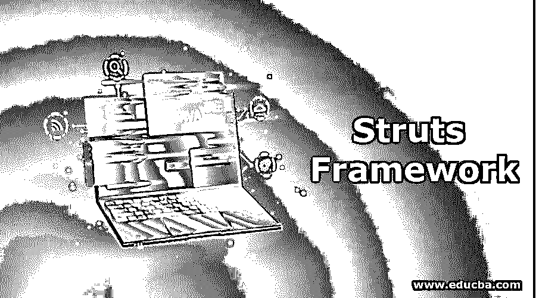
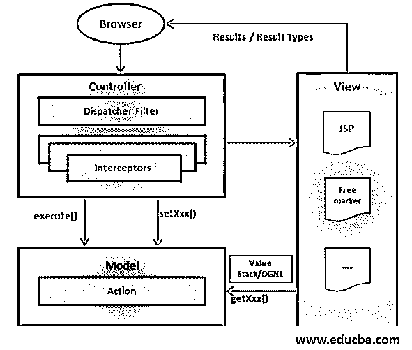

# Struts 框架

> 原文：<https://www.educba.com/struts-framework/>

## Struts 框架简介

开发 Java EE web 应用程序的 web 应用程序框架称为 Struts。Struts 由 Craig Mcclanahan 于 2000 年 5 月开发，并赠送给了 Apache 基金会。它也被称为雅加达支柱。它是用 Java 编写的，使用跨平台[，比如 Java 虚拟机](https://www.educba.com/java-virtual-machine/)。Struts 是开源的，使用 Java API。许可证是 Apache 许可证 2 版本。Java Servlet API 被扩展为使用模型视图控制器架构(MVC ),它基本上在这三种形式之间工作。Apache Struts 框架在 2007 年 2 月被 Struts 2 取代。

### Struts 框架

*   框架中提供了 Controllerservlet 和 ActionServlet。这些在库中定义，也在集成开发环境中定义。因此，它们在框架中使用的 XML 文件中注册。使用 Java servlet 应用程序接口，该接口具有[模型视图控制器架构](https://www.educba.com/what-is-mvc/) (MVC)。
*   模型与视图和控制器是分离的。模型是与数据库交互的应用程序逻辑，视图是客户端查看的 HTML 页面。
*   当框架启动时，使用一个名为 Action servlet 的控制器 Servlet。用户要查看的模板由 Action servlet 创建。控制器在客户机的模型和视图之间传递信息。
*   模板是使用 JSP 为 [HTML 内容](https://www.educba.com/what-is-html/)编写的。
*   程序员创建名为 struts-config.xml 的配置文件，这个配置文件将模型、视图和控制器放在一起。
*   这个 servlet 使用 struts-config.xml 将请求映射到 Struts 动作对象。
*   如果需要更改任何信息，那么更新 XML 文件[就足够了。](https://www.educba.com/what-is-xml/)
*   创建动作表单对象来临时存储数据并执行请求。
*   该模型返回一个字符串(Action forward)来指示控制器向客户机发送一个输出页面。
*   处理完请求后，Action object 会处理新数据，并将结果转发给适当的视图。
*   模型和客户端使用名为 JavaBeans 的表单[传递信息。](https://www.educba.com/what-is-javabeans/)
*   自定义标记库用于读写 beans 的内容，因此不需要 Java 代码。
*   使用 Struts 将 Web 表单国际化，并为表示层创建模板。模板机制被称为瓦片。
*   struts-config 文件用于处理应用程序操作类和结果页面。这些文件保存所有结果，如果需要任何更改，可以在这些文件中进行。
*   Java 注释用于提供元数据信息，帮助开发人员根据所提供的信息创建应用程序。
*   这些应用程序可以与任何其他框架或应用程序集成。
*   每当发出请求时，就会创建动作，并且 servlet 会响应模型调用。
*   提供了 UI 标签、控制标签和动作标签，以便 struts 易于使用。

<small>网页开发、编程语言、软件测试&其他</small>

*   XHTML、css_html 和 simple 是 struts 的主题，其中 [XHTML 是默认主题](https://www.educba.com/what-is-xhtml/)。
*   在 servlet 技术中，创建线程是为了处理请求，因此不会创建单独的内存区域。
*   表示层与业务逻辑混在一起，如果有任何代码更改，servlet 需要重新编译。
*   开发 web 应用程序非常简单快捷。
*   维护是一个问题，因为页面是分散的，必须确定写入后续页面的逻辑。

### Struts 的优势

1.  由于 Struts 遵循 MVC 框架，Java、JSP 和 Action 类都是高度可维护的，对于开发者来说很容易理解。
2.  开发时间更少，这为应用程序开发人员创造了优势。
3.  MVC 框架使得应用程序的维护变得非常容易。
4.  表示形式是 xml 或属性文件，因此可以从 xml.config 文件中收集关于应用程序的所有信息。包括动作类、表单 Bean 和 JSP 页面信息在内的所有信息都在配置文件中，这对开发人员非常有帮助。
5.  getParameter()信息存储在表单 Bean 中。所有的输入数据都在这里处理。由于表单 Bean，处理数据的时间非常少。
6.  提供了 JSP 标记，可以轻松地提供 JavaBeans 组件的属性。与其他标签相比，这些标签是定制的、简洁的和强大的。
7.  HTML 标记也是从 JSP 标记创建的，用于为用户界面设置页面。表单域对象来自 Java 文件。这些表单可以重新显示，所有值保持不变或稍作更改。
8.  为了检查表单值是否符合要求的格式，Struts 具有内置功能。这有助于开发人员更快地获得值。
9.  这种配置是集中的，它被证明是表单和动作类的一个优势。
10.  由于 xml 和属性文件，可以对这些文件进行任何更改，而无需更改原始 Java 代码。因此开发者不需要知道整个布局。他们只需编辑单个文件。这有助于节省编辑文件的时间。
11.  Struts 中的验证器非常适合验证开发人员在网络中输入的表单或字段。这种验证或者在服务器中执行，或者在服务器和客户端中执行。
12.  Struts 很好地保护了基础设施。HTTP 请求被映射到流程中，开发人员不必担心这个问题。他们可以专注于代码和开发领域。
13.  文档得到了很好的维护，对于开发框架的任何人都非常有用。

Struts 是一个大型框架，因此用于创建企业范围的应用程序。设计、动作形式和注释简单易懂。Struts 主要被认为是一种遗产，如果客户非常需要它，我们应该遵循它。由于开发人员的易用性和 Java 知识，这个框架很受欢迎。

### 推荐文章

这是一个 Struts 框架的指南。这里我们详细讨论 Struts 的介绍、框架和优点。您也可以阅读以下文章，了解更多信息——

1.  [弹簧 vs 支柱](https://www.educba.com/spring-vs-struts/)
2.  [JSP 生命周期](https://www.educba.com/jsp-life-cycle/)
3.  [ITIL 框架](https://www.educba.com/itil-framework/)
4.  [什么是 Struts？](https://www.educba.com/what-is-struts/)

