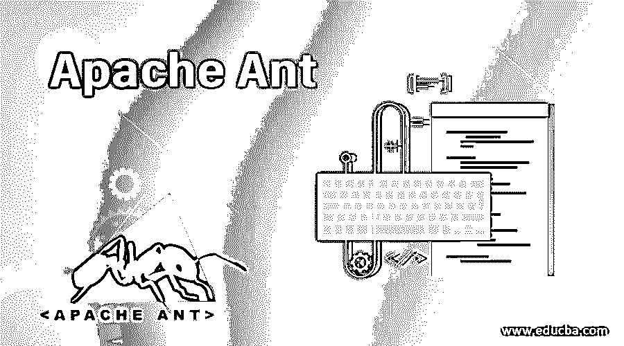

# 阿帕奇蚂蚁

> 原文：<https://www.educba.com/apache-ant/>

## 什么是阿帕奇蚂蚁？

Apache Ant 是一个用于构建 java 应用程序的工具，因为它由一个 java 库和内置的命令行组成。它是一个开源工具。它也被认为是一个自动化构建过程的软件工具。它通常用于基于 Java 的项目。它需要一个 java 平台，并且是用 java 语言实现的。构建文件可以很容易地在 Ant 中传输，因为它们继承了 java 平台的独立性。它还用于部署构建以形成应用程序。它起源于 2000 年初的 Apache Tomcat 项目。它使代码变得干净。

### 阿帕奇蚂蚁的工作

*   它既可以使用命令行，也可以与 ide 集成。
*   它可以在任何平台上使用，因为它是一个独立于平台的工具。
*   它基于三个模块构建，即任务、目标和扩展点。
*   在这里，当我们谈论任务时，它将每个绩效/行动创建为一个简单的步骤，可以将其命名为任务。
*   所有这些小任务的组合可以被命名为目标。
*   可以从 Ant 中直接调用目标。
*   通过以上方法，我们可以为最终部署构建应用程序文件。
*   在这里，有了 Ant，我们可以轻松简单地完成任务和构建。
*   它还包括每个构建的几个阶段，直到部署一个应用程序，因为 Ant 没有生命周期。

#### 应用

Ant 被认为是最好的基于 java 的应用程序构建工具。它将项目或任务的依赖项和相关文件编译成一个版本。这些构建可以是 jar 和/或 war 文件的形式。这些 jar 或 war 文件将被部署到应用服务器中，以便生成项目或模块的功能。将所有构建文件合并到一个地方后，最终的应用程序就会出来。由于 Ant 将有助于将一个应用程序过程削减为几个任务和小而简单的构建，我们可以快速创建构建，并使它们在持续集成和持续部署过程中有用，这意味着成为一个项目的整个过程。

<small>网页开发、编程语言、软件测试&其他</small>

### Apache Ant 的优缺点

以下是 Apache Ant 的不同优缺点。

#### 优势

*   它提供了一个开发构建的接口。
*   它由多个预定义的任务列表组成。
*   我们可以将 Ant 与任何商业或非商业 ide 集成在一起，或者与它本身一起工作。
*   它有助于将源代码转换成可执行代码。
*   它允许你在更短的时间内编译任意数量的文件。
*   它可以用于小型个人项目，也可以在大型项目或网站中重用。
*   由于它是独立于平台的，它可以帮助您管理平台相关的文件。
*   它可以帮助您从一个位置复制到另一个位置。
*   它提供了可扩展的架构和向后兼容性。
*   它可以使用，因为它允许您将二进制文件部署到测试服务器。
*   虽然市场上有很多最新的工具，但是仍然有一些公司在使用 Ant，因为它很容易使用。

#### 不足之处

*   与最近的工具如 Gradle、Maven 等相比，它是一个较老的构建工具。
*   它没有生命周期。
*   它没有像 maven 那样的中央存储库，仍然使用库来存储它的依赖项。
*   我们只需要在 build.xml 文件中提供整个项目结构，因为它没有具体的约定要提及。
*   在 Ant 中，我们需要定义所有东西，比如源目录、构建目录等等。
*   作为一个过程，我们需要提供一个命令来指定通过代码做什么。
*   它只是一个工具箱和一个构建工具。
*   与 Maven 相比，它最近使用得更少了。

### Apache Ant 将如何帮助职业发展？

当我们谈论职业观点时，它对应用程序开发人员或程序员是有用的，主要是那些基于 java 的应用程序的工作人员，对 Apache Ant 有一个好的了解是很重要的。因为它是来自 Apache 的构建工具，所以最终的构建只能通过 Ant 来处理。但是现在有一些新兴的技术工具，与 Ant 相比，它们有很好的特性。他们像 Maven，Gradle 等。其中 Maven 广泛应用于多个项目和应用程序开发的不同场景中。CI/CD 在当前的软件开发中起着至关重要的作用。所以这里他们将使用 Ant 或 Maven 或 Gradle，尽管 Maven 占据第一位。所以对于构建和维护工程师来说，Ant 是一个重要的工具。最后但同样重要的是，工程师应该努力从 Ant 向 Maven 提升自己。最后，我们必须记住，这两个工具只是来自 Apache 的起源。因此，尽管有技术，我们必须根据需求和未来的努力来提升自己。

#### Apache Ant 的特性

*   最重要的是，它是一个开源工具。
*   这是一个灵活的工具，我们可以编写不同的编程语言来自动化工作或任务。
*   这是一个很好的工具，用于重复的任务，尽管它们很复杂。
*   熟悉 XML 的人可以很容易地学习 Ant。
*   我们可以开发定制的任务，因为它提供了相应的接口。
*   它可以通过命令行使用，也可以集成到 ide 中。
*   它易于使用，独立于平台，并且可扩展。

### 结论

在尾注里，我要传达我对 Ant 的结论。虽然 Maven 是构建应用程序的好工具，但是用户必须升级到 Maven，因为它是市场上的新兴工具。Maven 不仅仅是一个构建工具，还是一个拥有完整生命周期的进程，这是 Ant 所没有的。但是对于基础的，比较小的项目，就比较有用，足够用了。当你已经在使用基于 java 的应用程序时，Ant 会给你一个美好的未来。但就职业发展而言，人们必须升级到 Maven 或其他最新工具，因为 Ant 本身不足以处理高端或大型项目。

### 推荐文章

这是一个 Apache Ant 的指南。在这里，我们讨论了 Apache Ant 的工作和应用，以及这项技术将如何帮助职业发展及其特点。您也可以阅读以下文章，了解更多信息——

1.  [阿帕奇水槽](https://www.educba.com/apache-flume/)
2.  Apache hbase
3.  [Apache Spark 架构](https://www.educba.com/apache-spark-architecture/)

