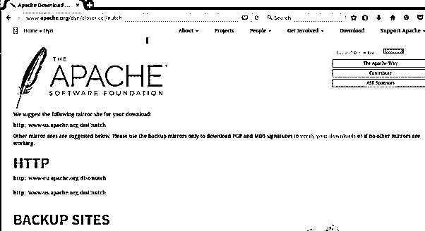
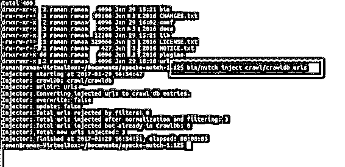

# 努奇阿帕奇

> 原文：<https://www.educba.com/nutch-apache/>

> 
> 
> 

## Nutch Apache 简介

Nutch Apache 是一个流行的网络爬虫软件，用于从网络上分离信息。它与其他 Apache 工具(如 Hadoop)结合使用，以进行更好的数据分析。它是一个开源产品，拥有 Apache Software 的许可。因此，开发人员社区拥有 Apache 中各种工具的许可，可以对数据进行排序和分析。与其他工具一样，Apache Hadoop 也具有相同的功能，通过使用网络爬行算法来存储、分析和收集网络文件。本文解释了 Apache Nutch 的简单安装、操作系统和特性。

### 什么是 Nutch Apache？

Nutch Apache 用于通过使用 web 爬行算法从 web 中分离数据。它是一个开源工具，在 Apache Solr 框架上工作，充当 Apache Nutch 中收集的信息的存储库。Nutch 最适合高维数据的批处理，可以集成到更小的作业中。Nutch 还提供了强大的插件，可以解析 Apache Tika、Elasticsearch 和 Apache Solr。Apache Nutch 提供了一个直观的、可扩展的、稳定的接口，用于评分、索引、HTML 过滤和解析等流行功能，以实现一些定制的实现。用户可以通过在 Apache Nutch 中运行简单的命令来获取 URL 下的数据。

### 如何安装 Nutch apache？

第一步是构建并下载插件软件和 Nutch Apache。

<small>网页开发、编程语言、软件测试&其他</small>

*   使用 GitHub，克隆索引插件的存储库。
*   从索引插件中选择首选版本
*   使用$ mvn 包构建索引插件
*   然后它在下载索引插件后执行多次测试。所以跳过测试，选择 mvn 包——Dskip 测试。

安装 Apache Nutch 1.15 版本，并遵循 Apache Nutch 手册中给出的安装步骤。

然后将目标文件解压到复制插件的文件夹中

然后处理插件索引

*   首先，要配置索引插件，构建一个名为 plugin 的文件。配置.属性
*   配置文件应该显示在谷歌云搜索的数据源上强制工作的参数。
*   配置文件可以包括管理索引插件的其他参数，以便插件知道将信息推入云搜索。用户还可以使用 API、batch *和 default ACL*来配置索引插件，以填充元数据和结构化数据。

### 阿帕奇 Nutch 配置

在 conf/nutch.xml 文件中添加参数。插件应该包括文本文件，该文件应该包含 index-basic、index-google cloud search 和 index-more。但是 conf/nutch.xml 为这个属性提供了标准值，但是由用户手动添加 index-Google-cloud 搜索到其中。元标记名也可以以文本的形式给出。逗号分隔列表，其属性映射到数据源，数据源有相应的模式。

然后，要配置 web 爬网，请将以下属性添加到 XML 文件 conf\index-writers.XML 中。

在开始 web 爬网配置之前，它应该将数据保存在企业希望显示可用标准作为搜索窗口结果的位置。

在 Apache Nutch 开始抓取内容的地方启动一个 URL。该 URL 被定义为起始 URL，在此，web 爬行过程到达所有需要被包括在爬行链接中的内容。目录安装需要起始 URL。

*   要从工作目录改变 Nutch 安装目录，给出$cd ~/Nutch/apache-Nutch-x/
*   然后构建一个目录到 URL: $mkdir URL
*   创建种子文件和列表 URL。然后继续使用 URL 规则来管理抓取，这是在谷歌云搜索的索引中提供的。只有这里提到的网址才会遵循规则进行抓取和索引。如果 URL 不遵循爬行模式，则网络爬虫停止运行。
*   然后从当前工作目录转到 nutch 目录。
*   然后编辑配置文件，将文件更改为遵循 web 爬网规则。
*   $nano.conf/urlfilter

为正则表达式提供–或+以按照 URL 遵循爬网模式，有时通过编辑爬网脚本来启用开放式表达式。如果 GCS.upload 参数设置为 raw，则添加二进制内容以传递 nutch 索引的命令。当插件被调用时，参数应该通过 Nutch 索引来包含二进制内容。的。爬网的 bin 脚本没有任何默认参数。

### Nutch apache 操作系统

Nutch Apache 有一个灵活有效的通用操作系统。因此，在安装插件后，索引可以从脚本执行到本地模式，以在各个 nutch 命令中运行爬网作业。所需的组件放在本地目录中以执行 Nutch，Nutch 是用 apache-Nutch-1.15 目录执行的。详细日志文件和输出日志保存在 edit/log4j 中。属性。它是高度可扩展的，并且具有丰富的爬行选项。它遵循配置 XML 文件中提供的 robots.txt 规则。被执行的 Nutch 在集群中拥有 100 台机器，集群是可伸缩的和健壮的。bias 选项设置为首先在重要内容上爬行。

### Nutch Apache 的例子

爬网信息知道从爬网数据库获取数据的 URL。

在链接数据库中，已知的 URL 链接由源链接和锚链接组成，用于处理网络爬行内容。

它以一系列片段的形式工作。该段由作为一个单元计算的有限 URL 组成。这些段可以用子目录来定义。

*   crawl_generate 中给出了需要获取的 URL 集
*   抓取状态在 crawl_fetch 中给出
*   从每个 URL 检索到的原始内容放在内容文件夹中
*   包含解析文本的 URL 位于 parse_text 中
*   解析的元数据和外部链接位于 parse_data 中

### 结论

因此，Nutch Apache 的工作、安装和属性是可以理解的，用户可以根据自己的内容需求和业务偏好来配置 web 爬行属性。

### 推荐文章

这是一个指南 Nutch 阿帕奇。这里我们对 Nutch Apache 的工作原理、安装和属性都有所了解，并且用户可以配置网页抓取属性。您也可以看看以下文章，了解更多信息–

1.  [阿帕奇兴趣点](https://www.educba.com/apache-poi/)
2.  [阿帕奇 Solr](https://www.educba.com/apache-solr/)
3.  [阿帕奇蚂蚁](https://www.educba.com/apache-ant/)
4.  [阿帕奇水槽](https://www.educba.com/apache-flume/)

