# Applet 生命周期

> 原文：<https://www.educba.com/applet-life-cycle/>

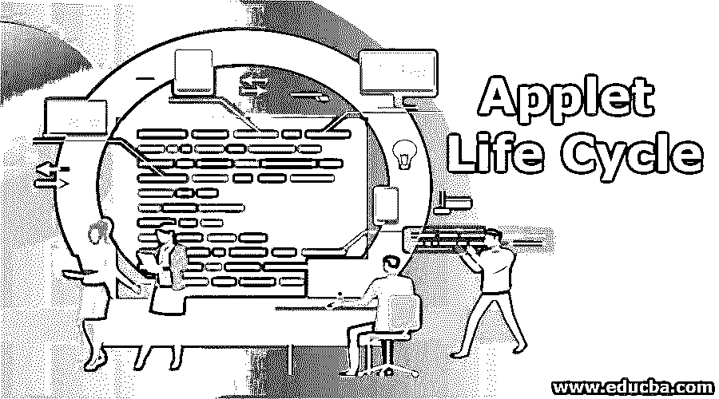

## Applet 生命周期简介

Applet 生命周期定义为对象在应用程序的整个执行过程中是如何创建、启动、停止和销毁的。Applet 生命周期有 5 个方法 init()，start()，stop()，aint()和 destroy()。这些方法由浏览器调用来执行。Applet 在客户端工作，因此处理时间更少。

### Applet 生命周期的方法

Applet 生命周期有 5 种方法。方法有 init()，start()，paint()，stop()和 destroy()。

<small>网页开发、编程语言、软件测试&其他</small>

*   **init():** init()方法用于初始化 applet。它在初始化时只调用一次。初始化的对象由 web 浏览器创建。我们可以将这种方法与线程类的出生状态进行比较。
*   **start():** start()方法用于启动 applet。它是在调用 init()方法后调用的。每次浏览器加载或刷新时都会调用它。在调用 init()方法之前，start()方法处于非活动状态。我们可以将这种方法与线程类的开始状态进行比较
*   **stop():** stop()方法用于停止小程序。每当浏览器停止、最小化或应用程序突然失败时，都会调用该函数。调用 stop()方法后，我们也可以随时启动()方法。这个方法主要处理清理代码。我们可以将这种方法与线程类阻塞状态进行比较
*   destroy(): destroy()方法用于在我们完成 applet 工作后销毁应用程序。它只被调用一次。一旦小程序被破坏，我们就不能启动它了。我们可以将这种方法与线程类的死状态进行比较
*   **paint():** paint()方法用于绘制任意形状，如正方形、长方形、梯形、日蚀形等。paint()方法将参数作为 ClassGraphics。这个 Graphics 类在 applet 中提供了绘画功能。我们可以将这种方法与线程类 runnable state 进行比较。

### Applet 生命周期在 Java 中是如何工作的？

**1。** Applet 是一个 Java 应用程序，可在任何网络浏览器中运行，并在客户端窗口工作。因为它是在浏览器中运行的，所以它没有 main()方法，所以 Applet 被设计为放置在 HTML 页面中。

**2。** java.applet.Appletclass 提供 init()、start()、stop()和 destroy()方法。

**3。** java.awt.Componentclass 提供了 paint()的另一种方法。

**4。**在 Java 中，任何一个类想要成为 Applet 类，就必须继承 Applet 类。

**5。init()方法**

**语法:**

`public void init()
{
//initialized objects
}`

**6。start()方法**

**语法:**

`public void start()
{
//start the applet code
}`

7 .**。停止()方法**

**语法:**

`public void stop()
{
//stop the applet code
}`

**8。destroy()方法**

**语法:**

`public void destroy()
{
//destroy the applet code
}`

**9。paint()方法**

**语法:**

`public void paint(Graphics graphics)
{
//any shapes code
}`

10。以上方法都是浏览器自动调用的。我们不需要显式调用。即使每种方法都有自己的规范来完全满足我们上面讨论的需求。

下面给出了方法的流程。

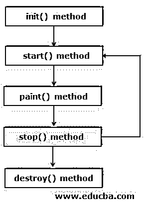

**11。整个小程序生命周期**

**语法:**

`Class MyLifeCycle extends Applet
{
public void init()
{
//initialized objects
}
public void start()
{
//start the applet code
}
public void paint(Graphics graphics)
{
//any shapes code
}
public void stop()
{
//stop the applet code
}
public void destroy()
{
//destroy the applet code
}
}`

**12。**小程序生命周期由 Java 插件软件管理。

13。运行小程序有两种方式。

*   通过使用 HTML 文件。
*   通过使用 applet viewer 工具，这是为了测试应用程序，但我们只是简单地用它来测试 HTML 文件。

### 要实现的示例

以下是使用 HTML 文件实施 Applet 生命周期的示例:

#### 示例#1

**Java 代码:AppletLifeCycle.java**

`import java.applet.Applet;
import java.awt.Graphics;
@SuppressWarnings("serial")
public class AppletLifeCycle extends Applet
{
public void init()
{
System.out.println("1.I am init()");
}
public void start()
{
System.out.println("2.I am start()");
}
public void paint(Graphics g)
{
System.out.println("3.I am paint()");
}
public void stop()
{
System.out.println("4.I am stop()");
}
public void destroy()
{
System.out.println("5.I am destroy()");
}
}` 

**HTML 代码:AppletLifeCycle.html**

`<!DOCTYPE html>
<html>
<head>
<meta charset="ISO-8859-1">
<title>Applet Life Cycle</title>
</head>
<body>
<applet code="AppletLifeCycle.class" width="300" height="300"></applet>
</body>
</html>`

**输出:**

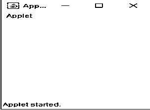

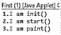

最小化小程序输出后:

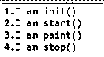

最大化小程序输出后:

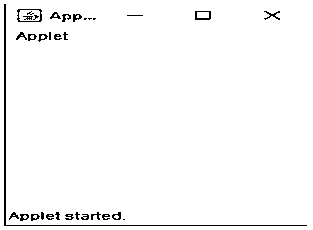

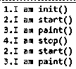

关闭小程序后-输出:

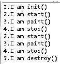

**说明:**

*   正如我们在输出中看到的，init()方法只被调用了一次，正如我们在上面讨论的那样。
*   当我们运行应用程序时，init()、start()和 paint()方法被顺序调用。
*   如果你最小化 applet，那么 stop()方法被调用。
*   同样，如果您将 applet 最大化，那么 start()和 pain()方法会被相继调用。
*   如果关闭应用程序，那么 destroy()方法将被调用。

#### 实施例 2

通过使用 applet 浏览器工具 applet 生命周期:无需编写 HTML 代码。只需编写 Java 代码并运行即可。这只是一个测试目的。

Java code:AppletLifeCycleWithAppletViewer.java

`import java.applet.Applet;
import java.awt.Graphics;
@SuppressWarnings("serial")
public class AppletLifeCycleWithAppletViewer extends Applet
{
public void init()
{
System.out.println("1.I am init()");
}
public void start()
{
System.out.println("2.I am start()");
}
public void paint(Graphics g)
{
System.out.println("3.I am paint()");
}
public void stop()
{
System.out.println("4.I am stop()");
}
public void destroy()
{
System.out.println("5.I am destroy()");
}
}`

**输出:**

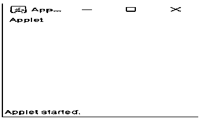

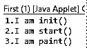

最小化小程序输出后:

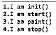

最大化小程序输出后:

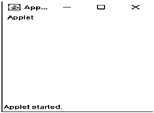

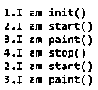

关闭小程序后-输出:

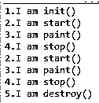

在 applet 窗口上显示矩形区域:

#### 实施例 3

**Java 代码:AppletRectangleArea.java**

`import java.applet.Applet;
import java.awt.Graphics;
@SuppressWarnings("serial")
public class AppletRectangleArea extends Applet {
private int breadth;
private int length;
public void init() {
length = 10;
breadth = 20;
}
public void paint(Graphics graphics) {
String rectangleArea="Area of rectangle is=>"+length*breadth;
graphics.drawString(rectangleArea, 20, 20);
}
}`

**输出:**

**说明:**

*   正如你在上面的代码中看到的，我们没有指定 start()、stop()和 destroy()方法。即使程序执行整个生命周期，因为所有这些方法都是由 JVM 调用的。
*   在 init()方法中初始化矩形的长度和宽度。
*   在 paint()方法中使用 drawstring()方法显示矩形区域。
*   对象是由 web 浏览器创建的。

### 推荐文章

这是一个小程序生命周期的指南。在这里，我们将讨论 Applet 生命周期方法在 Java 中是如何工作的，以及不同的方法和例子。您也可以浏览我们推荐的其他文章，了解更多信息——

1.  [Java 中的小程序](https://www.educba.com/applets-in-java/)
2.  [Servlet 架构](https://www.educba.com/servlet-architecture/)
3.  [Java 中的线程生命周期](https://www.educba.com/thread-life-cycle-in-java/)
4.  [JSP 生命周期](https://www.educba.com/jsp-life-cycle/)

