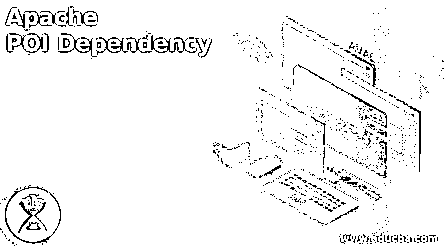
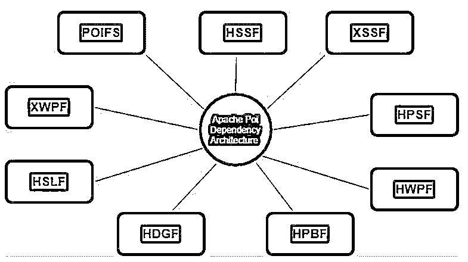
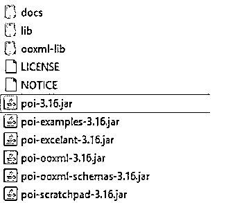
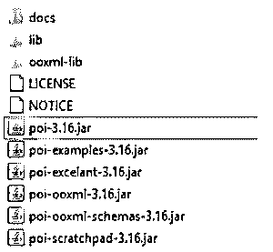
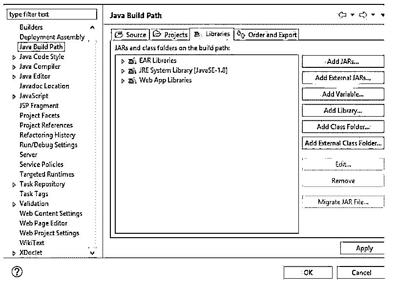
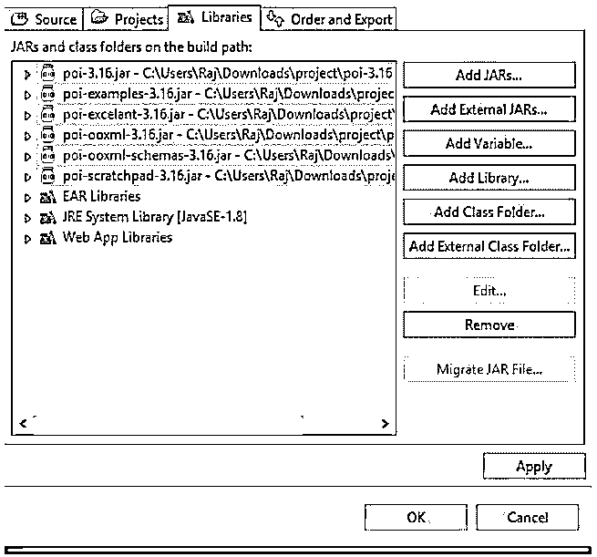

# Apache POI 依赖性

> 原文：<https://www.educba.com/apache-poi-dependency/>

## Apache POI 依赖关系介绍

Apache POI 依赖是由 Apache Foundation 提供的，它是开源的，我们可以说它是一个 Java 库的集合，我们可以用它来处理我们的应用程序中与 MS office 相关的文件。它提供了各种接口和类来处理这些文件和执行操作，通过 java 程序使我们的工作变得简单快捷。为了使用这个 apache POI，我们必须在应用程序中拥有所需的依赖关系，以便导入类和接口，并使用它们的方法来执行某个操作。有了它的帮助，我们可以很容易地写、读和修改微软文件。

### 什么是 Apache POI 依赖？

正如我们已经知道的，apache POI 用于使用 java 程序处理 MS office 文件，因此 apache POI 依赖项是各种 java 库的集合，这些库提供了各种接口和类，我们可以通过它们在应用程序中处理文件。所以这个 apache POI 提供了不同种类的库，可以用来处理应用程序中的文件。

<small>网页开发、编程语言、软件测试&其他</small>

*   这种依赖性为我们提供了一组 jar 文件。
*   通过使用这种依赖性，我们可以在应用程序中使用不同类型的类、接口和方法来通过 java 程序处理 MS office 文件。
*   这种依赖性支持读、写、修改等。

### Apache POI 相关性入门

在这里，我们将详细了解 apache POI 依赖关系架构:

*   **HPBF:** 这是 apache POI 的主要组件之一，代表恐怖的 Publisher 格式；该组件用于读写文件，特别是 MS-Publisher 文件。
*   HSSF: 这是 apache POI 的另一个组件，它代表可怕的电子表格格式，这种类型的组件特别用于读取和写入我们的 MS Excel 文件的 xls 格式。
*   **HPSF:** 这是 apache POI 的另一个组成部分，代表可怕的属性集格式；这个组件基本上用来提取 MS Office 文件的属性，其中基本上包括属性集。
*   HSLF: 这是 apache POI 的另一个组件，代表恐怖幻灯片布局格式；这基本上用于 PowerPoint 演示，支持编辑、创建和读取等操作。
*   **HDGF:** 这是 apache POI 的另一个组成部分，代表可怕的图表格式；这基本上包含并处理二进制文件；它内部包含处理与 MS Visio 相关的二进制文件的方法和类。
*   这是 apache POI 的又一个 com，代表糟糕的混淆实现文件系统；这被认为是我们使用的所有 poi 元素的基本组成部分或基本因素。如果我们想要读取不同的文件类型，我们可以通过显式编写代码来使用它。
*   HWPF: 这是 apache POI 的另一个组成部分，代表恐怖的文字处理器格式；该组件基本上为扩展名为 doc 的 MS word 文件提供支持。
*   XSSF: 这是 apache POI 的另一个组件，代表 XML 电子表格格式；这个组件基本上是用来读取 MS Excel 的 xlsx 扩展文件的。
*   XWPF: 这是 apache POI 的另一个组件，代表 XML 字处理器格式；该组件主要用于读写扩展名为 docx 的 MS Word 文件。

**Apache POI 依赖流程图:**

### 必需的 Apache POI 相关性和 Apache POI 相关性示例

在这里，我们将看到如何为 maven、gradle 或普通 java 项目配置 apache POI 依赖关系。

让我们看看分步说明或设置应用程序。

**胃:T1**

1.为了设置 maven 项目，我们在 pom.xm 文件中添加了依赖项，我们可以从 maven central 复制正确版本的依赖项。

**网址:**【https://mvnrepository.com/artifact/org.apache.poi/poi T2】

2.现在，我们将从站点复制合适的依赖项，并将其粘贴到我们项目的 pom.xml 中(见下文)。

`<!-- https://mvnrepository.com/artifact/org.apache.poi/poi -->
<dependency>
<groupId>org.apache.poi</groupId>
<artifactId>poi</artifactId>
<version>5.0.0</version>
</dependency>`

3.在 eclipse 中打开项目并打开 pom.xml，然后粘贴它。

4.之后，从 eclipse 或命令提示符运行 maven clean install。

【T0 度】

1.转到同一个链接，复制各自的依赖关系，适合 gradle。

2.将其复制并粘贴到应用程序的 build.gradle 文件中。

**举例:**

//https://mvnrepository.com/artifact/org.apache.poi/poi

**实现组:** 'org.apache.poi '，名称:' poi '，版本:' 5.0.0 '

**Java 项目:**要在 Java 项目中配置它，我们必须采取更多的额外步骤来配置它，按照一步一步的指南来设置依赖关系；见下文:

1.从下面的 URL 下载 apache POI 依赖项。

2.[https://www . Apache . org/dyn/closer . Lua/poi/release/bin/poi-bin-3.16-2017 04 19 . zip](https://www.apache.org/dyn/closer.lua/poi/release/bin/poi-bin-3.16-20170419.zip)

3.将其解压缩到您想要的系统位置。

4.一旦你把它提取出来，你就会看到这种结构。

5.一旦您提取了它，我们必须在 eclipse 中为我们的应用程序包含下面突出显示的文件夹和其中的库。

6.转到您的项目，右键单击，选择构建路径。

将出现以下屏幕:请按照突出显示的关键字添加外部库:

7.单击添加外部 jar 以添加库。

8.添加上述步骤中提到的所有罐子，然后按 ok。

9.结束。

### 结论

和整个教程一样，它描述了在我们的项目中配置它的用法和步骤。因此，maven、gradle 或 Java 项目遵循这些步骤来配置和使用它以及提到的类、接口和它们的方法。

### 推荐文章

这是一个关于 Apache POI 依赖的指南。在这里，我们分别讨论简介、所需的 apache POI 依赖项和示例。您也可以看看以下文章，了解更多信息–

1.  [什么是阿帕奇雄猫？](https://www.educba.com/what-is-apache-tomcat/)
2.  [阿帕奇水槽](https://www.educba.com/apache-flume/)
3.  [阿帕奇蚂蚁](https://www.educba.com/apache-ant/)
4.  [阿帕奇 Solr](https://www.educba.com/apache-solr/)

