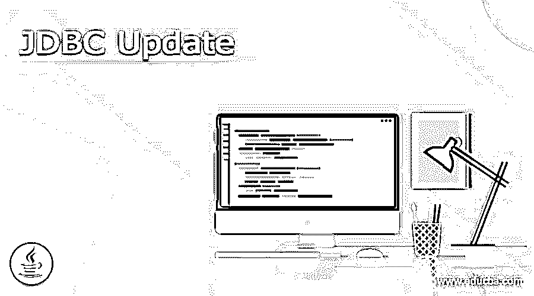
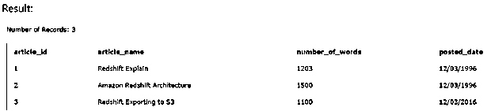
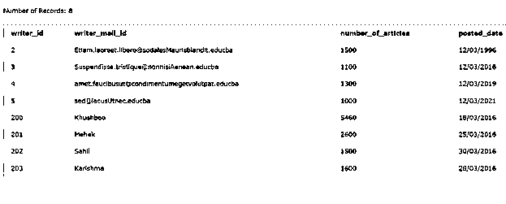

# JDBC 最新消息

> 原文：<https://www.educba.com/jdbc-update/>

## JDBC 更新简介

JDBC 更新是在 java 数据库连接 API 中使用的命令，从 Java 应用程序到您的应用程序所使用的数据库。如果您必须从您的应用程序对存储在数据库中的任何值进行更改，那么您必须使用 update 命令。启动 update 命令的先决条件是，您应该知道与您的数据库用户相关联的密码和用户名，并且 Oracle、MySQL 或您可能用于应用程序的任何数据库应该正在运行并处于 on 模式。

在本文中，我们将了解 update 命令的语法，以及在 JDBC 内部使用它时它是如何工作的。我们还将看看 JDBC 更新要采取的步骤，并借助一个示例了解其实施。

<small>网页开发、编程语言、软件测试&其他</small>

**语法:**

JDBC 更新命令的语法如下所示。

`UPDATE name of the table SET column name1 = value1, column name2 = value2, …. [WHERE restriction];`

在上述语法中，这里使用的术语详细描述如下

表格名称–要修改其内容的表格名称。
·列名–指定要更新其内容的同一表格的列名。
·限制–where 子句本质上是可选的，用于过滤和指定要选择更新的特定行。

### 它是如何工作的？

从指定了名称的表中检索行；如果在 update 命令中给出了 where 子句，则会对它们进行筛选。此外，从这些行中，其名称被指定的列被赋予命令中给出的值。注意，在同一个 update 命令中，我们可以根据需要更改任意多的值。指定更新查询后，您还需要准备可以执行的语句。

**JDBC 更新的步骤**

让我们看看在更新数据库数据时，JDBC 应用程序内部需要执行的步骤。
·导入包——包含执行 JDBC 操作所需的类的任何包都在程序开始时导入。使用 import java.sql.* package 可以导入大多数基本功能。
·打开并建立连接——您需要安装与您将使用的数据库相关的所需驱动程序，之后，您可以使用 DriverManager.getConnection()方法来创建连接对象。这用于以物理方式表示 java 应用程序和数据库之间的连接。
执行更新查询–您必须创建一个数据类型为语句的对象，该对象将用于创建和构建查询。这个对象被进一步发送到数据库，因为它包含我们必须执行的更新命令。更新查询可以包含 in 和 WHERE 的可选子句，用于根据条件更新表中的记录。
·环境清理——在执行 JDBC 操作时使用的任何资源都应该释放出来，以便其他操作也可以使用它们。

### 例子

让我们考虑一个使用 java 应用程序和 JDBC 更新 educba_articles 表中记录的例子。educba_articles 的内容如下所示

`SELECT * FROM [educba_articles]`

查询的输出是–

下面给出了使用 JDBC 更新命令来更新 educba_articles 表内容的 Java 程序

`import java.sql.Connection;
import java.sql.DriverManager;
import java.sql.ResultSet;
import java.sql.SQLException;
import java.sql.Statement;
public class EducbaUpdateExample {
static final String urlForDatabase = "jdbc:mysql://localhost/EDUCBA";
static final String userName = "payal";
static final String password = "payal123";
static final String selectQUERY = "SELECT article_id, article_name , number_of_words, posted_date FROM educba_articles";
public static void main(String[] args) {
try(Connection sampleConnection = DriverManager.getConnection(urlForDatabase, userName, password);
Statement sampleStatement = sampleConnection.createStatement();
) {
String sampleSqlStatement = "UPDATE educba_articles" +
"SET number_of_words = 1000 WHERE article_id in (1, 3)";
sampleStatement.executeUpdate(sampleSqlStatement);
ResultSet sampleResult = sampleStatement.executeQuery(selectQUERY);
while(sampleResult.next()){
System.out.print(" Article ID : " + sampleResult.getInt("article_id"));
System.out.print(", Name Of Article : " + sampleResult.getString("article_name"));
System.out.print(", Numer of Words : " + sampleResult.getInt("number_of_words"));
System.out.println(", Date of posting : " + sampleResult.getDate("posted_date"));
}
(sampleResult.close();
} catch (SQLException sampleException) {
sampleException.printStackTrace();
}
}
}`

编译并运行上述 java 项目后，您将得到结果。如果您的文件名是 EducbaUpdateExample.java，可以使用下面的命令来编译这个文件

贾瓦茨·EducbaUpdateExample.java

**上面代码的输出是-**

现在，为了运行 java 代码，我们可以执行以下命令

java EducbaUpdateExample

上述命令的输出如下所示，其中包含根据我们的查询语句更新后的包含 is 1 和 3 的文章记录

#### 实施例 2

现在让我们考虑另一个例子，我们将尝试更新表中的多列。我们有一个名为 educba_writers 的表，其内容可以通过以下查询进行研究

`SELECT * FROM [educba_writers]`

其输出如下所示

现在，我们将尝试使用以下程序更新该表的内容

`import java.sql.Connection;
import java.sql.DriverManager;
import java.sql.ResultSet;
import java.sql.SQLException;
import java.sql.Statement;
public class EducbaWriterUpdateExample{
static final String urlForDatabase = "jdbc:mysql://localhost/EDUCBA";
static final String userName = "payal";
static final String password = "payal123";
static final String selectQUERY = "SELECT writer_id, writer_mail_id , number_of_articles, posted_date FROM educba_writers";
public static void main(String[] args) {
try(Connection sampleConnection = DriverManager.getConnection(urlForDatabase, userName, password);
Statement sampleStatement = sampleConnection.createStatement();
) {
String sampleSqlStatement = "UPDATE educba_writers" +
"SET number_of_articles = 100, posted_date = "26/08/2021" WHERE article_id in (3, 4)";
sampleStatement.executeUpdate(sampleSqlStatement);
ResultSet sampleResult = sampleStatement.executeQuery(selectQUERY);
while(sampleResult.next()){
System.out.print(" Writer ID : " + sampleResult.getInt("writer_id"));
System.out.print(", Mail ID of Writer : " + sampleResult.getString("writer_mail_id"));
System.out.print(", Numer of Articles : " + sampleResult.getInt("number_of_articles"));
System.out.println(", Date of posting : " + sampleResult.getDate("posted_date"));
}
(sampleResult.close();
} catch (SQLException sampleException) {
sampleException.printStackTrace();
}
}
}`

编译上述程序–

贾瓦茨·EducbaWriterUpdateExample.java

**输出为-**

Java EducbaWriterUpdateExample

**输出为-**

### 结论

JDBC 更新方法用于从我们的 java 应用程序更新数据库中现有表的记录。

### 推荐文章

这是 JDBC 更新指南。在这里我们讨论介绍，语法，它是如何工作的？，分别为 JDBC 更新的步骤。您也可以看看以下文章，了解更多信息–

1.  [JDBC 司机](https://www.educba.com/jdbc-driver/)
2.  [蜂巢 JDBC 驾驶员](https://www.educba.com/hive-jdbc-driver/)
3.  [JDBC 建筑](https://www.educba.com/jdbc-architecture/)
4.  什么是 JDBC？

