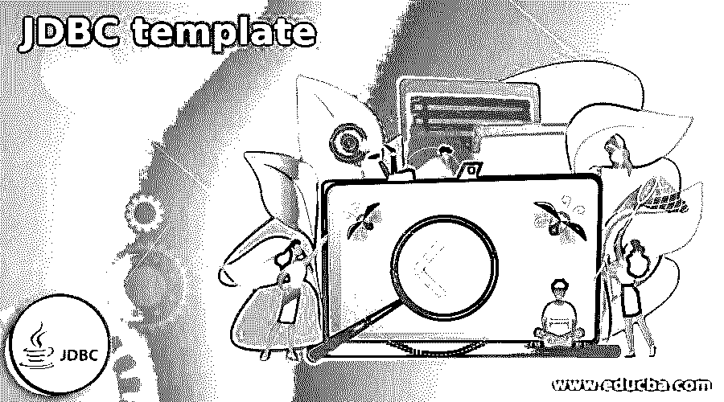
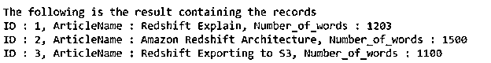
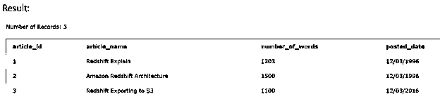

# JDBC 模板

> 原文：<https://www.educba.com/jdbc-template/>

## JDBC 模板介绍

JDBC 模板是在 spring 框架中提供的类，用于使 java 应用程序的数据库操作遵循相同的 JDBC 概念，但节省了大量重复代码，并使其更容易和有效，因为它自己处理异常处理和事务管理。JDBC 模板类的完整证明名是 org . spring framework . JDBC . core . JDBC template 类。在这篇文章中，我们将了解 JDBC 模板的一般用法和要求，对它的简要介绍，它的语法和它是如何工作的，以及一些例子的帮助。

### JDBC 级的需求

当使用 Java 数据库连接的传统方法时，与连接创建、关闭和处理流程相关的所有代码都在开发人员身上。以下是 JDBC 的缺点

<small>网页开发、编程语言、软件测试&其他</small>

*   像导入所有文件、创建和建立与数据库的连接、准备查询和关闭连接对象这样的代码需要在执行代码之前和之后手动完成，查询需要编写。
*   需要完成与基于数据库应用的逻辑的异常处理相关的代码。
*   在事务的情况下，事务管理需要通过我们自己的编码手工完成。
*   为上述工作编写的所有代码都需要重复，当需要从一个数据库逻辑转移到另一个数据库逻辑时，会消耗大量时间。

传统 JDBC 的所有上述缺点是 JDBC 模板的优点，因为它消除了所有这些缺点。JDBC 模板节省时间

因为我们可以直接执行您想要执行的查询，并在单个配置文件中提及所有其他与连接相关的细节。

### 它是如何工作的和 JDBC 模板介绍？

jdbc 核心包由名为 org 的中心类组成，spring framework . JDBC . core . JDBC template 也称为 JDBC 模板，通常用于避免我们在使用 JDBC 时出现的各种常见错误。该模板负责执行与 JDBC 相关的所有核心工作流，以便应用程序只需提供需要执行的 SQL 查询，并提取该查询的结果供应用程序进一步使用。这使得开发人员只需关注业务逻辑和相应的代码，而将所有其他核心相关功能交由 JDBC 模板处理变得非常简单。

JDBC 模板负责执行所有传递的查询、检索数据、更新和对结果集执行所有迭代。它进一步处理在进行数据库相关操作时可能出现的所有异常，并将它们转换成一般的异常。您可以在这个包 org.springframework.dao 中获得与 JDBC 模板处理的异常的层次结构相关的信息

**语法—**

现在，让我们看看 JDBC 模板类的一般声明，以了解它扩展了哪个类，实现了哪些接口。以下是其声明——

公共类 JdbcTemplate 扩展 JdbcAccessor 实现 JdbcOperations

使用它时需要遵循的步骤包括

*   使用数据源配置，我们应该创建一个 JdbcTemplate 类的对象。
*   此外，在您的应用程序和相关的类中，您应该使用该类中提供的方法来执行数据库操作。

使用 JDBC 模板的 query)方法执行查询语句的语法如下所示

`String sampleQueryVar = query statement;
List <Object/type> sampleListVar = jdbcTemplateObject.query(sampleQueryVar, new row mapper object)`

上述语法中使用的术语描述如下

*   sampleQueryVar——这是为保存我们需要执行的查询语句而声明的变量。
*   sampleListVar–这个变量将存储执行查询语句后检索到的所有数据。这个变量的数据类型根据我们将要执行的查询语句而变化。
*   查询语句–这是我们需要在数据库中执行的查询，其结果需要在应用程序中使用。它可以是任何操作语句，如 SELECT、INSERT、DELETE 或 UPDATE。
*   行映射器对象–这是行映射器类的对象，它将每个检索到的行结果转换为类对象，类对象是结果的目标格式。
*   jdbcTemplateObject–为了从数据库中读取目标对象数据，我们需要一个我们创建的模板类的对象。

### 例子

现在，让我们借助一个例子来理解 jdbc 模板的实现。为此，我们需要 eclipse IDE，我们将在其中创建一个 spring 应用程序。它将包含以下指定文件

ArticlesDAO.java 文件将是我们的数据访问对象接口，它将包含以下代码

`package com.educbaOrganization;
import java.util.List;
import javax.sql.DataSource;
public interface ArticlesDAO {
public void setDataSource(DataSource ds);
public List listArticles();
}
Article.java file.
package com.educbaOrganization;
public class Article {
private Integer number_of_words;
private String article_name;
private Integer article_id;
public void setNumber_of_words(Integer number_of_words) {
this.number_of_words = number_of_words;
}
public Integer getNumber_of_words() {
return number_of_words;
}
public void setArticleName(String article_name) {
this.article_name = article_name;
}
public String getArticleName() {
return article_name;
}
public void setArticleId(Integer article_id) {
this.article_id = article_id;
}
public Integer getArticleId() {
return article_id;
}
}
ArticleMapper.java file.
package com.educbaOrganization;
import java.sql.ResultSet;
import java.sql.SQLException;
import org.springframework.jdbc.core.RowMapper;
public class ArticleMapper implements RowMapper {
public Article mapRow(ResultSet rs, int rowNum) throws SQLException {
Article article = new Article();
article.setArticleId(rs.getInt("article_id"));
article.setArticleName(rs.getString("article_name"));
article.setNumber_of_words(rs.getInt("number_of_words"));
return article;
}
}
Following is the implementation class file ArticleJDBCTemplate.java for the defined DAO interface ArticlesDAO.
package com.educbaOrganization;
import java.util.List;
import javax.sql.DataSource;
import org.springframework.jdbc.core.JdbcTemplate;
public class ArticleJDBCTemplate implements ArticlesDAO {
private DataSource dataSource;
private JdbcTemplate jdbcTemplateObject;
public void setDataSource(DataSource dataSource) {
this.dataSource = dataSource;
this.jdbcTemplateObject = new JdbcTemplate(dataSource);
}
public List listArticles() {
String SQL = "select * from educba_articles";
List  articles = jdbcTemplateObject.query(SQL, new ArticleMapper());
return articles;
}
}
MainApp.java file
package com.educbaOrganization;
import java.util.List;
import org.springframework.context.ApplicationContext;
import org.springframework.context.support.ClassPathXmlApplicationContext;
import com.educbaOrganization.ArticleJDBCTemplate;
public class MainApp {
public static void main(String[] args) {
ApplicationContext context = new ClassPathXmlApplicationContext("Beans.xml");
ArticleJDBCTemplate articleJDBCTemplate =
(ArticleJDBCTemplate)context.getBean("articleJDBCTemplate");
System.out.println("The following is the result containing the records" );
List articles = articleJDBCTemplate.listArticles();
for (Article record : articles) {
System.out.print("ID : " + record.getArticleId() );
System.out.print(", ArticleName : " + record.getArticleName() );
System.out.println(", Number_of_words : " + record.getNumber_of_words());
}
}
}
Beans.xml file
<?xml version = "1.0" encoding = "UTF-8"?>
<beans xmlns = "http://www.springframework.org/schema/beans"
xmlns:xsi = "http://www.w3.org/2001/XMLSchema-instance"
xsi:schemaLocation = "http://www.springframework.org/schema/beans
http://www.springframework.org/schema/beans/spring-beans-3.0.xsd ">
<bean article_id="dataSource"
class = "org.springframework.jdbc.datasource.DriverMannumber_of_wordsrDataSource">
<property name = "driverClassArticleName" value = "com.mysql.jdbc.Driver"/>
<property name = "url" value = "jdbc:mysql://localhost:3306/TEST"/>
<property name = "userarticle_name" value = "root"/>
<property name = "password" value = "admin"/>
</bean>
<bean article_id="articleJDBCTemplate"
class = "com.educbaOrganization.ArticleJDBCTemplate">
<property name = "dataSource" ref = "dataSource" />
</bean>
</beans>`

**输出:**

我们可以通过对数据库执行以下查询来交叉检查数据库内容

`SELECT * FROM [educba_articles];`

上述查询的输出是

### 结论

JDBC 模板的使用使得使用 JDBC 执行数据库操作变得非常容易，因为我们只需要关注业务逻辑，其余的所有核心职责都由模板本身执行。

### 推荐文章

这是一个 JDBC 模板指南。这里我们讨论 JDBC 模板类的一般声明，以理解它扩展了哪个类。您也可以看看以下文章，了解更多信息–

1.  [甲骨文的 JDBC 驱动程序](https://www.educba.com/jdbc-driver-for-oracle/)
2.  [JDBC 建筑](https://www.educba.com/jdbc-architecture/)
3.  什么是 JDBC？
4.  [PostgreSQL JDBC 驱动程序](https://www.educba.com/postgresql-jdbc-driver/)

