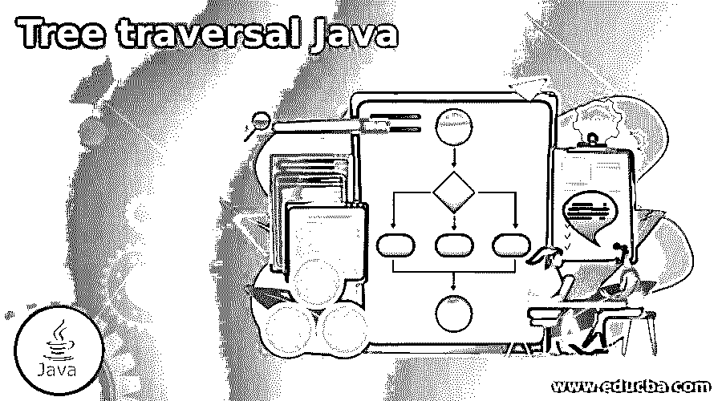
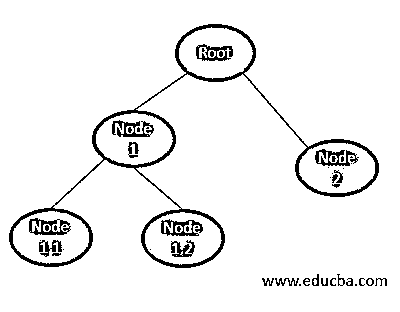
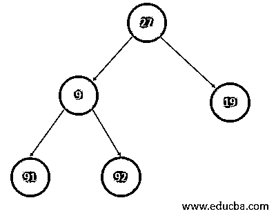
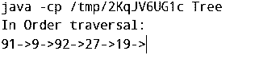
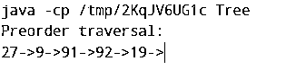
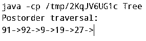

# 树遍历 Java

> 原文：<https://www.educba.com/tree-traversal-java/>




## 树遍历 Java 简介

Java 树遍历被定义为一种用 Java 编程语言实现的算法，它包括作为数据结构的树，并且通过算法的实现结合了访问树的所有节点的基本原理。计算机科学数据结构术语中的遍历表示需要访问数据结构中的所有节点，以便完成手头的更大任务。树的组成部分是根节点和子节点，其中一些结束于该特定节点并被命名为叶子，其他的创建更多的子树。在本文中，我们将介绍 Java 中的树遍历的实现，并看看我们可以通过哪些不同的方法来实现相同的目标。

### 句法

Java 中的类声明:

<small>网页开发、编程语言、软件测试&其他</small>

```
class <class name> {
// List the fields (variables) for the class
// Define the methods of the class to perform the specified operations
}
```

在 Java 中定义方法:

```
returnType <method name>() {
// Body of the method that constitutes the steps that will fulfill the assigned task
}
```

在 Java 中声明节点:

```
Node<{ Data Type }> <variable name> = new Node<{ Data Type }>(" <Value>");
Access the left of the node in Java:
<variable name>.left
```

在 Java 中访问节点的右边:

```
<variable name>.right
```

### 如何在 Java 中进行树遍历？

在我们开始讨论 Java 中遍历树的不同方式之前，我们首先需要知道树是如何构造的，因为这是在 Java 中将树构建为类的基本组件之一。树有节点，因此我们定义一个节点类。这个类将具有作为表示节点数据的数据的字段，一个指向节点左侧的左指针和另一个指向节点右侧的指针。所有这些字段构成了节点类。下面是一棵树的示意图:




一旦我们定义了构成节点和指针的树类，现在是时候看看用 Java 实现的 3 种类型的遍历了，每种类型都有自己的遍历签名:

#### 1 按顺序遍历

这种遍历的定义方式是我们访问左边子树的元素，然后是子树的节点，最后遍历右边的子树。伪代码如下:

*   通过传递左边的节点递归调用函数，直到我们到达 null 节点。
*   显示数据
*   通过传递正确的节点递归调用函数，直到到达 null 节点。

有序算法的遍历路径将是:节点 1.1→节点 1→节点 1.2→根→节点 2。

#### 2.前序遍历

这种遍历的定义方式是访问根节点的元素，遍历左边的子树，最后遍历右边的子树。伪代码如下:

*   首先遍历根节点。
*   通过传递左边的节点递归调用函数，直到我们到达 null 节点。
*   通过传递正确的节点递归调用函数，直到到达 null 节点。

前序算法的遍历路径将是:根→节点 1→节点 1.1→节点 1.2→节点 2。

#### 3.后序遍历

这种遍历的定义方式是，我们先访问左边子树的元素，然后访问右边子树的元素，最后遍历子树的节点，直到到达基节点。伪代码如下:

*   通过传递左边的节点递归调用函数，直到我们到达 null 节点。
*   通过传递正确的节点递归调用函数，直到到达 null 节点。
*   显示数据

后序算法的遍历路径将是:节点 1.1→节点 1.2→节点 1→节点 2→根。

### 树遍历 Java 的例子

下面给出了树遍历 Java 的例子:




#### 示例#1

使用递归的顺序遍历

**语法**

```
class NodeClass {
int value;
NodeClass left, right;
public NodeClass(int key) {
value = key;
left = right = null;
}
}
class Tree {
NodeClass base;
Tree() {
base = null;
}
void inOrderFunc(NodeClass node) {
if (node == null)
return;
inOrderFunc(node.left);
System.out.print(node.value + "->");
inOrderFunc(node.right);
}
public static void main(String[] args) {
Tree tree = new Tree();
tree.base = new NodeClass(27);
tree.base.left = new NodeClass(9);
tree.base.right = new NodeClass(19);
tree.base.left.left = new NodeClass(91);
tree.base.left.right = new NodeClass(92);
System.out.println("In Order traversal");
tree.inOrderFunc(tree.base);
}
}
```

**输出:**




#### 实施例 2

使用递归的前序遍历

**语法**

```
class NodeClass {
int item;
NodeClass left, right;
public NodeClass(int key) {
item = key;
left = right = null;
}
}
class Tree {
NodeClass base;
Tree() {
base = null;
}
void preorderFunc(NodeClass node) {
if (node == null)
return;
//First the node:
System.out.print(node.item + "->");
//Recursively look at the left side of the tree
preorderFunc(node.left);
//Recursively look at the right side of the tree
preorderFunc(node.right);
}
public static void main(String[] args) {
Tree tree = new Tree();
tree.base = new NodeClass(27);
tree.base.left = new NodeClass(9);
tree.base.right = new NodeClass(19);
tree.base.left.left = new NodeClass(91);
tree.base.left.right = new NodeClass(92);
// preorderFunc tree traversal
System.out.println("Preorder traversal: ");
tree.preorderFunc(tree.base);
}
}
```

**输出:**




#### 实施例 3

递归的后序遍历

**语法**

```
class NodeClass {
int item;
NodeClass left, right;
public NodeClass(int key) {
item = key;
left = right = null;
}
}
class Tree {
NodeClass base;
Tree() {
base = null;
}
void postorderFunc(NodeClass node) {
if (node == null)
return;
postorderFunc(node.left);
postorderFunc(node.right);
System.out.print(node.item + "->");
}
public static void main(String[] args) {
Tree tree = new Tree();
tree.base = new NodeClass(27);
tree.base.left = new NodeClass(9);
tree.base.right = new NodeClass(19);
tree.base.left.left = new NodeClass(91);
tree.base.left.right = new NodeClass(92);
System.out.println("Postorder traversal: ");
tree.postorderFunc(tree.base);
}
}
```

**输出:**




### 结论

本文研究了用 Java 实现树遍历的各种方法，以及来自现实世界的例子。鼓励读者通过在代码中添加更多节点来查看遍历，并查看遍历结果！

### 推荐文章

这是一个树遍历 Java 的指南。在这里，我们讨论了用 Java 实现树遍历的各种方法和例子。您也可以看看以下文章，了解更多信息–

1.  [Java 中的 Deque](https://www.educba.com/deque-in-java/)
2.  [Java 中的元数据](https://www.educba.com/metadata-in-java/)
3.  [Java 集合排序](https://www.educba.com/java-collection-sort/)
4.  [跳过列表 Java](https://www.educba.com/skip-list-java/)


