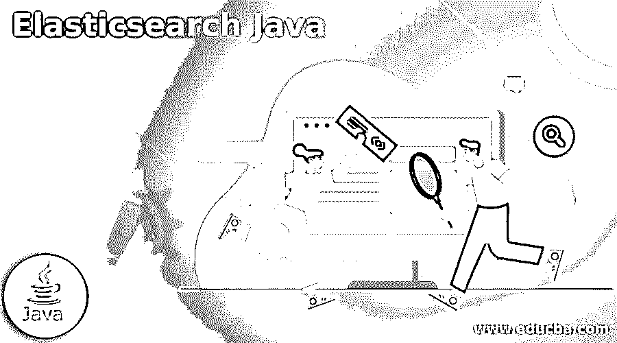
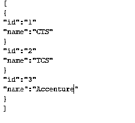

# Elasticsearch Java

> 原文：<https://www.educba.com/elasticsearch-java/>




## Elasticsearch Java 简介

Elasticsearch 技术是使用基于 Java 的搜索引擎编写的，至少需要 Java 8 版本来执行操作。使用 Oracle 的 Java 和 OpenJDK 是为所有 Elasticsearch 节点和客户端处理的最多也是唯一的。我们可以在不同的 Java 版本中使用相同的 JVM 版本，比如 1.8 是 elasticsearch 安装中最推荐的版本。

### 什么是 Elasticsearch java？

Elasticsearch 是基于 Apache Lucene 的当前搜索，也是分析引擎之一。这是一个完全开源的 NoSQL 数据库，用 Java 编程语言编写。这意味着它以非结构化的方式存储数据，不能使用 SQL 数据库进行查询。因此，它是一个 NoSQL 数据库，而且是以一种非结构化的方式。它非常强调搜索能力和功能，在这一点上，搜索数据是使用巨大的 Elasticsearch API 最简单的方法就是从中获取数据。

<small>网页开发、编程语言、软件测试&其他</small>

### 弹性搜索的用途

一般来说，elasticsearch 用于开源，它是一个全文搜索和分析引擎，可高度扩展，用于快速存储高度开发的内容。大量数据将通过实时场景进行分析。然后，它被高度和典型地用作具有高级安全性和搜索功能的基于 web 的应用程序的基础引擎和技术。Elasticsearch 与 ELK Stack、Logstash 和 Kibana 的其他组件结合在一起。它主要用于数据分析，并作为数据索引和存储系统。如果我们使用搜索和典型的 RDBMS 数据库需要大量的文本，而它们又不能有效地工作，那么执行糟糕的配置的方法就像一个黑盒和其他性能问题。这是一个高度灵活的搜索引擎，可以使用无需知识的插件和其他健壮的搜索引擎进行扩展。Elasticsearch 有 n 个 API，可用于执行数据插入、数据更新和在各种数据扇区中搜索等任务。

### Elasticsearch Java 设置

java 必须安装在安装 Java 后将使用 Elasticsearch 的机器上。如果我们已经在机器上安装了它，我们使用 java 版本。主要是 Elasticsearch 将支持版本 11 或高于 Java 8 的版本。它是在实时应用程序中运行的开源全文搜索和分析引擎之一，单页面应用程序(SPA)开发也利用了它。我们可以将 Elasticsearch Java 虚拟机(JVM)的堆大小设置为机器上可用的 RAM 数量。我们可以使用 jvm.options 文件中的 Edit 选项来配置 jvm。机器。它有一些预定义的步骤来执行弹性搜索设置，

1.  首先，我们可以将文件描述符的数量设置为 65536 或更多，以防止 Elasticsearch 耗尽描述符和其他丢失的数据。
2.  然后，如果我们想避免内存交换，并确保系统配置，这样做。例如，可以使用 mlockall 默认命令将 Java 虚拟机(JVM)配置为锁定内存中的堆。

同样，在 elasticsearch.yml 文件中，我们可以设置 bootstrap。安装 Elasticsearch 后内存锁属性为真，我们可以配置。该属性通过设置内存锁来防止内存交换。如果在 Elasticsearch 启动时出现内存锁定问题，我们可能需要指定软内存锁无限制和硬内存锁无限制。

### Elasticsearch java 连接

Java API 客户端通常由如下三个主要元素组成:

*   API 的客户端类:这些为 Elasticsearch APIs 提供了高度类型化的数据结构和操作。由于其规模，Elasticsearch API 被组织成一些特性组，每个特性组都有其客户类。例如，ElasticsearchClient 类将实现 Elasticsearch 的基本功能。
*   **JSON 对象的映射器:**接下来，这将应用程序类转换为 JSON 格式，并与 API 客户端平滑地结合。
*   **传输层的实现:**最后，这是处理所有 HTTP 请求的地方。

**Java Rest 客户端:**

**举例:**

```
package com.example.example3;
import org.springframework.data.annotation.Id;
import org.springframework.data.elasticsearch.annotations.Document;
import lombok.AllArgsConstructor;
import lombok.Data;
import lombok.NoArgsConstructor;
@Document(indexName="companies")
@Data
@AllArgsConstructor
@NoArgsConstructor
public class companies {
@Id
private String id;
private String <u>name</u>;
}
Repository:
package com.example.example3;
import org.springframework.data.elasticsearch.repository.ElasticsearchRepository;
public interface companyRespository extends ElasticsearchRepository<companies, String>{
}
```

**主:**

```
package com.example.example3;
import java.util.List;
import org.springframework.beans.factory.annotation.Autowired;
import org.springframework.boot.SpringApplication;
import org.springframework.boot.autoconfigure.SpringBootApplication;
@SpringBootApplication
@RestController
public class Jan5Application {
@Autowired
private companyRespository repo;
@PostMapping("/saveCompany")
public int saveCustomer(@RequestBody List<companies> comp[]) {
repo.saveAll(comp);
return comp.size();
}
@GetMapping("/findAll")
public Iterable<companies> findAllCompanies() {
return repo.findAll();
}
@GetMapping("/findByName/{name}")
public List<companies> findByName(@PathVariable String name) {
return repo.findByname(name);
}
public static void main(String[] args) {
SpringApplication.run(Jan5Application.class, args);
}
}
```

**应用程序.属性:**

```
spring.data.elasticsearch.cluster-name=my-application
spring.data.elasticsearch.cluster-nodes=localhost:9300
```

**样本输出:**




我们用上面的例子创建了带有 Rest API 和 elasticsearch 的 spring boot 应用程序。在这里，我创建了道德类，比如具有 id 和 name 等属性的公司。然后我创建了存储库，公司就像一个道德班一样处理它；我们可以传递数据类型为的道德类。最后，我创建了像 RestController 这样的主类来调用道德和存储库，并控制公司的详细信息，如 id 和名称。最后，我已经使用一个工具发送了请求，比如使用 Post 方法发送请求的 mail carriers，并使用 get 方法搜索或查找详细信息。

### 结论

一般来说，我们已经看到了如何利用 ElasticSearch 的 Java API 来执行一些最典型的全文搜索引擎功能，以处理实时应用程序的大数据和分析数据。此外，API 将像 Rest Web 服务一样处理控制器来执行操作。

### 推荐文章

这是一个关于 Elasticsearch Java 的指南。在这里，我们讨论利用 ElasticSearch 的 Java API 和 conduct 以及一些最典型的全文搜索引擎特性。您也可以阅读以下文章，了解更多信息——

1.  [Java 异步](https://www.educba.com/java-async/)
2.  [Java 转储](https://www.educba.com/java-dumps/)
3.  [Java 中的 Weka](https://www.educba.com/weka-in-java/)
4.  [Java 电子邮件](https://www.educba.com/java-email/)


