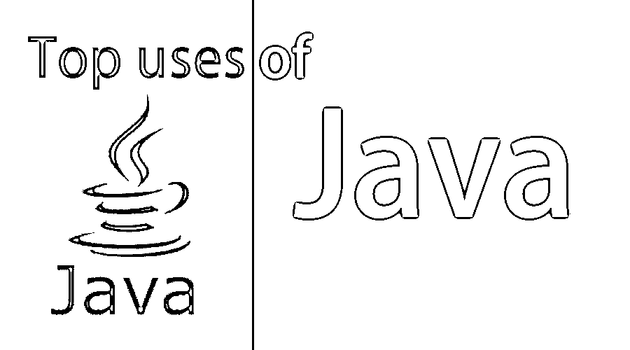

# Java 的应用

> 原文：<https://www.educba.com/applications-of-java/>

## Java 应用介绍

Java 是当今世界上运行在 Java 平台上的数十亿设备中最流行的语言；java 触及了软件开发的各个领域，Java 的特性使其成为当前软件开发市场上最强大的语言。它是一种面向对象的语言；它支持所有面向对象编程语言的特性；它是当前世界上最安全的语言。所有的银行应用程序开发都只在 java 中进行；像 C，C++语言是很容易学的。它还支持多线程，这有助于游戏开发。借助 java，分布式应用程序也很容易开发。现在有很多 java 的框架，这使得它更强大，像 spring，hibernate，JSP，servlet，springBoot。企业应用程序开发总是首选 java 语言，只是因为 Java 的安全性和可伸缩性。

### Java 在现实世界中的应用

以下是前 7 种不同的应用程序:

<small>网页开发、编程语言、软件测试&其他</small>

#### 桌面 GUI 应用程序

桌面应用程序可以很容易地用 Java 开发；为了支持这一点，java 提供了 AWT、Swings 和 JavaFX。AWT 代表 Abstract window toolkit，用于开发借助 AWT 开发的桌面应用程序 UI 继承了 windows view 意味着它不完全基于 java 它使用 windows UI 功能，而 swing 完全基于 java 它基于 java 意味着纯基于 java 的开发可以借助 Java 的 Swings 包来完成。

javaFX 是一种用 Java 开发桌面应用程序的现代方式；它是基于图形的，与 AWT a swings 完全不同。在这些包和框架的帮助下，任何种类的桌面应用程序都可以很容易地开发出来。我们可以用 java 开发任何种类的桌面应用程序。Netbeans IDE 还在中提供了拖放功能，因此可以在有限的时间内完成 UI 开发。在这种情况下，当我们处理 JavaFX 时，ScenBuilder 软件用于为应用程序构建 UI。

#### 科学应用

java 支持科学应用程序开发，因为它具有强大的安全性和健壮性，许多科学应用程序都是基于 java 技术的，如 MATLAB——它是基于 java 的，它的前端和后端都是基于 java 的，只在前端 Java 提供 struts、JSP、servlet，在后端核心 Java 可以在 servlet 中使用。用 java 开发的与研究、科学、医学相关的应用程序。它有强大的数学计算在不同的平台上给出相同的结果；这使得它选择开发一个应用程序。

#### 企业应用

对于企业应用程序开发来说，Java 是首选，因为它的强大功能符合需求，在当今世界，大多数企业网站都是基于 Java 的应用程序，因为它是最安全、最强大、可伸缩的。这些网站需要太多的安全性，这是由 java 实现的。Java 有很强的内存管理特性；它自动删除未使用的内存，从而提高了大型应用程序交易网站的性能，要求更好的性能来增加他们网站上的受众，以实现这些公司所使用的 java。

Java 在 JVM–Java 运行时环境中运行，该环境验证字节码来自外部系统，以防止安全漏洞。如果企业应用网站上的人数增加，Java 的应用可以很容易地扩展。java 是最安全的语言，这也是大多数银行应用程序在 Java 平台上开发的原因。它提供了一个多线程环境，有助于同时运行多个线程，这有助于提高系统的性能，这也是选择 java 而不是其他语言的原因。

#### 网络应用

用来开发 web 应用程序的 Java 也提供了 JSP、Servlet、Struts、Spring、hibernate 来支持。在这些技术的帮助下，我们可以很容易地根据客户需求开发任何类型的 web 应用程序。Servlet 和 JSP，是服务器端的组件，帮助开发 web 应用的业务逻辑；Jsp 是 servlet 的扩展；与 servlet 相比，它有更多的特性，易于使用，因为它有 HTML 中的标签。这些是帮助开发基于 web 的应用程序的 java 的主要组件。我们可以开发基于网络的应用程序来帮助这些技术。

#### 移动应用

借助 java 可以轻松开发移动应用程序。在当今世界，每两部手机就有一部基于 Java 的 Android 操作系统。我们可以很容易地在 android 上开发任何游戏、任何种类的应用程序。AndroidStudio 用于为 Android 应用程序编写代码；任何 android 手机都可以用作模拟器来测试 Android 应用程序。Android 完全基于 Java 它遵循 java 的所有约定。任何懂 java 的人都可以轻松学习 Android，并可以开始所需应用的开发。

#### Web 服务器和应用服务器

今天的 Java 生态系统包含多个 Java web 服务器和应用服务器。而[阿帕奇 Tomcat](https://www.educba.com/what-is-apache-tomcat/) ，简单，Jo！、Rimfaxe Web Server (RWS)和 Project Jigsaw 主导了 Web 服务器领域，WebLogic、WebSphere 和 JBoss EAP 主导了商业应用服务器领域。

#### 网络服务

java 帮助开发 web 服务，这是一个平台，独立于语言，这意味着用另一种语言开发的应用程序可以很容易地使用 java web 服务，为了支持这一点，Java 提供了 Soap 和基于 rest 的 web 服务，它们各有优缺点，Soap 有一些限制，但它比 Rest 更安全，但它只支持 XML 数据格式，在开发过程中需要遵循许多约定。虽然 rest 支持许多数据格式，如 JSON、HTML 和 XML，这有助于它变得比 soap 更易满足，但在 web 服务的开发过程中，它比 soap 需要更少的带宽。

### 结论

因为我们 java 正在触及软件开发的每一个领域。当我们需要开发一个更安全、易于扩展的应用程序时，可以根据业务需求使用它；我们也应该使用 java，因为它有强大的安全特性，可以运行任何平台，这是 Java 的优势。它是开发银行应用程序时的首选语言，而银行应用程序在这一领域需要大量的安全性考虑；java 优于其他语言，这就是为什么在 java 领域有很多工作。因此，如果我们的业务需求与 java 特性相匹配，我们可以选择这种语言。

### 推荐文章

这是 Java 在现实世界中的应用指南。这里我们讨论了 Java 的不同应用——比如移动应用、web 应用、桌面应用等等。您也可以阅读以下文章，了解更多信息——

1.  [JavaScript vs C#](https://www.educba.com/c-sharp-vs-javascript/)
2.  [Java Web 服务面试问题](https://www.educba.com/java-web-services-interview-questions-and-answers/)
3.  [Java 性能 vs Python](https://www.educba.com/java-performance-vs-python/)
4.  [JavaFX 布局](https://www.educba.com/javafx-layouts/)
5.  [类型以及如何创建 JavaFx 图表？](https://www.educba.com/javafx-charts/)
6.  [如何在 JavaFX TextField 中输入文本？](https://www.educba.com/javafx-textfield/)
7.  [用程序实现 JavaFX 文本的属性](https://www.educba.com/javafx-text/)

