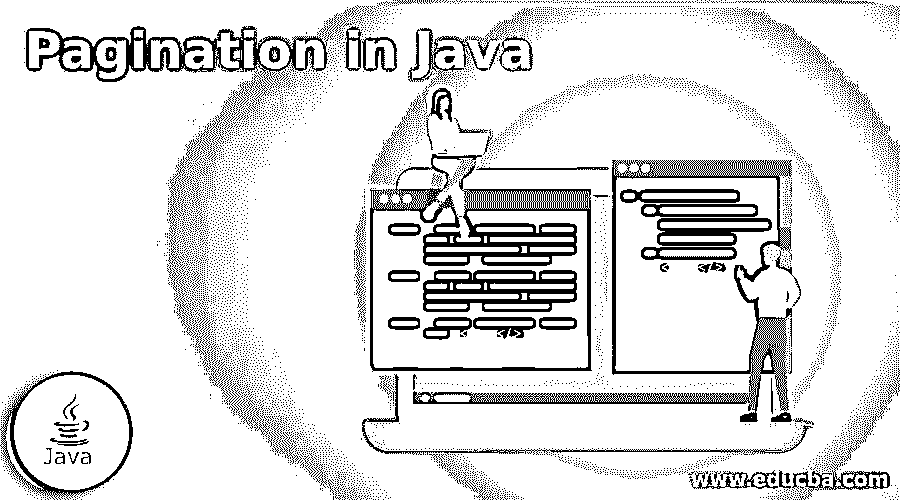
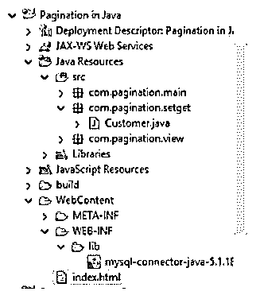
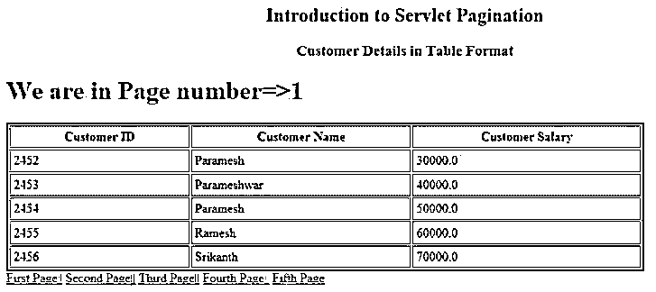

# Java 中的分页

> 原文：<https://www.educba.com/pagination-in-java/>




## Java 分页介绍

Java 分页概念用于在第一页、第二页、第三页、第四页等页面之间移动。按钮或链接。分页的主要原则是通过点击链接或按钮立即在内容间移动。Java 分页为第一页、第二页、第三页、第四页等提供了多个链接或按钮。创建第一页，第二页，第三页，第四页等。，Java 中的按钮；我们有 Servlets 来实现这一点。

### 什么是引导寻呼机？

Java 分页概念用于通过使用第一页、第二页、第三页、第四页等来访问内容。、按钮或更多链接或按钮，以平稳地访问内容。

<small>网页开发、编程语言、软件测试&其他</small>

### 为什么我们使用 JavaScript 分页？

下面给出了我们为什么使用 JavaScript 分页:

**实时场景:**

让我们以亚马逊网站或 Flipkart 网站为例，展示它们数据库中的可用产品。假设他们有 100 万件产品。如果他们试图一次展示所有的商品，顾客必须等待更多的时间，比如一天，才能看到所有的商品清单。

### 我们应该如何处理这种情况？

*   我们可以使用链接按钮列表一次显示 50 到 100 个项目，而不是一次显示所有项目。
*   如果顾客对前 50 至 100 件产品不满意，那么他会转向下 50 至 100 件产品，以此类推。这个概念叫做分页。

### 逐步创建分页项目

1.  创建任何带有 setter 和 getter 的类，用于向列表中添加值。
2.  为分页逻辑创建 Servlet 类。
3.  创建一个类，将列表值添加到任何数据库中，以便在输出视图页面上查看这些值。

**Note:** Here MySQL database used; make sure you must install the MySQL server on your PC. Use mysql-connector-java.jar file to work MySQL database code.

4.创建用于查看分页的 HTML 视图页面。

**语法:**

**Servlet 语法:**

```
//create a setter and getter class
public class Customer {
private int id;
private String name;
private float salary;
//setters and getters
}
//for pagination logic in servlet class
protected void doGet(HttpServletRequest request, HttpServletResponse response) throws ServletException, IOException {
response.setContentType("text/html");
PrintWriter printWriterOut=response.getWriter();
String stringPageNumber=request.getParameter("page");
int paginationPageID=Integer.parseInt(stringPageNumber);
int toalCount=pageNumbers;
if(paginationPageID==1){}
else{
paginationPageID=paginationPageID-1;
paginationPageID=paginationPageID*toalCount+1;
}
}
//database connection for getting customer values
public static Connection getConnection(){
Connection con=null;
try{
Class.forName("com.mysql.jdbc.Driver");
con=DriverManager.getConnection("jdbc:mysql://localhost:3306/test","root","root");
}catch(Exception e){System.out.println(e);}
return con;
}
//view output html page
<body>
<div class="a">
<a href="PaginationServlet?page=1">View Customer Details</a>
</div>
</body>
```

### Java 中分页的例子

为了更好地理解，上面提到的每一步我们都作为一个例子。一旦你完成了所有的例子，你的项目结构必须如下图所示；否则，可能行不通。

创建一个动态 web 项目，并添加如下所有的例子如下:




**Note:** Use Apache Tomcat server 7.0.

#### 示例#1

创建客户类别。

**Java 代码:Customer.java**

```
package com.pagination.setget;
public class Customer {
private int id;
private String name;
private float salary;
public int getId() {
return id;
}
public void setId(int id) {
this.id = id;
}
public String getName() {
return name;
}
public void setName(String name) {
this.name = name;
}
public float getSalary() {
return salary;
}
public void setSalary(float salary) {
this.salary = salary;
}
}
```

#### 实施例 2

为分页逻辑创建 servlet 类。

Java Servlet 代码:Pagination.java

```
package com.pagination.view;
import java.io.IOException;
import java.io.PrintWriter;
import java.util.List;
import javax.servlet.ServletException;
import javax.servlet.annotation.WebServlet;
import javax.servlet.http.HttpServlet;
import javax.servlet.http.HttpServletRequest;
import javax.servlet.http.HttpServletResponse;
import com.pagination.main.Pagination;
import com.pagination.setget.*;
@SuppressWarnings("serial")
@WebServlet("/PaginationServlet")
public class ViewPagination extends HttpServlet {
protected void doGet(HttpServletRequest httpServletRequest, HttpServletResponse httpServletResponse) throws ServletException, IOException {
httpServletResponse.setContentType("text/html");
PrintWriter printWriterOut=httpServletResponse.getWriter();
String stringPageNumber=httpServletRequest.getParameter("page");
int paginationPageID=Integer.parseInt(stringPageNumber);
int toalCount=5;
if(paginationPageID==1){}
else{
paginationPageID=paginationPageID-1;
paginationPageID=paginationPageID*toalCount+1;
}
List<Customer> customerList=Pagination.getRecords(paginationPageID,toalCount);
printWriterOut.print("<h2 style='color:green;text-align:center'>Introduction to Servlet Pagination</h2>");
printWriterOut.print("<h3 style='color:blue;text-align:center'>Customer Details in Table Format</h3>");
printWriterOut.print("<h1 style='color:brown'>We are in Page number=>"+stringPageNumber+"</h1>");
printWriterOut.print("<table style='color:navy' border='2' cellpadding='4' width='80%'>");
printWriterOut.print("<tr><th>Customer ID</th><th>Customer Name</th><th>Customer Salary</th>");
for(Customer customer:customerList){
printWriterOut.print("<tr><td>"+customer.getId()+"</td><td>"+customer.getName()+"</td><td>"+customer.getSalary()+"</td></tr>");
}
printWriterOut.print("</table>");
printWriterOut.print("<a href='PaginationServlet?page=1'>First Page||</a> ");
printWriterOut.print("<a href='PaginationServlet?page=2'>Second Page||</a> ");
printWriterOut.print("<a href='PaginationServlet?page=3'>Third Page||</a> ");
printWriterOut.print("<a href='PaginationServlet?page=4'>Fourth Page||</a> ");
printWriterOut.print("<a href='PaginationServlet?page=5'>Fifth Page</a> ");
printWriterOut.close();
}
}
```

#### 实施例 3

创建用于保存列表值的 MySQL 数据库代码。

**Java 代码:MySQLPagination.java**

```
package com.pagination.main;
import com.pagination.setget.*;
import java.sql.*;
import java.util.ArrayList;
import java.util.List;
public class Pagination {
public static Connection getConnection(){
Connection connection=null;
try{
Class.forName("com.mysql.jdbc.Driver");
connection=DriverManager.getConnection("jdbc:mysql://localhost:3306/test","root","root");
}catch(Exception e){System.out.println(e);}
return connection;
}
public static List<Customer> getRecords(int start,int total){
List<Customer> list=new ArrayList<Customer>();
try{
Connection connection=getConnection();
PreparedStatement preparedStatement=connection.prepareStatement("select * from customer limit "+(start-1)+","+total);
ResultSet rs=preparedStatement.executeQuery();
while(rs.next()){
Customer customer=new Customer();
customer.setId(rs.getInt(1));
customer.setName(rs.getString(2));
customer.setSalary(rs.getFloat(3));
list.add(customer);
}
connection.close();
}catch(Exception e){System.out.println(e);}
return list;
}
}
```

#### 实施例 4

查看 HTML 页面。

**HTML 代码:ViewPagination.html**

```
<!DOCTYPE html>
<html>
<head>
<meta charset="ISO-8859-1">
<title>Pagination</title>
<style type="text/css">
.a {
text-align: center;
}
</style>
</head>
<body>
<div class="a">
<a href="PaginationServlet?page=1">View Customer Details</a>
</div>
</body>
</html>
```

**输出:**





**说明:**

*   在第一个例子中，我们创建了一个客户 setter 和 getter 类。
*   在第二个示例中，我们创建了用于添加分页逻辑的分页 servlet 类。
*   在第三个示例中，我们创建了一个 MySQL 数据库，用于添加列表值以显示在分页视图中。
*   在第四个例子中，我们使用 HTML 页面创建了一个视图页面。

### 结论 Java 中的分页

Java 的分页用于通过使用按钮或链接立即在页面之间移动。Java 中的分页可以通过 Servlet 和 HTML y 使用 MySQL jar 文件来完成。

### 推荐文章

这是一个 Java 分页指南。这里我们分别讨论创建分页项目的介绍、步骤和例子。您也可以看看以下文章，了解更多信息–

1.  [Java URL 类](https://www.educba.com/java-url-class/)
2.  [Java 字符串等于](https://www.educba.com/java-string-equals/)
3.  [Java 字典](https://www.educba.com/java-dictionary/)
4.  Java 中的[范围](https://www.educba.com/range-in-java/)


