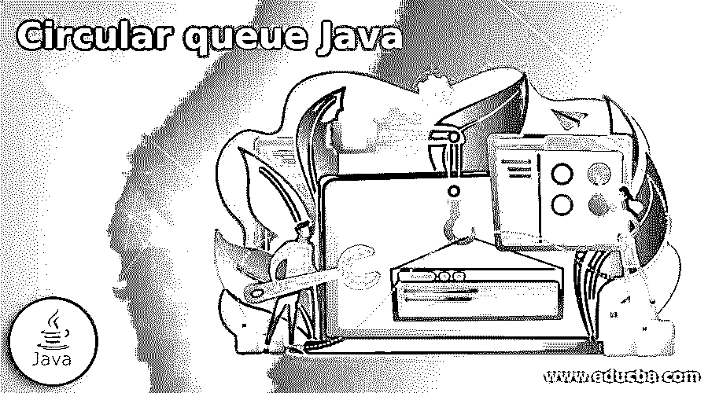
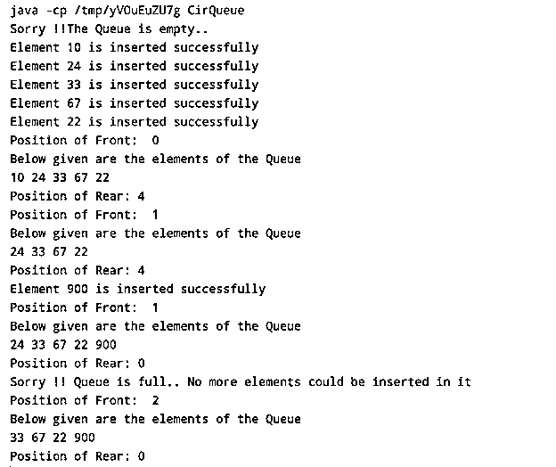

# 循环队列 Java

> 原文：<https://www.educba.com/circular-queue-java/>

**

** 

## 循环队列 Java 简介

下面的文章提供了循环队列 Java 的概要。循环队列是一种线性数据结构，操作以 FIFO(先进先出)方式执行，就像简单队列一样。在环形队列中，最后一个位置与第一个位置相连，形成一个圆圈。它也被称为环形缓冲区。在简单的队列结构中，如果尾部到达队列的末尾，即队列变满，那么开始元素处的空间有可能是空的，不能被利用。循环队列解决了队列的这一限制。在这个主题中，我们将学习循环队列 Java。

**语法:**

<small>网页开发、编程语言、软件测试&其他</small>

下面给出了在 Java 程序中使用循环队列的基本语法:

### 如何在 Java 中创建一个循环队列？

让我们详细了解循环队列的创建和工作原理:

对循环队列执行的基本操作如下所示:

1.  **前:**用来指向队列的第一个元素。
2.  **后置:**用来指向队列的最后一个元素。
3.  **Enqueue(value):** 它是一个函数，用于将元素插入队列中。队列中的元素被插入到后面的位置。
4.  **Dequeue():** 该函数用于删除队列中的元素。作为队列的基本性质，元素的删除发生在队列的前面。

下面给出了在循环队列中创建、插入或删除元素时遵循的步骤:

*   最初，前面和后面的值被设置为-1。
*   在入队(值)操作中:
*   如果我们在队列中插入第一个元素，那么前端和后端都被设置为 0。
*   在队列中插入新元素时，后面的元素变成了 rear + 1。
*   新元素被添加到后面的位置。
*   尾部以循环方式递增，即如果它到达末端并且队列变满，它指向队列的开始。
*   在出列操作中:
*   首先，检查队列是否为空。前==后== -1，表示队列为空，不能删除。
*   如果队列只有 1 个元素，即 front == rear，则删除该元素并设置 front == rear == -1。
*   如果队列中有元素，则 front 指出的值将被删除，并且循环地将前端索引增加 1。

在循环队列中工作时，需要记住以下场景:

1.  如果 front = 0，rear = size -1，则队列已满，这意味着前面指向第一个位置，后面指向最后一个位置。因此队列已满，无法进行插入。
2.  如果 front = rear+1，则队列已满，这意味着如果在如此多的删除之后，前面位于队列的位置 3，而在以循环方式插入之后，后面位于位置 2，则列表已满，不能再进行插入。
3.  如果在前面，队列还没有满！= 0 和 rear = max-1，这意味着在队列的开始位置有空的位置，所以可以进行插入。
4.  如果后方！= size-1，则可以插入新值，因为后面可以使用 mod(size)进一步增加。

### 例子

下面给出的例子显示了循环队列在 Java 程序中的实现:

*   在队列中插入元素
*   显示空队列中的项目
*   在队列中插入元素
*   从队列中删除元素
*   在完整队列中插入元素
*   显示队列的元素以及前面和后面的位置。

```
public class CirQueue {
// Defining the size of Circular Queue
int SIZE = 5;
int front, rear;
int queue[] = new int[SIZE];
//creating the constructor of the above class
CirQueue() {
front = -1;
rear = -1;
}
// Implementing the 2 scenarios to check if the queue is full or not
boolean isFullQueue() {
if (front == 0 && rear == SIZE - 1) {
return true;
}
if (front == rear + 1) {
return true;
}
return false;
}
// Check if the queue is empty or not
boolean isEmptyQueue() {
if (front == -1)
return true;
else
return false;
}
// Adding an element in the queue
void enQueue(int value) {
if (isFullQueue()) {
System.out.println("Sorry !! Queue is full.. No more elements could be inserted in it");
}
else {
// if there is no element in the queue
if (front == -1)
front = 0;
// incrementing the rear position in circular manner using modulo operator
rear = (rear + 1) % SIZE;
//placing the value at the rear position
queue[rear] = value;
System.out.println("Element " + value + " is inserted successfully");
}
}
// Deleting the element from the queue
void deQueue() {
int value;
// checking of the queue is empty or not
if (isEmptyQueue()) {
System.out.println("Sorry !!The Queue is empty.. ");
} else {
value = queue[front];
// if there is only one element in the queue
if (front == rear) {
front = -1;
rear = -1;
}
else {
// Incrementing the front in a circular manner
front = (front + 1) % SIZE;
}
}
}
// Displaying the elements of the Circular queue
void displayQueue() {
int i;
if (isEmptyQueue()) {
System.out.println("Sorry!! The Queue is Empty");
} else {
System.out.println("Position of Front:  " + front);
System.out.println("Below given are the elements of the Queue");
for (i = front; i != rear; i = (i + 1) % SIZE)
System.out.print(queue[i] + " ");
System.out.println(queue[i]);
System.out.println("Position of Rear: " + rear);
}
}
// Main function to drive the code
public static void main(String[] args) {
// creating the object of the class to call the methods
CirQueue que = new CirQueue();
// Queue is empty. No element is inserted as of now
que.deQueue();
que.enQueue(10);
que.enQueue(24);
que.enQueue(33);
que.enQueue(67);
que.enQueue(22);
que.displayQueue();
que.deQueue();
que.displayQueue();
que.enQueue(900);
que.displayQueue();
// Element cannot be inserted as the queue is full
que.enQueue(867);
que.deQueue();
que.displayQueue();
}
}
```

**输出:**




下面给出的是在循环队列上进行各种插入和删除操作后的输出截图:

### 结论

上面的描述清楚地解释了什么是循环队列，以及它在任何编程语言中是如何工作的。为了解决普通队列的局限性，引入了循环队列。在处理它之前，对程序员来说，首先理解队列及其在实际程序中的实现是非常重要的。

### 推荐文章

这是一个循环队列 Java 的指南。这里我们讨论循环队列在任何编程语言中是如何工作的，以及如何在 Java 中创建它。您也可以看看以下文章，了解更多信息–

1.  [Java 中的排序字符串](https://www.educba.com/sort-string-in-java/)
2.  [在 Java 中排序字符串数组](https://www.educba.com/sort-string-array-in-java/)
3.  [Javafx Scrollpane](https://www.educba.com/javafx-scrollpane/)
4.  [JavaScript 列表](https://www.educba.com/javascript-list/)


