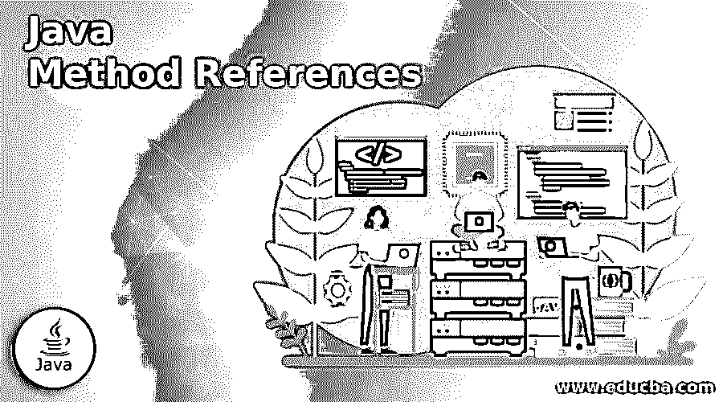

# Java 方法引用

> 原文：<https://www.educba.com/java-method-references/>




## Java 方法参考简介

下面的文章提供了 Java 方法参考的概要。在 JDK 8 中，lambda 表达式被引入来在一行中创建匿名方法来执行一个操作。但是在调用现有方法时编写 lambda 表达式时，这种操作可以通过使用方法引用来实现。这使得在存在对现有方法的调用的情况下，表达式更加紧凑，可读性更好。此外，在方法引用范围内，解析运算符(:: )用于将方法名与类名分开。

### Java 方法引用的类型

让我们用一个例子来看看方法引用的必要性:

<small>网页开发、编程语言、软件测试&其他</small>

**代码:**

```
public class Employee {
public enum Sex {
MALE, FEMALE
}
String name;
LocalDatejoiningDate;
Sex gender;
String emailAddress;
public int getNumberOfYears() {
}
public Calendar getJoiningDate() {
return joiningDate;
}
public static int compareByJoiningDate(Employeea, Employeeb) {
return a.joiningDate.compareTo(b.joiningDate);
}}
```

如果我们想按 joiningDate 方式对雇员列表进行排序，即谁先加入，那么我们可以在一个子类中调用下面给出的方法。

**代码:**

```
Person[] rosterAsArray = roster.toArray(new Employee[roster.size()]);
class JoiningDateComparator implements Comparator<Employee> {
public int compare(Employeea, Employeeb) {
return a.getJoiningDate().compareTo(b.getJoiningDate());
}
}
```

因此，我们可以编写一个 lambda 表达式来调用上面的方法，同时对列表进行排序，以比较两个雇员的加入日期。

**代码:**

```
Arrays.sort(rosterAsArray,
(a, b) ->Person.compareByAge(a, b)
);
```

或者我们可以用下面的方式调用这个方法；对数组中的每一对对象调用方法的意义相同。

**代码:**

```
Arrays.sort(rosterAsArray, Person::compareByAge)
```

JDk 8 中存在以下四种类型的方法引用:

#### 1.静态方法的引用

使用::运算符对静态方法的引用称为对静态方法的引用。

**语法:**

```
ClassName::MethodName()
```

**工作:**

*   这里被引用的方法是静态类型的，这意味着调用该方法不需要该类的任何实例；相反，只有类名就足够了。
*   因此，当 lambda 表达式中有一个 metionsClassName::MethodName 时，JRE 会转到该类，在提到的类中找到一个静态方法。因为它是对静态方法的调用，因此不能在非静态块下提及。

**举例:**

在下面的示例中，使用 java.util 包中的 bifunction 类的功能调用静态方法 add of Addition 类，其中该方法的引用存储在 myObj 对象中，并通过需要作为参数传递的值进行传递。

**代码:**

```
import java.util.function.BiFunction;
class Addition{
public static int add(int a, int b){
return a+b;
}
}
public class HelloWorld {
public static void main(String[] args) {
BiFunction<Integer, Integer, Integer>myObj = Addition::add;
int res = myObj.apply(30, 5);
System.out.println("Sum of given number is: "+res);
}
}
```

**输出:**


#### 2.对特定对象的实例方法的引用

**语法:**

```
object::methodName()
```

**工作:**

*   在这种类型的引用中，使用类的对象来引用它的一个实例方法。在这里，JRE 检查传递的参数是否与方法声明中提到的类型相同。
*   这有助于使用类的实例方法编写 lambda 表达式。

**举例:**

在下面的示例中，使用对实例方法的方法引用来调用 HelloWorld 类的 showName 方法。

**代码:**

```
interface MyInterface{
void display();
}
public class HelloWorld {
public void showName(){
System.out.println("Call to method ShowName");
}
public static void main(String[] args) {
HelloWorld obj = new HelloWorld();
MyInterface ref = obj::showName;
ref.display();
}
}
```

**输出:**


#### 3.对特定类型的任意对象的实例方法的引用

**语法:**

```
ClassName :: instanceMethodName()
```

**工作:**

*   这与上面给出的引用类型相同，不同之处在于这里引用的对象是不断变化的，这意味着许多对象都在调用相同的方法，但使用方法引用的是相同的类型。

**示例:**在下面的示例中，我们为数组中存储的所有字符串调用 compareToIgnoreCase 方法。因此，这不是一个接一个地传递不同的对象，而是发生在使用花名册的单个语句中。

**代码:**

```
import java.util.Arrays;
public class HelloWorld {
public static void main(String[] args) {
String[] empArray = { "John", "Jack", "Aditya", "Vishal", "Saurabh", "Amanda", "Daniel"};
Arrays.sort(empArray, String::compareToIgnoreCase);
System.out.println("Sorted list of names of Employees \n");
for(String str: empArray){
System.out.println(str);
}
}
}
```

**输出:**


#### 4.对构造函数的引用

**语法:**

```
myFunc(roster, HashSet<MyClass>::new);
```

**工作:**

*   这个引用调用也是为了调用一个类的构造函数。
*   为此，在 lambda 表达式中使用了“new”关键字，因此 JRE 推断调用该特定类的构造函数。

让我们以一个 lambda 表达式为例，它包含对 below 方法的调用，需要传递一个 HashSet 的新构造函数。

**代码:**

```
publicstatic<T, MYSRCextends Collection<T>, MYDESTextends Collection<T>>
MYDEST MyMethod(
MYSRC src,
Supplier< MYDEST>dest) {
MYDEST res = collectionFactory.get();
for (T t : src)
{res.add(t);
}
returnres;
}
```

那么λ表达式应该是这样的:

**代码:**

```
Set<myClass>rosterSet = MyMethod(roster, HashSet::new);
```

这里 JRE 自动推断传递的参数包含 myClass 类型的对象，或者我们可以使用下面的 lambda 表达式

```
Set<myClass>rosterSet = transferElements(roster, HashSet<myClass>::new);
```

**示例:**在下面的示例中，firstReference 类的构造函数使用“new”操作符调用，并存储在引用变量“inObj”中。然后这个引用变量被用来引用这个类的实例方法。

**代码:**

```
@FunctionalInterface
interface firstInterface{
firstReference show(String say);
}
class firstReference{
public firstReference(String say){
System.out.print(say);
}
}
public class HelloWorld {
public static void main(String[] args) {
//Method reference to a constructor
firstInterface inObj = firstReference::new;
inObj.show("Let’s begin learning Contructor type method reference");
}
}
```

**输出:**


### 结论

方法引用是调用应用程序中使用的 lambda 表达式中的现有方法的一种方式。JDK 1.8 引入了这一特性，以使 lambda 表达式更加紧凑，并重用现有代码。如上所示，有四种方法可以调用类名的方法。

### 推荐文章

这是 Java 方法参考指南。这里我们分别讨论 Java 方法引用和类型的介绍。您也可以看看以下文章，了解更多信息–

1.  [Java getMethod()](https://www.educba.com/java-getmethod/)
2.  [Java 布尔到字符串](https://www.educba.com/java-boolean-to-string/)
3.  Java 中的[范围](https://www.educba.com/range-in-java/)
4.  [JavaScript 倒计时](https://www.educba.com/javascript-countdown/)


