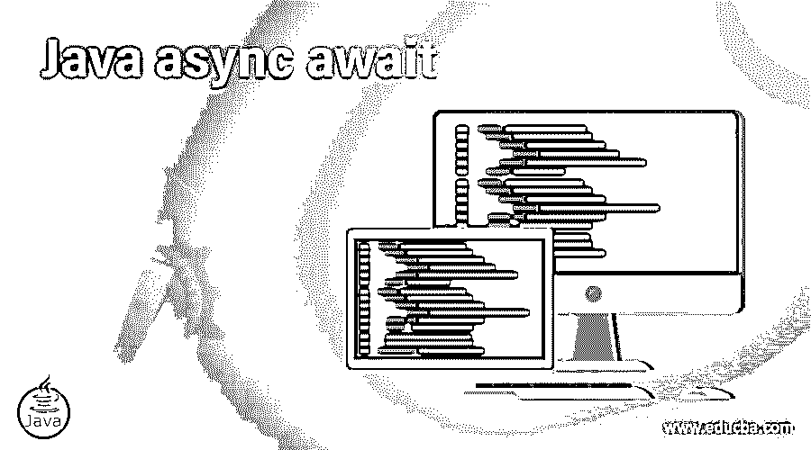
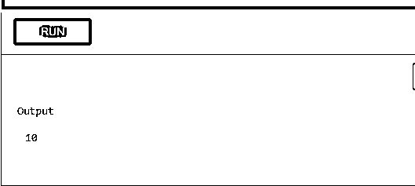
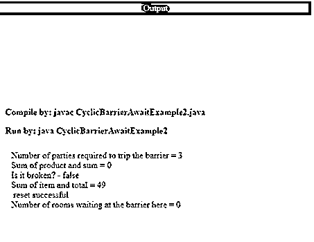
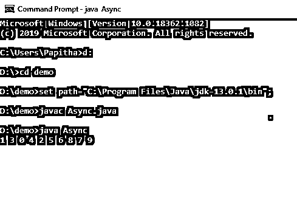
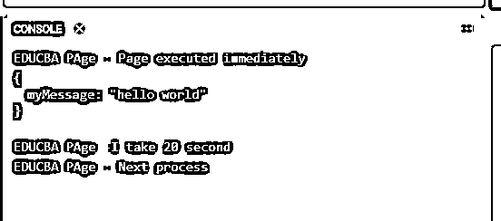

# Java 异步等待

> 原文：<https://www.educba.com/java-async-await/>




## Java 异步 await 简介

Java 异步 await 被定义为执行 I/O 绑定的操作，不需要任何应用程序响应。这些函数通常用于文件和网络操作，因为它们需要在操作完成时执行回调；此外，这个函数总是返回一个值。借助 awake 关键字，在常规控制流语句中使用异步调用，它是非阻塞代码。在这个主题中，我们将学习 Java async await。

**语法**

<small>网页开发、编程语言、软件测试&其他</small>

async / await 的一般签名如下

```
async  Void test() {
print('Welcome to EDUCBA');
}
```

**等待就像**

```
const test=async() =>
{
Await test ();
Print ("completed");
}
```

### Java 中的 async-await 函数是如何工作的？

Async await 函数帮助编写同步代码，同时在代码后面执行异步任务。我们需要 async 关键字。接下来是等待的部分，说明正常运行异步代码并继续下一行代码。Await 是一个新的操作符，它自动等待一个承诺来解析正在运行的流程，它用在 async 函数中。如果在任何其他情况下使用它，会导致语法错误。

在错误处理的情况下，如果函数抛出一个错误，async 做出的承诺将被拒绝。如果相应的函数恰好返回值，则承诺将被解决。这个非阻塞代码运行在一个单独的线程上，并通知主线程任务的完成或失败。Try-catch 在函数中用于同步处理错误。让我们以这样一个例子开始

```
async function hello() {
//process waiting
await new Promise(res => setTimeout(res, 2000));
// Rejection with 20 %
if (Math.random() > 0.2) {
throw new Error('Check the number.')
}
return 'number';
}
```

上面的代码说函数 hello()是异步的，它通过返回一个数字并通过检查数字抛出一个错误来解决这个问题。

接下来，一起使用 await 和 return 来挂起一个进程

```
async function miss() {
try {
return await hello();
} catch (e) {
return 'error caught';
}
}
```

使用该函数的更好的链接如下所示

```
Async function promise1( req,res)
{
Try
{
Let a=await a.get(req,uid);
Let b=await cart.get (yser,uid);
Res.send(await dosome(a,cart));
}
Catch (err)
{
Res.send(err);
}
}
```

所以这里 await 关键字指示函数 get()在捕获错误之前完成。

有了这个可完成的未来，它返回一个未来对象。这个可完成的未来是对异步计算的引用，实现了未来。

```
private static CompletableFuture<Void> hello{
try {
String intermediate = await(doA());
String res = await(doB(intermediate));
reportSuccess(res);
} catch (Throwable th) {
reportFailure(th);
}
return completedFuture(null);
}
```

### Java 异步 await 的例子

所以在这一节中，我们将看到 async 和 await 的优点是如何工作的。

#### 示例#1

这里让我们看看简单的 Java 代码。

```
import 'dart:async';
void main() async {
var a = await ten();
print(a);
}
Future<int> ten() async {
return 10;
}
```

**解释**

上面的代码使用的是未来，java 7 版本 API，等待十秒钟显示 10。

**输出:**




#### 实施例 2

```
import java.util.concurrent.TimeUnit;
import java.util.concurrent.TimeoutException;
import java.util.concurrent.BrokenBarrierException;
import java.util.concurrent.CyclicBarrier;
class Comput1 implements Runnable
{
public static int item = 0;
public void run()
{
item = 3 * 3;
try
{
CyclicBarrierAwaitExample2.newBarrier.await();
}
catch (InterruptedException | BrokenBarrierException e)
{
e.printStackTrace();
}
}
}
class Comput2 implements Runnable
{
public static int total = 0;
public void run()
{
// check if newBarrier is broken or not
System.out.println("Is it broken? - " + CyclicBarrierAwaitExample2.newBarrier.isBroken());
total = 20 + 20;
try
{
CyclicBarrierAwaitExample2.newBarrier.await(2000, TimeUnit.MILLISECONDS);
System.out.println("Number of rooms waiting at the barrier "+
"here = " + CyclicBarrierAwaitExample2.newBarrier.getNumberWaiting());
}
catch (InterruptedException | BrokenBarrierException e)
{
e.printStackTrace();
}
catch (TimeoutException e)
{
e.printStackTrace();
}
}
}
public class CyclicBarrierAwaitExample2 implements Runnable
{
public static CyclicBarrier newBarrier = new CyclicBarrier(3);
public static void main(String[] args)
{
CyclicBarrierAwaitExample2 test = new CyclicBarrierAwaitExample2();
Thread t = new Thread(test);
t.start();
}
@Override
public void run()
{
System.out.println("Number of parties required to trip the barrier = "+
newBarrier.getParties());
System.out.println("Sum of product and sum = " + (Comput1.item +
Comput2.total));
Comput1 comp1 = new Comput1();
Comput2 comp2 = new Comput2();
Thread t = new Thread(comp1);
Thread t2 = new Thread(comp2);
t.start();
t2.start();
TimeUnit unit = TimeUnit.SECONDS;
try
{
CyclicBarrierAwaitExample2.newBarrier.await(1,unit);
}
catch (InterruptedException | BrokenBarrierException | TimeoutException e)
{
e.printStackTrace();
}
System.out.println("Sum of item and total = " + (Comput1.item +
Comput2.total));
newBarrier.reset();
System.out.println(" reset successful");
}
}
```

**解释**

所以这里的值是在另一个线程处理任务时累加的。

**输出:**




#### 实施例 3

**Async.java**

```
import java.util.*;
import java.util.concurrent.*;
public class Async {
static List<Task> tasks = new ArrayList<>();
static ExecutorService executor = Executors.newScheduledThreadPool(3);
public static void main(String[] args) {
createTasks();
executeTasks();
}
private static void createTasks() {
for (int k= 0; k < 10; k++) {
tasks.add(new Task(k));
}
}
private static void executeTasks() {
for (Task task : tasks) {
executor.submit(task);
}
}
static class Task extends Thread {
int n;
public void run() {
try {
Thread.sleep(new Random (). nextInt (1000));
} catch (InterruptedException e) {
e.printStackTrace();
}
printNum();
}
private void printNum() {
System.out.print(n + " ");
}
public Task(int n) {
this.n = n;
}
}
}
```

**解释**

上述代码通过分配一个线程值(即一个工作线程)来启动一个任务。这里我们停止了 print number()函数中的同步任务。因此，输出如下所示:

**输出:**




#### 示例 4–时间秒

**Async.html**

```
<html>
<meta charset="utf-8"/>
<body> Understanding JavaScript Program Execution</br>
<script type="text/javascript">
function tensec()
{
return new Promise((resolve,reject)=>{ setTimeout(() => {
console.log('EDUCBA PAge -I take 20 second');
resolve();
}, 10000);
});
}
async function run()
{
console.log('EDUCBA PAge : Page executed immediately');
await tensec();
console.log('EDUCBA PAge : Next process');
}
run();
</script>
</body>
</html>
```

**解释**

上面的代码执行它的承诺，并在 asyn-await 的帮助下显示它们的等待时间间隔。例如，上面的脚本等待 20 秒来完成任务。

**输出:**




### 结论

结束编写异步代码有点困难，最重要的是，承诺是定义延迟执行流程的一般方式。在本文中，我们学习了如何编写看起来像同步代码的异步代码。在复杂的代码中使用 async 更加重要。JavaScript 开发人员必须非常了解这个概念。

### 推荐文章

这是一个 Java 异步 await 指南。在这里，我们将讨论 async-await 函数在 Java 中是如何工作的，并给出例子和输出。您也可以看看以下文章，了解更多信息–

1.  [Java 别名](https://www.educba.com/java-alias/)
2.  [JavaScript onfocus](https://www.educba.com/javascript-onfocus/)
3.  [Java 格式化程序](https://www.educba.com/java-formatter/)
4.  [Java 按值调用](https://www.educba.com/java-call-by-value/)


