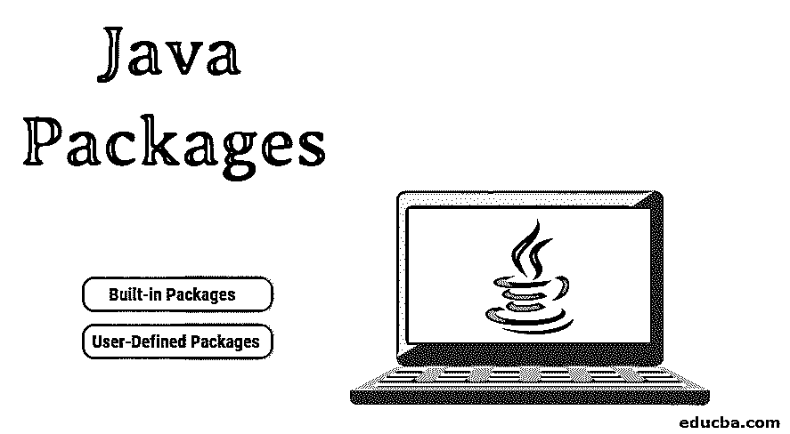

# Java 包

> 原文：<https://www.educba.com/java-packages/>




## Java 包介绍

以下文章 Java Packages 提供了用 Java 创建包的概要。

*   这个包代表了一组类、接口和子包的[封装。包使术语定义良好，并与编码设计上下文紧密关联，这样开发人员就有了一个肤浅的想法。](https://www.educba.com/encapsulation-in-java/)
*   包也有助于控制数据封装，因为类的默认和受保护成员只在包范围内出现；它们不是对所有类都公开的。
*   在进入包的工作之前，让我们先来看一些术语——子包——一个子包放在另一个包中，就像在 java.util.ArrayList 中一样， [Java 是父包](https://www.educba.com/frameworks-in-java/)，util 是子包。

### 包装工作

*   目录镜像包；现在的问题是 java 运行时如何知道在哪里寻找用户已经创建的包？
*   缺省情况下，java 运行时使用当前工作目录作为它的起始点，并且你的用户在主目录的子目录中创建了一个包，它会被找到。
*   另一种方法是通过设置 CLASSPATH 环境变量来指定目录路径。
*   最后一种方法是在 java 和 javac 中使用 CLASSPATH 选项来指定类的路径。
*   请注意，为了简单起见，应该按照域名的顺序来命名包。
*   java 编译器必须知道基目录的位置，以便定位类；为此，我们需要在系统中设置环境变量。
*   如果我们以两个包 awt 和 java.awt.event 为例，后者是一个子包，因此后者的目录结构应该包含 awt 内的事件目录，“$BASE_DIR\java\awt”是父包的地址，“$BASE_DIR\java\awt\event”是子包的地址。

### 包装类型

*   Java 提供了使用内置 [java 包](https://www.educba.com/java-package-example/)或基于用例使用用户创建的包的灵活性。
*   内置包在编码时总是很重要，因为它们提供了很多；rt.jar 文件包含多个功能定义，它们出现在 java.util.* like 包中。

现在让我们详细看看内置和用户定义的软件包——

<small>网页开发、编程语言、软件测试&其他</small>

#### 1.内置软件包

内置包包含大量的 java 类，它包含以下包——

*   lang——在这个特定的包中找到了对象类；这个包是自动导入的，它捆绑了基本类。
*   这是一个至关重要的包，包含许多与集合相关的类，如 ArrayList、 [HashMap](https://www.educba.com/hashmap-in-java/) 等。所有的数据结构实现都在这个类中，您需要通过抽象地合并它们来使用它们。
*   输入输出流处理和处理相关的类放在这个包中；这类的一个例子是 InputStreamRe、Filereader [ader](https://www.educba.com/javascript-filereader/) 等。
*   net——包含用于执行某些网络相关操作的类；示例类是 Socket 和 SocketAddress。
*   bean——包含与 bean 开发相关的类，基于 java beans 体系结构的组件。

#### 2.用户定义的包

*   用户总是有特权将他创建的类封装到某个包中；用户只能以自己的方式定义该包的名称和目录结构。
*   因此，这个包就像一个名称空间，通常包含相关的类，如果这个包没有被标记为任何类，它就会被放入默认包中。

**例子**

```
package com.supplychains
class SupplyChainManagement
{
public void getPrompt()
{
System.out.println(“Welcome to SCM”);
}
}
```

现在，只需导入名为“com.supplychains”的包，就可以在其他类中访问该类，然后就可以访问类 supply chain management 及其成员函数和成员变量。

### 如何用 Java 创建包？

首先，你要上课；让我们只考虑上面描述的阶级结构。

```
package com.supplychains
class SupplyChainManagement
{
public void getPrompt()
{
System.out.println(“Welcome to SCM”);
}
}
```

这个类应该像“SupplyChainManagement.java”是我们保存它的名字一样保存。

*   现在用 javac 编译器编译这个文件，可以通过编写 javac SupplyChainManagement.java 来完成；这将在同一目录中创建一个. class 文件。
*   现在我们可以使用命令“javac-d . supplychainmanagement . Java”，这个命令将导致包的形成，现在目录结构是我们必须关心的一件事在上面的命令中，放在-d 后面的代表当前的工作目录。所以在选中的目录下，会创建一个文件夹，并形成一个包，在这个包中会放置步骤 2 中创建的类文件。
*   下一步是编译包；这可以通过以下命令完成–

“javac -d..SupplyChainManagement.java。”

..表示父目录(如 c 盘或 D 盘)。

*   因此，通过这种方式，可以将多个类捆绑在一个目录结构中，该目录结构只能以相应的顺序访问。
*   现在您只需要使用 import 语句将这个包合并到任何 java 类中；请注意，java 运行时将根据环境变量中设置的路径来引用它，该变量只包含根目录。

### 结论

因此，我们阅读了一些关于 java 中的包，它们的创建，它们的工作，以及我们如何从任何地方创建包并导入到任何其他类中。包可以封装接口和类。各种各样的内置包已经可以用来利用数据结构和算法；java 提供了很多种，多线程也通过多个并发包得到支持。

### 推荐文章

这是 Java 包的指南。这里我们讨论包的介绍、工作和类型，包括内置的和用户定义的包，以及用 java 创建包。您也可以阅读以下文章，了解更多信息——

1.  [最佳 Java 编译器](https://www.educba.com/best-java-compilers/)
2.  [最佳 Java IDE](https://www.educba.com/best-java-ide/)
3.  [Java 中的堆排序](https://www.educba.com/heap-sort-in-java/)
4.  [Java 中的析构函数](https://www.educba.com/destructor-in-java/)


