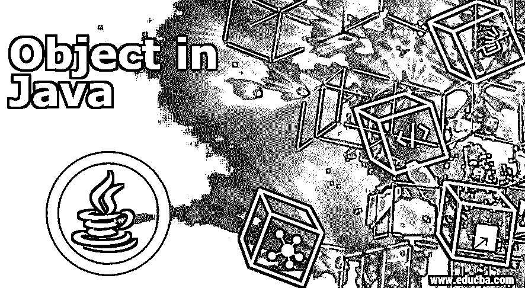

# Java 中的对象

> 原文：<https://www.educba.com/object-in-java/>




## Java 中的对象简介

Java 是一种强大的面向对象编程语言，由对象和类组成。这些对象使得在编码时更容易映射[现实生活中的实体。在用 java 编程时，这些对象会一直被使用。java 中的对象易于定义和使用。理解类和对象是必要的，因为像 Java 这样的面向对象编程语言中的一切都是基于它们的。在本文中，我们将看到与该对象相关的所有细节以及示例。](https://www.educba.com/what-is-coding/)

### 如何用 Java 创建一个对象？

*   如果你熟悉 java 编程，你可能知道一个对象是用 Java 中的类创建的。类什么都不是，但是它提供了创建对象的蓝图。类别是用来执行个体化物件。所以从技术上讲，在用 Java 创建对象之前，我们已经声明了类。

让我们看看创建对象的语法

<small>网页开发、编程语言、软件测试&其他</small>

**语法:**

```
ClassName objectName = new ClassName();
```

*   语法简单易懂。它以我们声明对象的类名开始，后面是对象名。对象名什么都不是，但它类似于用用户偏好的名称声明一个变量名。直到这个用名字定义对象的过程在 Java 中被称为对象声明。
*   对象声明后跟一个等号(=)，它将把对象的引用赋给我们声明的对象变量。new 关键字用于创建新对象。这个新的关键字将使用蓝图创建一个新的对象，即类，并将为该对象分配内存。这种新对象的创建在 Java 中称为对象实例化。
*   然后，new 关键字后面是该类的方法或构造函数。new 关键字将在创建新对象时自动调用类的构造函数；这个过程在 java 中被称为对象初始化。

我们也可以用不同的方式声明一个对象。首先，我们将声明它，然后我们可以初始化它。

```
ClassName objectName;      // Declarationobject
Name = new ClassName();       // Initialization
```

*   每次我们在 java 中创建新的对象，内存都会分配给新创建的对象，那个对象的引用会返回给对象变量。然后，该对象引用可用于执行与对象相关的不同操作。这里的对象引用只是对应于新声明的对象变量名。

### Java 中对象的特性

*   java 中的每个对象都有自己的身份。没有两个对象会有相同的身份。每个对象将对应于一个不同的内存位置，用户将无法获得该内存位置的地址。
*   一个对象将有与之相关联的类型。每个对象都有一个数据类型作为类。
*   一个对象中还会声明两件事情状态和行为。这些东西是在类本身中声明的。状态将定义属性，行为将定义与类相关的动作。

### Java 中对象的属性

当在 Java 中定义一个类时，我们定义了两个主要的东西。第一个表示属性或状态。这就是所谓的对象属性。属性只是与类相关的特定数据。每个对象，当用 java 创建时，都有这些可用的属性。我们可以通过使用对象引用在类内或类外访问这些属性，这取决于为它使用的修饰符。因为对象类似于实时实体，所以属性表示实体的状态。例如，移动的对象可能具有类似大小、重量等的属性。不同的内存位置将被分配给与我们创建的对象相关的每个属性。

### Java 中对象的方法

*   我们在创建类时声明的第二个主要的东西是方法。这些方法就像在类中声明的函数一样。这些方法也是特定于声明它们的类的。这些方法表示使用对象引用调用时要执行的特定操作或过程。这些方法就像现实世界中的行为。例如，移动电话将执行呼叫或拨号的动作。呼叫动作只不过是移动的行为。
*   在用 Java 编程时，我们通常会创建一个对象，为其数据成员赋值，并使用方法执行与 ii 相关的特定操作。这些方法是组合和执行编程时所需的特定操作的简单方法。
*   我们可以执行方法中要求的任何事情。这些方法还可以访问类中定义的数据成员。我们可以对类中的数据成员执行操作。只要需要，我们可以在类中定义任意数量的方法。

### Java 中对象的规则

*   对于任何对象的声明都没有这样的硬性规定，但是我们在声明对象名时应该遵循标准的 [java 命名约定](https://www.educba.com/java-naming-conventions/)。
*   我们只能通过对象引用或在特殊情况下通过类引用来访问类的方法，但在这两种情况下，我们都不能访问或修改方法的实现。
*   我们可以根据需要多次重用曾经定义过的对象。
*   我们可以根据需要轻松移除或替换正在使用的对象。

### 结论

所以，java 中的一切都围绕着对象。只需使用类名就可以创建一个对象。一个对象将包含状态和行为。我们可以使用对象引用来访问该类的方法和数据成员。每个对象都有与之相关的某些特征或属性。作为一种面向对象的编程语言，java 中的一切都是对象。这些对象使得 java 编程语言更加安全和健壮。

### 推荐文章

这是一个 Java 对象的指南。这里我们讨论如何在 java 中创建一个对象，它的特征、属性、方法以及规则。您也可以阅读以下文章，了解更多信息——

1.  [Java 中的构造函数](https://www.educba.com/constructor-in-java/)
2.  [Java 中的排序](https://www.educba.com/sorting-in-java/)
3.  [Java 中的构造函数](https://www.educba.com/constructor-in-java/)
4.  [Java 中的 JCheckBox](https://www.educba.com/jcheckbox-in-java/)


