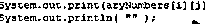
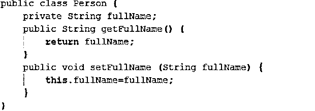

# Java 命令

> 原文：<https://www.educba.com/java-commands/>

## Java 命令简介

Java 是一种多用途、通用的 T2 计算机编程语言，它是基于类和面向对象的最佳融合。它也没有过多的实现依赖性。今天，几乎在每个领域，我们都可以看到 Java 的身影。这种语言主要提供三种计算平台，即 J2SE，J2ME，[，J2EE](https://www.educba.com/what-is-j2ee/) 。这是最流行的基于客户机-服务器应用程序的编程语言之一，带有一个由 Java 运行时环境和其他实用程序组成的 Java 开发工具包。它由 [Java 虚拟机](https://www.educba.com/cheat-sheet-java/)和一个字节码组成，使得这种语言可以在任何平台和任何[计算机架构](https://www.educba.com/types-of-computer-architecture/)上编译和执行。Java 受到一些开发环境的支持，如 Eclipse、IntelliJ、BlueJ、Netbeans 等。，但有一些基本命令可以通过终端或命令提示符或编程中使用的一些语法来执行。在本教程中，我们将讨论不同类型的 Java 命令。

### 基本 Java 命令

基本命令如下所述:

<small>网页开发、编程语言、软件测试&其他</small>

*   **Java–version:**这是一个非常基本的 Java 命令，用于检查您机器上安装的 Java 版本。这也用于确保变量的安装和路径设置是否正确。
    T3

    

*   **Javac–version:**这个命令用来告诉你负责编译源代码的编译器版本。这也是 Java 开发工具包(俗称 JDK)的一部分。T3T5】
*   **Whereis:** 这个 Java 命令用于在目录中查找特定的组件。在下面的例子中，我们考虑了 javac。
    T3

    

*   为了在程序被转换成字节码后执行它，我们先使用 Java，然后使用程序名。在下面的例子中，我们采用了名为 Hello World 的程序。
    

    

*   **Echo:** 这个 Echo 命令在 Java 中使用，是一个必须知道的命令，因为它有助于显示特定文件的数据。通常，这用于检查路径变量。
    T3

    

*   **Main:** 顾名思义，这是程序的主函数，编译器首先到达并执行它的一部分。
    T3

    

*   **Public:** 这是 java 中的一个访问修饰符，用来定义程序控件的访问级别。Public 意味着该类是公开可用的。
    T3

    

*   **类**:是一个逻辑实体，经常说是对象的蓝图。它在一个称为类的实体中包含函数和其他数据成员。
    T3

    

*   Java 中的一切都是对象，因为它是组成一切的唯一物理实体。它是对已经可用的数据进行操作的过程和数据的组合。
    T3

    

*   **Static** :这是一个 java 关键字，确保可以在不使用对象的情况下调用功能块的方法。
    T3

    

### 中间 Java 命令

中间命令解释如下:

*   这是 java 关键字，用于指定预期函数没有可能的返回类型。
    

    

*   **args[]:** 这是用来指定 main 函数中包含的参数，[]暗示数组。T3T5】

*   **String:** 这是一个预建的 Java 类，用于处理 Java 中所有与字符串相关和与字母相关的关键字。
    T3

    

*   **System:** 这是 Java 中的一个预建类，存在于默认的 lang 包中，用于处理标准输入、标准输出和其他流错误。
    T3

    

*   **Out:** 这是系统类的对象和静态成员，用于在输出路径上打印消息，输出路径通常是控制台或文件。
    T3

    

*   **打印:**该方法用于顺序打印程序内容，光标不会移动到下一行。T3T5】

*   **Println** :该功能用于打印新一行的内容。
    T3

    

*   **Private** :这是 java 中的访问修饰符，仅用于定义方法在类中的作用域或函数。
    T3

    

*   **Int** :这是用于处理所有整数类型值的整数数据类型，因此变量需要用 Int 数据类型初始化。
    T3

    

*   **Double** :另一种数据类型，用于定义带有小数值的变量。它属于用于存储双精度值的 Java 基本数据类型。与 float 变量相比，它的范围更大，float 变量也用于定义和声明带小数的变量。
    T3

    

### 高级 Java 命令

高级命令如下所述:

*   **返回:**这是在程序结束时使用的命令，专门返回一个值。它还是一个保留关键字，这意味着它不能在 Java 中用作标识符。return 关键字可用于从有值或无值的方法中退出。
    T3

    

*   **This:** 这个关键字在 java 中是用来引用对象的当前状态或者当前类的[实例变量](https://www.educba.com/instance-variable-in-java/)或者当前类的构造函数。
    

    

*   **超级关键字:**是一个变量，用来引用父类对象或者调用父类方法。
    T3

    

*   **Extends:** 这是在继承的情况下使用的关键字，继承是一种 Java 面向对象的编程概念，其中一个组件(类或接口)的属性被其他组件调用。延伸和实现齐头并进。
    T3

    

### 使用 Java 命令的提示和技巧

当您使用这些 Java 命令时，在 IDE 中使用 TAB 按钮将会加快您的开发工作，因为在这种情况下关键字将会自动生成。

### 结论

这些是 Java 开发人员经常使用的一些 Java 命令和关键字。除了程序的逻辑之外，还有几个其他的命令。我希望你喜欢我们的文章。敬请关注。

### 推荐文章

这是 Java 命令的指南。这里我们讨论了基本、中级和高级 Java 命令以及使用的技巧和诀窍。您也可以阅读以下文章，了解更多信息——

1.  [Java 中的数据类型](https://www.educba.com/data-types-in-java/)
2.  [Java getMethod()](https://www.educba.com/java-getmethod/)
3.  [Java 瞬态](https://www.educba.com/java-transient/)
4.  [Java 线程优先级](https://www.educba.com/java-thread-priority/)

