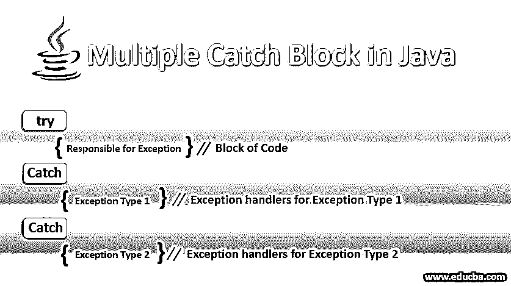
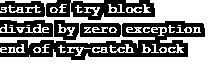
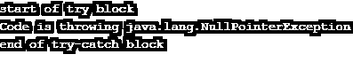

# Java 中的多重 Catch 块

> 原文：<https://www.educba.com/multiple-catch-block-in-java/>




## Java 中的多重 Catch 块简介

我们可以通过在 java 中插入 try-catch 块来处理代码中的异常。在本文中，我们将看到如何通过使用多个 catch 块或 catch 块的多个参数来处理单个 try 块的多个异常。

### 句法

下面给出了 Java 中多个 Catch 块的语法:

<small>网页开发、编程语言、软件测试&其他</small>

语法 1: 简单的 try-catch 块

```
try
{
//code snippet which might responsible for exceptions
}
catch (<type_of_exception> <name_of_exception_object>)‏
{
//here we handle exceptions
}
```

**语法 2:** 带有多个 catch 块的 try-catch 块

```
try
{
//code snippet which might responsible for exceptions
}
catch (<type_of_exception> <name_of_exception_object>)‏ //catch block 1
{
//here we handle exceptions
}
catch (<type_of_exception> <name_of_exception_object>)‏ //catch block 2
{
//here we handle exceptions
}
catch (<type_of_exception> <name_of_exception_object>)‏ //catch block 3
{
//here we handle exceptions
}
```

**语法 3:** 使用多个 catch 语句作为 catch 块参数的 try-catch 块

```
try
{
//code snippet which might responsible for exceptions
}
catch (<type_of_exception1> | <type_of_exception2> | <type_of_exception3> <name_of_exception_object>)‏
{
//here we handle exceptions
}
```

### Java 中的 Catch 块是如何工作的？

首先，我们需要在转移到 catch 块之前检查 try 块。

#### 1.尝试阻止

它包含可能导致异常的代码片段。因此，每当您怀疑您的代码可能会导致异常时，请将该代码片段放在 try 块中。try 块至少需要一个 catch 块。

#### 2.捕捉块

它包含代码片段，该代码片段处理在其对应的 try 块中编写的代码可能发生的异常。现在如何处理多个异常，如果有的话？

你可以采取两种方式:

*   **对一个 try 块使用多个 Catch:**在这里，您可以为一个相应的 Try 块处理多个 Catch 块下的多个异常。程序流会自动逐个到达 catch 块，然后根据异常找到相应的 catch 块并进行相应的处理。
*   **在 Catch 块的参数中使用多个 Catch 语句:**这个特性来自 Java 7。在这里，您可以在一个 catch 块(由管道符号分隔)下为相应的 try 块处理多个异常。程序流将自动到达 catch 块，然后为 try 块找到 catch 块参数中的相应异常，并进行相应的处理。

### 构造器

我们也可以在构造函数中编写 try-catch 块，它会像预期的那样工作。在下面的例子中，我们将在 try 构造函数中编写代码:try 块将生成算术异常，该异常在 catch 块中处理。

```
public class MultipleCatchBlockInConstructor
{
MultipleCatchBlockInConstructor()
{
try
{
int num=6/0;
}
catch(ArrayIndexOutOfBoundsException excp)
{
System.out.println("Exception is : "+excp);
}
catch(ArithmeticException excp)
{
System.out.println("Exception is : "+ excp);
}
}
public static void main(String[] args) {
MultipleCatchBlockInConstructor mc=new MultipleCatchBlockInConstructor();
}
}
```

**输出:**


### Java 中多个 Catch 块的示例

在本节中，我们将讨论许多代码示例。您应该自己尝试这段代码，并将输出与给定的代码进行比较。

#### 示例#1

这是一个简单的多 catch 块的例子，其中我们编写了一个语句，该语句将在 try 块中生成异常，这些异常将由三个 catch 块中相应的 catch 块处理。

**代码:**

```
public class MultipleCatchBlockInJava {
public static void main(String[] args) {
try{
System.out.println("start of try block");
int num = 6/0;
}
catch(ArithmeticException e)
{
System.out.println("divide by zero exception ");
}
catch(ArrayIndexOutOfBoundsException e)
{
System.out.println("ArrayIndexOutOfBounds Exception occurs");
}
catch(Exception e)
{
System.out.println("Any other excpetion");
}
System.out.println("end of try-catch block");
}
}
```

**输出:**




#### 实施例 2

在这个例子中，我们通过 try 和 catch 块说明了数组的越界异常处理。

**代码:**

```
public class MultipleCatchBlockInJava {
public static void main(String[] args) {
try{
System.out.println("start of try block");
int arr[]=new int[6];
System.out.println(arr[12]); //we want to access 12th element of array which does not exist as size is of 6
}
catch(ArithmeticException e)
{
System.out.println("divide by zero exception");
}
catch(ArrayIndexOutOfBoundsException e)
{
System.out.println("Array IndexOutOfBounds Exception occurs");
}
catch(Exception e)
{
System.out.println("Any other exception");
}
System.out.println("end of try-catch block");
}
}
```

**输出:**


#### 实施例 3

在这个例子中，我们将看到 catch 块是如何处理空指针的。另外，请注意，try 块中有多种异常情况，但是一旦程序流到达第一个异常生成语句(此处为 Nullpointer 异常)，它将立即移出 try 块，并在 catch 块中搜索异常处理程序。try 块中的另一个异常生成语句(这里是数组索引越界异常)被忽略。

**代码:**

```
public class MultipleCatchBlockInJava {
public static void main(String[] args) {
try{
System.out.println("start of try block");
String str=null;
System.out.println(str.length());  //we want to get length of a null string
int arr[]=new int[6];
System.out.println(arr[12]); //we want to access 12th element of array which does not exist as size is of 6
}
catch(ArithmeticException e)
{
System.out.println("divide by zero exception");
}
catch(ArrayIndexOutOfBoundsException e)
{
System.out.println("Array IndexOutOfBounds Exception occurs");
}
catch(NullPointerException e)
{
System.out.println("Null pointer Exception occurs");
}
System.out.println("end of try-catch block");
}
}
```

**输出:**


#### 实施例 4

在这个例子中，我们将检查一个 catch 块的多个参数将如何处理异常。

**代码:**

```
public class MultipleCatchBlockInJava {
public static void main(String[] args) {
try{
System.out.println("start of try block");
String str=null;
System.out.println(str.length());  //we want to get length of a null string
int arr[]=new int[6];
System.out.println(arr[10]); //we want to access 10th element of array which does not exist as size is of 6
}
catch(ArithmeticException | ArrayIndexOutOfBoundsException | NullPointerException e )
{
System.out.println("Code is throwing " + e);
}
System.out.println("end of try-catch block");
}
}
```

**输出:**




### 结论

从 java 编程的角度来看，我们对多个 catch 块的学习到此结束。总结一下:每当你需要处理多个异常时，你可以把它们写在多个 catch 块中。或者，对于 java 7 和更高版本，您可以在单个 catch 块的参数中编写多个异常，程序流会自动选择这一点。此外，为了更好地理解，您应该自己编写代码，这一点很重要。

### 推荐文章

这是一个 Java 中多重 Catch 块的指南。这里我们讨论 java 中多重 catch 块的介绍和构造函数，以及不同的例子和代码实现。您也可以阅读以下文章，了解更多信息——

1.  [Java 中的 17 大不同工具](https://www.educba.com/java-tools/)
2.  [如何用 Java 连接数据库？](https://www.educba.com/how-to-connect-database-in-java/)
3.  [实现快速排序算法的步骤](https://www.educba.com/quick-sorting-algorithms-in-java/)
4.  [在 JavaScript 中封装的工作方式](https://www.educba.com/encapsulation-in-javascript/)


