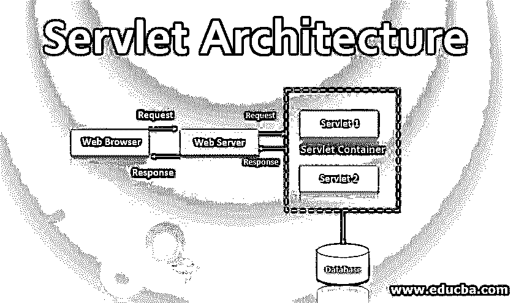
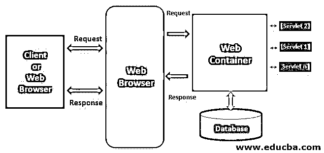

# Servlet 架构

> 原文：<https://www.educba.com/servlet-architecture/>

## Servlet 架构简介

Servlet 架构属于用于创建动态 web 应用程序的 java 编程语言。主要是 servlets 用于开发服务器端应用。Servlets 非常健壮且可伸缩。在引入 servlets 之前，使用的是 CGI(公共网关接口)。Servlets 用于动态执行客户端请求和响应任务。Servlets 可用于执行任务，

*   控制应用程序的流程。
*   生成动态网页内容。
*   服务器端负载平衡。
*   实现业务逻辑。

有两种类型的 Servlets。通用 Servlets 2。可以通过三种可能的方式创建 http Servlet . Servlet :( I)实现 Servlet 接口;( II)扩展通用 Servlet。㈢扩展 HTTPServlet。servlets 可用的三种生命周期方法是 init()、service()和 destroy()。每个 servlet 都应该覆盖这些方法。

<small>网页开发、编程语言、软件测试&其他</small>

### Servlet 架构的组件

下图显示了组件如何在 servlet 架构上工作。

#### 1.客户

在这种架构中，web 浏览器充当客户端。与 web 浏览器连接的客户端或用户。客户端负责向 web 服务器发送请求或 HttpRequest，并处理 Web 服务器的响应。

#### 2.网络服务器

Web 服务器控制 web 用户如何访问托管文件，并负责处理用户请求和响应。这里的服务器是软件，它理解 URL 和 HTTP 协议。每当浏览器需要在 web 服务器上托管文件时，使用 HTTP 请求处理客户端请求；如果找到请求的文件，通过 HTTP 响应将它发送回浏览器。有两种类型的 web 服务器静态和动态 web 服务器，在静态 web 服务器中，它按原样发送文件，但在动态 web 中，服务器托管的文件在发送到浏览器之前会被更新。

#### 3.Web 容器

web 容器是 web 服务器中的一个组件，它与 Java servlets 交互。web 容器负责管理 servlets 的生命周期，它还执行 URL 映射任务。Web 容器在服务器端处理 servlets、JSP 和其他文件的请求。servlet 执行的重要任务是加载和卸载 servlet，创建和管理请求和响应对象，以及执行 servlet 管理的整体任务。

### Servlet 请求流

下面是处理 servlet 请求的步骤，考虑上面的图表。

*   客户端发送一个请求。
*   Web 服务器接受请求并将其转发给 web 容器。
*   Web 容器在 web.xml 文件中搜索请求 URL 模式，并获取 servlet 的地址。
*   如果 servlet 还没有被实例化，它将通过调用 init()方法被实例化和初始化。
*   容器通过传递 ServletRequest 和 ServletResponse 对象来调用公共服务()。
*   Public service()方法将 ServletRequest 和 ServletResponse 对象分别转换为 HttpServletRequest 和 HttpServletResponse 对象。
*   公共服务()方法调用受保护的服务()。
*   受保护的服务()方法检查客户机请求&调用相应的 do__()方法。
*   通过将 do__()生成的结果发送到客户端来处理请求。

### 优势

以下是 servlet 的一些重要优势:

*   Servlets 是独立于服务器的，因为它们与任何 web 服务器兼容。与 ASP 和 JavaScript 等其他服务器端 web 技术相比，这些技术是特定于服务器的。
*   Servlets 是独立于协议的，即它支持 FTP、SMTP 等。主要是它提供了对 HTTP 协议功能的扩展支持。
*   Servlets 是持久的，因为它在显式销毁之前一直保留在内存中，这有助于多个请求的处理，并且一个数据库连接可以处理多个数据库请求。
*   Servlets 是可移植的；因为 servlets 是用 java 编写的，所以它们是可移植的，支持任何网络服务器。
*   与其他脚本语言相比，servlets 被编译成字节码的执行速度更快。字节码转换提供了更好的性能，并有助于类型检查和错误。

### Servlet 架构的使用

让我们看看下面给出的 servlet 的一些用法:

1.  Servlets 用于[表单数据操作](https://www.educba.com/data-manipulation-language/)，比如接受表单数据和生成动态 HTML 页面。
2.  Servlets 有助于开发服务器负载平衡应用程序，其中负载平衡是在不同的服务器之间进行的。
3.  Servlets 在企业网络平台中用作中间层，用于连接 SQL 数据库。
4.  Servlets 可以与 applets 集成，以提供高级交互性和动态 web 内容生成。
5.  Servlet 用于开发应用程序，它们在中间层充当主动代理，共享数据。
6.  因为 servlet 支持各种协议，如 HTTP、FTF 等。，这有助于开发文件服务器应用程序和支持聊天的应用程序等应用程序。

### 结论

与任何其他脚本语言相比，Java servlets 在性能上更好，并且它们是平台独立的。Servlets 在请求和响应处理方面是动态的。由于 servlet 支持各种协议，因此在开发 web 应用程序时可以使用 servlet 来处理不同的协议。总的来说，servlets 最适合开发动态 web 应用程序。

### 推荐文章

这是一个 Servlet 架构的指南。这里我们讨论 Servlet 架构的组件、请求流、优点和用途。你也可以看看下面的文章来了解更多-

1.  [JSP vs Servlet](https://www.educba.com/jsp-vs-servlet/)
2.  [小程序生命周期](https://www.educba.com/applet-life-cycle/)
3.  Servlet 中的[会话](https://www.educba.com/session-in-servlet/)
4.  [Servlet 过滤器](https://www.educba.com/servlet-filter/)

