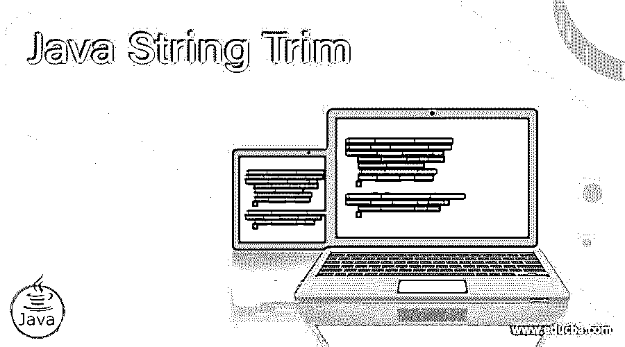
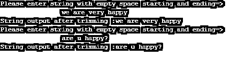
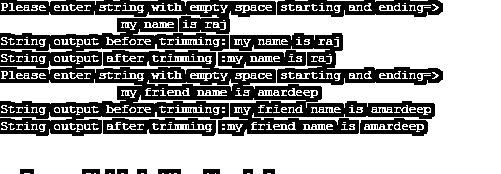

# Java 字符串修剪

> 原文：<https://www.educba.com/java-string-trim/>




## Java 字符串修剪简介

String trim 是 Java 中的一个方法。trim()用于移除字符串两端的空格。java.lang.String 包中提供了 trim()方法。为了使用 trim 方法，我们必须导入这个包。Java 根据其 Unicode 识别空字符。Java 中空字符的 Unicode 是' \u0020 '。因此，在处理 trim()方法时，java 编译器会检查这个 Unicode 字符串中的空格，如果发现任何空格，就会将其从两端删除。从技术上讲，起始空格被称为前导空格，结束空格被称为尾随空格。通过删除不必要的空白使可读性更好。

**实时场景:**我们知道，Java 或其他任何编程语言中的每个字符都会占用一些内存，同理 Java 中的空字符也会占用空间。为了保存这个，我们在 Java 中使用 trim()方法。

<small>网页开发、编程语言、软件测试&其他</small>

### trim()方法在 Java 中是如何工作的？

*   trim()方法仅适用于字符串值。它删除字符串值两端的空格。

**签名:**

```
public String trim()
```

**返回值:**返回去掉前后串的字符串作为输出。

**举例:**

| " |  |  |  | EDUCBA 是在线课程提供商 |  |  | " |

*   在上面的例子中，在前面有 3 个空位，在末端有 2 个空位。
*   删除这些空格，我们必须对上面的字符串应用 trim 方法，然后我们得到字符串“EDUCBA 是在线课程提供商”。

**方法的内部实现:**

```
public String trim() {
int length = value.length;
int count = 0;
char[] characters = value;
while ((count  < length) && (characters[count ] <= ' ')) {
count++;
}
while ((count < length) && (characters [length - 1] <= ' ')) {
length--;
}
return ((count > 0) || (length <value.length)) ? substring(count, length) : this;
}
```

### 例子

下面举几个例子

#### 示例#1

**代码:**

```
//Java package
//package com.string.trim;
//creating class
public class JavaTrim {
// main method for run the Java application
public static void main(String args[]) {
// declaring a string
String string1 = "       Hi, I am Paramesh       ";
// displaying the output
System.out.println("String output after trimming :" + string1.trim());
// declaring a string
String string2 = "       Hi, I am Amardeep       ";
// displaying the output
System.out.println("String output after trimming :" + string2.trim());
}
}
```

**输出:**


#### 实施例 2

**代码:**

```
//Java package
//package com.string.trim;
import java.util.Scanner;
//creating class
public class JavaTrim {
// main method for run the Java application
public static void main(String args[]) {
Scanner scanner=new Scanner(System.in);
System.out.println("Please enter string with empty space starting and ending=>");
// Asking a user to enter input string
String string1 = scanner.nextLine();
// displaying the output
System.out.println("String output after trimming :" + string1.trim());
System.out.println("Please enter string with empty space starting and ending=>");
// Asking a user to enter input string
String string2 = scanner.nextLine();
// displaying the output
System.out.println("String output after trimming :" + string2.trim());
scanner.close();
}
}
```

**输出:**




#### 实施例 3

**代码:**

```
//Java package
//package com.string.trim;
import java.util.Scanner;
//creating class
public class JavaTrim {
// main method for run the Java application
public static void main(String args[]) {
Scanner scanner=new Scanner(System.in);
System.out.println("Please enter string with empty space starting and ending=>");
// Asking a user to enter input string
String string1 = scanner.nextLine();
System.out.println("String output before trimming: "+string1.trim());
// displaying the output
System.out.println("String output after trimming :" + string1.trim());
System.out.println("Please enter string with empty space starting and ending=>");
// Asking a user to enter input string
String string2 = scanner.nextLine();
System.out.println("String output before trimming: "+string2.trim());
// displaying the output
System.out.println("String output after trimming :" + string2.trim());
scanner.close();
}
}
```

**输出:**




#### 实施例 4

**代码:**

```
//Java package
//package com.string.trim;
import java.util.Scanner;
//creating class
public class JavaTrim {
// main method for run the Java application
public static void main(String args[]) {
Scanner scanner = new Scanner(System.in);
System.out.println("Please enter string with empty space starting and ending=>");
// Asking a user to enter input string
String string1 = scanner.nextLine();
System.out.println(
"String output before trimming: " + string1.trim() + " and it's length is :" + string1.length());
// displaying the output
System.out.println(
"String output after trimming :" + string1.trim() + " and it's length is :" + string1.trim().length());
scanner.close();
}
}
```

**输出:**


### 结论

Java 中的 String trim 用于删除字符串开头和结尾的空格。trim()方法根据空格的 Unicode 标识并移除这些空格。

### 推荐文章

这是一个 Java 字符串修剪的指南。在这里，我们讨论这个方法在 Java 中是如何工作的，并给出例子、代码和输出。您也可以看看以下文章，了解更多信息–

1.  [Java 字典](https://www.educba.com/java-dictionary/)
2.  [Java 库](https://www.educba.com/java-repository/)
3.  [JavaScript 浮动](https://www.educba.com/javascript-floating/)
4.  [Java 别名](https://www.educba.com/java-alias/)


