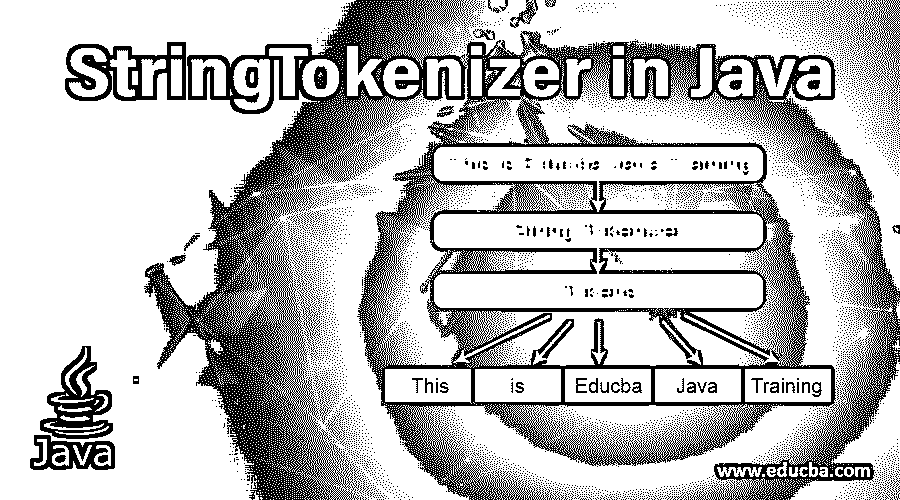
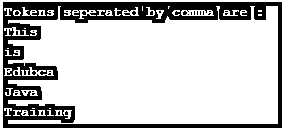
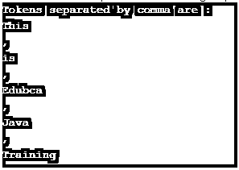
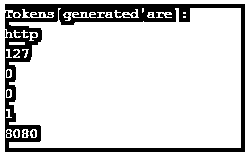
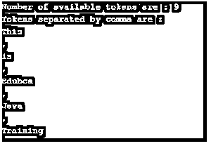

# Java 中的字符串化器

> 原文：<https://www.educba.com/stringtokenizer-in-java/>




## Java 中 StringTokenizer 简介

以下文章提供了 Java 中 StringTokenizer 的概要。java 中的 String Tokenizer 允许应用程序根据某种分隔符将给定的字符串分解成标记。字符串的每个拆分部分称为一个标记。字符串标记器在内部使用 string 类的 substring 方法来创建标记。String tokenizer 在内部维护上一个标记的索引，并基于该索引计算下一个标记。

在本文中，我们将看到 string tokenizer 类中不同构造函数的详细描述。此外，还会有 java 代码示例，展示字符串标记器实例的创建以及其中不同可用方法的使用。

<small>网页开发、编程语言、软件测试&其他</small>

**下面是 java 中字符串标记器的声明:**

```
public class StringTokenizer extends Object
implements Enumeration<Object>
```

### 字符串标记器构造函数

String Tokenizer 是遗留框架的一部分。

下面是 string tokenizer 类的主要构造函数。

*   **String tokenizer(String str):**为指定的字符串创建一个字符串标记器。这将设置默认分隔符，可以是空格、制表符、换行符、回车符和换页符。
*   **StringTokenizer (String str，String delim):** 这将为指定的字符串创建一个字符串标记器，标记将基于指定的分隔符生成。
*   **StringTokenizer (String str，String delim，boolean returndelims):** 这将为指定的字符串创建一个字符串标记化器，标记将基于指定的分隔符生成。第三个参数是一个布尔值，它指定是否需要分隔符作为标记。

可以根据需要使用上面指定的构造函数。

### Java 中字符串标记器的重要方法

| **方法名** | **描述** |
| 布尔型 hasMoreTokens() | 这个方法检查是否有更多的令牌可用。 |
| String nextToken() | 该方法返回下一个可用令牌的值。 |
| String nextToken(String delim) | 此方法根据提供的分隔符返回下一个可用标记的值。 |
| 布尔 hasmoreellemons _) | 这类似于 hasMoreTokens。 |
| object nextellemon_) | 该方法与 nextToken 相同，但返回一个对象。 |
| int counttokens() | 该方法返回许多标记。 |

### 例子

下面是一些例子:

#### 示例#1

让我们看一个字符串标记器类的例子，展示第一个构造函数的用法。

**代码:**

```
package com.edubca.stringtokenizerdemo;
import java.util.*;
public class StringTokenizerDemo{
public static void main(String args[]){
//create string tokenizer instance
StringTokenizer st1 =
new StringTokenizer("This is Edubca Java Training");
System.out.println("Tokens separated by space are : ");
while (st1.hasMoreTokens())
System.out.println(st1.nextToken());
}
}  Output:
```


#### 实施例 2

在这个例子中，我们将看到字符串标记器类的第二个构造函数的使用，它接受一个字符串和分隔符。

**代码:**

```
package com.edubca.stringtokenizerdemo;
import java.util.*;
public class StringTokenizerDemo{
public static void main(String args[]){
//create string tokenizer instance
StringTokenizer st1 =
new StringTokenizer("This,is,Edubca,Java,Training", ",");
System.out.println("Tokens separated by comma are : ");
while (st1.hasMoreTokens())
System.out.println(st1.nextToken());
}
}
```

**输出:**

在上面的例子中，我们看到了如何在字符串标记器中基于给定的分隔符创建标记。

**

** 

#### 实施例 3

在这个例子中，我们将看到字符串标记器类的第三个构造函数的使用，它接受字符串、分隔符和布尔值。

**代码:**

```
package com.edubca.stringtokenizerdemo;
import java.util.*;
public class StringTokenizerDemo{
public static void main(String args[]){
//create string tokenizer instance
StringTokenizer st1 =
new StringTokenizer("This,is,Edubca,Java,Training", ",",true);
System.out.println("Tokens separated by comma are : ");
while (st1.hasMoreTokens())
System.out.println(st1.nextToken());
}
}
```

**输出:**

**

** 

正如我们在上面看到的，输出定界符也被认为是一个令牌。

#### 实施例 4

在这个例子中，我们将如何在 java 字符串标记器中处理多个分隔符。

**代码:**

```
package com.edubca.stringtokenizerdemo;
import java.util.*;
public class StringTokenizerDemo{
public static void main(String args[]){
String stringvalue = "http://127.0.0.1:8080/";
//create string tokenizer instance with multiple delimiters
StringTokenizer st1=new StringTokenizer (stringvalue,"://.");
System.out.println("Tokens generated are : ");
while (st1.hasMoreTokens())
System.out.println(st1.nextToken());
}
}
```

以下是运行上述代码后产生的输出:




上述标记是通过基于多个标记对字符串进行标记化而生成的(//)。).

#### **例子** #5

在这个例子中，我们将看到 count tokens 方法在 string tokenizer 中的使用。

**代码:**

```
package com.edubca.stringtokenizerdemo;
import java.util.*;
public class StringTokenizerDemo{
public static void main(String args[]){
//create string tokenizer instance
StringTokenizer st1 = new StringTokenizer("This,is,Edubca,Java,Training", ",",true);
System.out.println("Number of available tokens are : " + st1.countTokens());
System.out.println("Tokens separated by comma are : ");
while (st1.hasMoreTokens())
System.out.println(st1.nextToken());
}
}
```

**输出:**




### 结论 Java 中的字符串化器

从上面的讨论中，我们清楚地了解了什么是 java 中的 string tokenizer，它是如何创建的，以及 string tokenizer 类中有哪些不同的可用方法。

### 推荐文章

这是 Java 中 StringTokenizer 的指南。在这里，我们讨论它们的介绍、声明、字符串记号赋予器构造函数和例子。您也可以看看以下文章，了解更多信息–

1.  [C 中的字符串数组](https://www.educba.com/strings-array-in-c/)
2.  [Java 中的字符串比较](https://www.educba.com/string-comparison-in-java/)
3.  [Python 中的字符串格式](https://www.educba.com/string-formatting-in-python/)
4.  [Tableau 字符串函数](https://www.educba.com/tableau-string-functions/)


