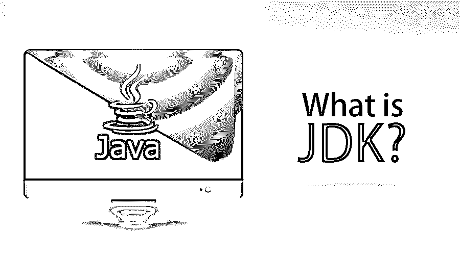

# 什么是 JDK？

> 原文：<https://www.educba.com/what-is-jdk/>

## JDK 简介(Java 开发工具包)

Java 开发工具包或 JDK 是一种广泛使用的软件开发环境包，用于任何或所有以 Java 为平台开发的软件。由于 Java 提供了安全性、一致性、可靠性和良好的处理速度等属性的组合，因此大多数开发人员选择它来创建系统应用程序或 web 应用程序。JDK 是为 Java 开发过程创建功能环境的重要部分。

### 什么是 JDK？

所有基于 Java 的应用程序和小程序都是使用 JDK 开发的。它由许多软件组件组成。一个是 JRE (Java 运行时环境)和其他工具，如 Java 和 javac——合起来称为开发工具。JRE 拥有 JVM (Java 虚拟机)和其他库文件。JDK 为所有构建在 Java 平台上的应用程序提供了一个基础。该软件包含各种工具和实用程序，有助于执行各种任务。这只是 JDK 的概况。

<small>网页开发、编程语言、软件测试&其他</small>

### JDK 组件

让我们看看下面列出的一些最常用的 JDK 组件:

1.  JRE : Java 运行时环境
2.  java: 它只是一个为所有 java 应用程序工作的加载器。此外，这个特殊的工具解释 javac 生成的类文件。单个 java 启动器用于开发和部署。 [JRE 被用作](https://www.educba.com/jre-vs-jvm/)部署发射器的日子已经一去不复返了。如今，JRE 已经不存在于 Sun JDK 中，完全被这个新的 java 加载器所取代。
3.  javac: 它是一个编译器。基本上，它将源代码转换成 Java 字节码
4.  通过这个组件，我们可以在不借助网络浏览器的情况下运行 Java 小程序，甚至调试它们。
5.  **apt:** 这是一个注释处理工具
6.  **extcheck:** 为了识别冲突，使用下一个检查
7.  idlj:IDL-to-Java 编译器，用于从提供的 Java IDL 文件生成 Java 绑定
8.  这是一个 Java 访问桥
9.  javadoc: 这是一个文档生成器，它从源代码注释中自动生成文档
10.  **jar:** 它是一个归档器。以及相关的类库打包到一个 JAR 文件中。此外，它还管理这些文件
11.  **javafxpackager:** 获取包和签署 [JavaFX 应用](https://www.educba.com/javafx-applications/)的工具
12.  jarsigner: 这是一个验证和 jar 签名工具
13.  javah: 它是一个存根生成器和“C”头，用于编写内置方法
14.  javap: 这是一个类文件反汇编器
15.  javaws: 这是一个用于 JNLP 应用程序的 Java Web Start 启动器
16.  JConsole: 这是一个用于 Java 监控和管理的控制台
17.  这是一个调试器
18.  jhat: 这是一个 Java 堆分析工具(实验性的)
19.  jinfo: 它特别用于从正在运行的 Java 进程中获取配置信息
20.  jmap: 它是一个 Oracle jmap，也是一个内存映射。这给出了 Java 内存映射的结果。另一方面，它在[打印堆内存](https://www.educba.com/what-is-heap-memory/)或共享对象内存映射特定核心转储或进程的细节时很有用。
21.  jmc: 它被称为 Java 任务控制器
22.  jps: 这是一个 JVM 进程，状态工具。它能够列出目标系统上被检测的热点 JVM
23.  jrunscript: 这是一个 [Java 命令](https://www.educba.com/java-commands/)-行脚本外壳
24.  一个工具打印 Java 线程的 Java 堆栈痕迹
25.  jstat: Java 虚拟机统计监控工具
26.  **keytool:** 用于操作密钥库的工具
27.  **pack200:** JAR 压缩工具
28.  **Policytool:** 决定 Java 运行时的实用程序。这意味着它是一个策略创建和管理工具。
29.  **VisualVM:** 是一个可视化工具。它集成了许多命令行 JDK 工具。
30.  wsimport :它生产可移植的 JAX-WS 工件，目的是调用 web 服务
31.  xjc: 它是 Java API 中增强 XML 绑定(JAXB) API 的一部分。在接受了 [XML 模式](https://www.educba.com/what-is-xml/)之后，它生成 Java 类

有了这个，开发工具也就有了；图书馆和接入点可与 JDK。一个更重要的组件是 JVM，它被称为 Java 虚拟机，为任何平台提供执行支持。

这些是 JDK 可用的软件组件。

### 了解 JDK

一个关键的平台，JDK，被用来构建基于 Java 的应用程序。它被认为是 Java 编译器的心脏。JDK 用于开发基于 Java 的软件，而 JRE 用于运行 Java 代码。为了简单地运行 Java 程序，JDK 需要 JRE(作为独立组件使用)。

### 为什么使用 JDK？

Java 开发工具包包含各种工具和 Java 开发信息。部署 Java 软件就像下载 JDK 软件并将其与类路径混合一样简单。在安装 JDK 时下载后，选择正确的 Java 版本将是执行程序的唯一方法。Java 8 是一个常用的版本，但是 Java 10 是最新的版本，也可以在网上找到。

一组目录——JDK 用于 Java 平台规范的应用中，包括类库和编译器。它也可以被称为 JRE 的超集。

### JDK 的目的

JDK 的主要目的是编译代码并将 java 代码转换成字节码，而 JRE 是执行这些字节码所必需的。

Java 开发工具包可以在 Oracle 公司发布的下列不同 Java 平台上实现。

*   Java SE: 标准版 Java 平台
*   **Java EE:** 企业版 Java 平台
*   **Java ME:** 微版 Java 平台

选择上述平台完全取决于所承担项目的类型。

### 结论

这就是 JDK 的全部。这是开始深入了解 JDK 的好时机。正如在上面的文章中所解释的那样，通过学习 JDK 及其组件的基础知识，构建 JAVA 应用程序将变得更加容易。因此，从现在开始，充分利用这些内容，以实现长期盈利。

### 推荐文章

本文介绍了什么是 JDK(Java 开发工具包)。在这里，我们讨论了基本概念以及组件和用途列表。您也可以浏览我们推荐的其他文章，了解更多信息——

1.  [安装 Java 8](https://www.educba.com/install-java-8/)
2.  [JavaFX 标签](https://www.educba.com/javafx-label/)
3.  [JavaFX 布局](https://www.educba.com/javafx-layouts/)
4.  [JRE vs JVM](https://www.educba.com/jre-vs-jvm/)

