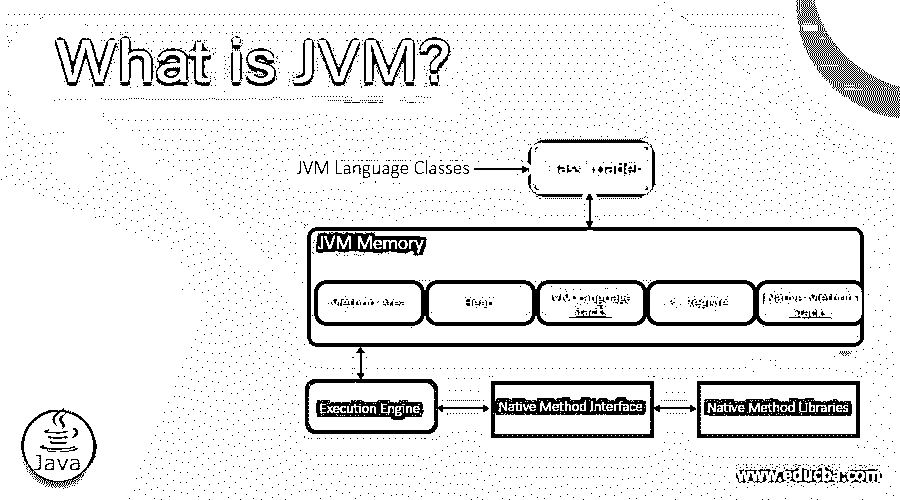

# JVM 是什么？

> 原文：<https://www.educba.com/what-is-jvm/>

## JVM 简介

Java 虚拟机(JVM)是一个强大的引擎，它提供了一个 Java 软件或应用程序运行时环境。Java 字节码被转换成你的机器的语言。JVM 是 Java 运行环境(JRE)的一部分。编译器用其他编程语言为特定系统生成机器代码。字节码是主机和 Java 源代码之间的中间语言。

### 谅解

由于 Java 虚拟机，Java 被认为是平台无关的。当提交到使用 JVM 不同操作系统的不同计算机时，字节码被 JVM 解释成机器语言。准确的说，JVM 程序是用 C 编程语言编写的，而 JVM 是独立于操作系统的。因此，它是 Java 架构的关键组件。除此之外，它还负责分配 Java 程序所需的基本内存。它还负责禁止内存空间。

<small>网页开发、编程语言、软件测试&其他</small>

### 它是做什么的？

JVM 执行的关键操作如下:

*   代码加载
*   代码验证
*   代码执行
*   运行时环境供应

除此之外，它还推出了类文件格式、内存区域、垃圾收集堆、寄存器集、致命错误报告等分类。

### JVM 架构

下面给出了关于 JVM 内部架构的一些关键见解，包括:

#### 1.类加载器

它是 JVM 的一个子系统，用来加载类文件。当运行 java 程序时，它首先被类加载器加载。

Java 包含的三个类装入器如下:

*   **Bootstrap ClassLoader:** 是扩展 ClassLoader 的超类。它帮助加载包含所有类文件的 rt.jar 文件。
*   **扩展类加载器:**是系统类加载器的父类加载器，也是 Bootstrap 的子类加载器。$JAVA_HOME/jre/lib/ext 目录中的 jar 文件可以通过扩展类加载器提取。
*   **系统/应用类加载器:**是扩展类加载器的子级，也称为应用类加载器。可以通过它从类路径中提取类文件。默认情况下，可以使用'-cp '或'-classpath '开关更改设置为当前目录的类路径。

#### 2.类(方法)区域

像字段和方法数据、运行时常量池和方法代码这样的类前结构存储在类(方法)区域。它是在 JVM 启动时创建的内存，像 Heap 一样在所有线程之间共享。

#### 3.许多

对象是通过这个有用的运行时数据区域分配的。它是一个存储对象及其实例变量的内存位置。每当在 Java 中创建一个对象，它就进入堆——内存区域。

#### 4.堆

除了存储帧，Java Stack 还保存变量和部分结果。它在方法、调用和返回中也起着关键作用。每个单独的线程都由它的私有 JVM 栈组成，这个栈是和线程同时创建的。每当方法升级时，都会生成一个新的框架，并在方法调用时分解。

#### 5.程序计数器(PC)寄存器

PC 寄存器包含 JVM 指令执行时的地址。因此，跟踪指令对每个指令都有价值，这对于本机方法来说是未定义的。

#### 6.本机方法堆栈

应用程序中使用的本机过程是本机方法堆栈的一部分。这些方法是用 Java 以外的语言编写的。与每个线程相关联，JVM 实现不能依赖传统的堆栈，也不能加载本地方法。准确地说，它类似于 stack，但[用于原生方法](https://www.educba.com/native-methods-in-java/)。

#### 7.发动机

作为 JVM 的关键方面，它与不同的内存区域进行通信。

*   垃圾收集器:这在 JVM 的动态内存管理系统中起着至关重要的作用。被任何可访问的 Java 对象占用且不再被其引用的内存通过垃圾收集器释放。
*   **解释器:**它在读取字节码流后执行指令。
*   **实时(JIT)编译器:**为了增强性能，JIT 编译器同时编译功能相似的字节码部分。它有助于减少编译过程所需的时间。

#### 8.Java 本地接口(JNI)

用其他语言编写的应用程序，如 C、C++、汇编等。，可以连接到 JNI 的接口。Java 使用 JNI 框架与操作系统库交互或将输出发送到控制台。

### JVM 有什么用？

JVM 有两个主要功能:允许 Java 程序在任何设备或操作系统上运行(称为“一次编写，随处运行”原则)以及管理和优化程序内存。

### 优点和缺点

Java 程序适合通过 JVM 执行。字节码——一种中间语言用于编译 Java 程序，然后通过 JVM 执行。任何由 JVM 支持的平台都可以执行每一个被编译成字节码的程序。这使得 Java 软件在各种计算平台上更加有效和兼容。然而，JVM 有一些显著的优点和缺点，任何开发人员在投资 Java 开发之前都应该仔细权衡。

#### 1.安全性

通过 JVM 的安全技巧，程序员可以有效地编写高端安全的 Java 程序。此外，它使操作系统资源能够识别恶意软件，并相应地帮助防止恶意软件。

#### 2.表演

运行在 JVM 上的 Java 程序可能比用 C++编写的程序执行得慢。这是因为代码优化过度依赖于不同的系统特定特性。此外，Java 字节码不能针对特定的硬件集进行优化，因为它是系统中立的。

#### 3.正确性

正确的是程序，它有效地执行并最大限度地满足用户的期望。JVM 的内置特性使它能够正确无误地运行。

### 为什么要用 JVM？

尽管有 Java 语法代码，JVM 可以在各种不同的语言程序上运行。

下面列出了它被如此广泛使用以及在不同平台上使用的一些原因:

*   **它使用堆内存:**堆内存是用于定义类和对象初始化的动态内存分配的核心组件。因为 [JVM 支持堆内存](https://www.educba.com/what-is-heap-memory/)，所以它被广泛接受。
*   **为远程代码位置提供安全性:**JVM 框架的设计使得远程应用程序易于执行。执行 Java 小应用程序遵循这一理论。

### 结论

JVM 可以在多种操作系统上工作，这一事实让它在技术领域获得了好评。在 Windows、Linux 和其他操作系统上使用它，可以转换字节码，而不管要执行的硬件和操作系统。此外，它通过保护主机的数据和程序为主机提供安全的能力是 JVM 在过去如此成功并在未来继续占主导地位的另一个原因。

### 推荐文章

这是什么是 JVM 的指南？在这里，我们分别用 JVM 的体系结构和用途列表来讨论基本概念。您也可以浏览我们推荐的其他文章，了解更多信息——

1.  [Java 中的数据类型](https://www.educba.com/data-types-in-java/)
2.  [JRE vs JVM](https://www.educba.com/jre-vs-jvm/)
3.  [Java 中的类加载器](https://www.educba.com/classloader-in-java/)
4.  [堆栈与堆内存](https://www.educba.com/stack-vs-heap-memory/)

