# J2EE 技术公司

> 原文：<https://www.educba.com/j2ee-technologies/>

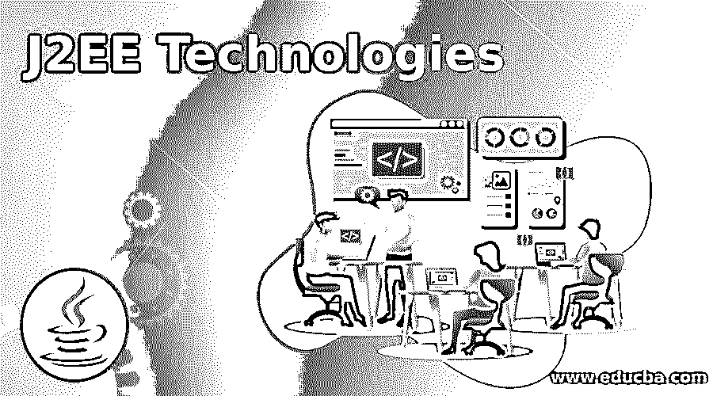

## J2EE 技术简介

J2EE 是 Java 2 企业版的简称，以前称为 Java 2 平台企业版，具有一组扩展 Java 2 标准版(J2SE)的规范。J2EE 提供了一套超大规模、多层、基于组件的分布式内置服务。通常，J2EE 是一组帮助构建大规模应用程序的 API。J2EE 技术不仅使用 API，而且它是构建和部署企业应用程序的标准，它承诺“一次编写，随处运行”。

Java Enterprise Edition 包括几个规范，用于各种目的，如生成网页、从数据库中读取和写入、管理分布式队列。

<small>网页开发、编程语言、软件测试&其他</small>

### J2EE 技术列表

J2EE 平台的图示。

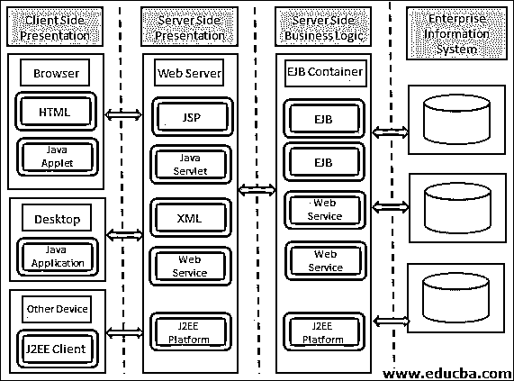

#### 1.Java Servlet

servlet 是在 webserver.java servlet 上运行的 java 程序，用于生成动态网页，以处理来自 web 浏览器的请求，处理 web 浏览器，并将处理发送回浏览器。

通用网关接口(CGI)也用于开发动态网页，但 CGI 有几个限制，如性能、可伸缩性、可重用性等…..为了克服这个限制，我们可以使用 servlet。

CGI 最大的缺点之一是——每当用户发出新的请求时，CGI 程序都会创建一个新的进程来处理它。如果大量用户增加，那么 CGI 必须为每个请求创建一个新的进程，为每个进程创建新的进程对于服务器端来说是无效的，因为资源有限。与 CGI 和 servlet 相比——与 CGI 不同，servlet 程序由单独的线程处理。

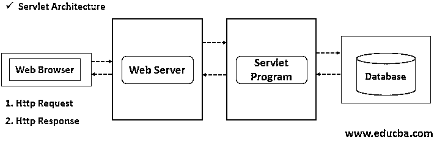

**Servlet 执行过程:**

*   客户端发送一个请求。
*   web 服务器接收请求。
*   web 服务器将请求传递给相应的 servlet。
*   Servlet 处理请求并以输出的形式生成响应。
*   Servlet 将响应发送回 web 服务器
*   Web 服务器向客户端发送响应。

#### 2.Java 服务器页面(JSP)

Java Server Pages 是用于创建动态网页和构建基于 web 的应用程序的服务器端编程。

##### JSP 的特性

*   JSP 性能显著提高，因为它允许用户在 HTML 中嵌入 java 代码。
*   像 servlet 一样，JSP 也可以访问企业 Java APIs
*   JSP 页面也与 servlets 结合使用。
*   允许在 HTML 中嵌入 java 代码的 JSP 标签是
*   在 HTML 中嵌入 JSP 代码使得 HTML 页面像注册表、下拉框等一样是动态的。
*   JSP 用于访问 Java Beans 对象。
*   JSP 将表示层与业务逻辑分离开来。
*   与 servlets 相比，提供了最简单的生成动态网页的方法。
*   JSP 代码中的任何更改都在 web 容器中处理，不需要重新编译。
*   像 servlets JSP[不需要额外的文件类文件和 web，xml。
*   JSP 不需要额外的 web.xml 映射。

##### JSP 的架构

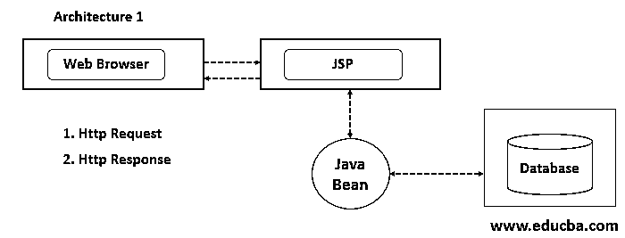

**建筑#1 的工作**

在这个体系结构中，JSP 在处理客户端请求中扮演着重要的角色。

*   客户端向 JSP 发送请求
*   JSP 创建 JavaBean 对象。
*   如果需要，JavaBeans 使用来自数据库的必要数据处理请求。
*   响应被发送回客户端。

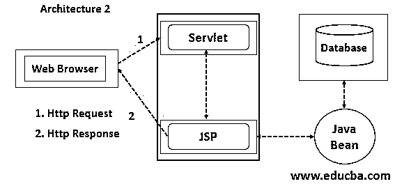

**建筑#2 的工作**

在这个架构中，Servlet 扮演着重要的角色。Servlet 充当控制器。

*   客户端发送请求。
*   Servlet 处理客户端发送的请求。
*   Servlet 负责创建 bean 对象，并调用特定的 JSP 页面。
*   这里 JSP 不处理任何客户端请求。
*   JSP 只是执行表示部分。

#### 3.企业 Java Bean (EJB)

Enterprise Java Beans 是一种开发架构，用于构建高度可伸缩和健壮的企业级应用程序。

##### EJB 的特色

*   开发人员必须关注应用程序的业务逻辑。因为应用服务器提供了大多数系统级服务事务、日志记录、异常处理等。
*   EJB 容器管理所有 EJB 实例。
*   EJB 组件可以在任何兼容 EJB 的服务器上运行，这些优势与平台无关。

##### 企业 Beans 的类型

企业 beans 的类型有:

**1。会话 Bean**

会话 beans 为客户端执行任务。封装的业务逻辑可以由客户端以编程方式调用。

有三种类型的会话 beans:

*   **有状态会话 Bean:** 有状态会话 Bean 的实例代表唯一客户端的状态，通常称为会话状态。它也被称为交互式会话，并且只与一个用户相关联。一旦客户机删除 beans，会话结束，状态消失，状态就会保留。
*   **无状态会话 Bean:** 无状态会话实例不维护与客户端的会话状态。当客户端调用无状态 bean 变量的方法时，包含特定于客户端的变量，但仅限于调用期间。该实例适用于所有客户端。可以实现 web 服务。
*   **单例会话 Bean:** 为每个应用实例化一次，并在应用的生命周期内存在。在单个实例 bean 在所有并发客户机之间共享的情况下使用。维护客户端调用之间的状态，但不需要在服务器关闭时维护状态。应该在应用程序启动时实例化。

**2。消息驱动**

消息驱动 bean 充当特定消息类型(如 java 消息服务器 API)的监听器。

**EJB 建筑**

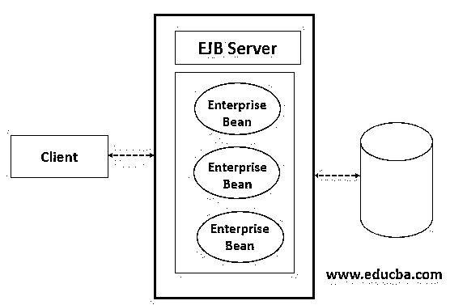

#### 4.Java 数据库连接(JDBC)

Java 数据库连接是一个用于连接和执行查询的 Java API，它使用 JDBC 驱动程序进行连接。

##### 驱动程序的类型

*   JDBC-ODBC 桥驱动程序
*   原生驱动。
*   网络协议驱动。
*   瘦司机。

##### 特征

*   ODBC 使用 ODBC 驱动程序进行连接，因为这些驱动程序是平台相关的，这也是 java 开发自己的 JDBC API 的原因。
*   Java 可以用来编写不同类型的可执行文件，包括 Java 小程序、JSP、EJB、Servlets 等。

##### JDBC 建筑

JDBC 建筑分为两种类型

1.  两层架构。
2.  三层架构。

**两层架构:**

两层架构的图形表示。

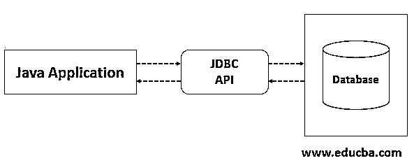

在这种两层架构中，java 应用程序直接从数据库中访问。客户端使用 JDBC 驱动程序直接访问数据。在客户端-服务器配置中，数据库可以位于同一台机器上，也可以位于另一台机器上。

**三层架构:**

三层架构的图形表示。

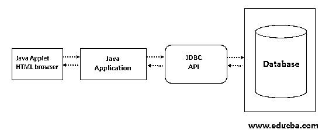

在这种体系结构中，命令被发送到中间层，中间层处理请求，然后转发到数据源。数据源处理请求，并将结果发送回中间层，然后发送给用户。三层维护对企业数据的数据访问和更新的控制。

#### 5.Java 消息服务(JMS)

Java 消息服务是一个 API，它提供网络中计算机之间的正式通信，称为消息服务。

*   消息交换可以是同步或异步模式。
*   JMS API 允许其他 java 平台语言之间的互操作性。
*   应用程序建立在消息队列、发送方和接收方概念之上。

JMS 中有两种类型的消息传递域

**1。点对点消息传递域**

*   应用程序基于队列发送方和接收方的概念。
*   发送到消息队列接收方的每条消息都将消息存储在消息队列中。
*   队列存储所有消息，直到它被使用或过期。
*   如果接收者在网络中不可用，消息将保留，直到接收者使用消息。
*   接收者确认消息消耗。

**2。发布/订阅消息传递域**

*   应用程序向名为 topic 的消息代理发送消息。
*   主题将消息发布给所有订阅者。
*   主题保留所有消息，直到被接收者使用。
*   在这里，多个消费者和消费者将在订阅后获得消息。

**JMS 架构**

#### 6.Java 事务 API (JTA)

JTA 允许通过网络中的多台计算机执行分布式事务来访问和更新数据。JTA API 充当事务管理器和客户端之间 java 接口。

应用服务器和资源管理器控制共享资源事务中的访问。

*   **原子性:**事务管理器负责做出提交或回滚的最终决定。
*   **提供一致性:**如果事务失败，数据完整性得到保护。
*   在其他应用程序或线程提交或回滚事务之前，不可能进入事务的各个阶段。
*   即使在系统出现故障的情况下，提交的内容也可以保留。
*   三种类型的事务管理器。
*   **数据库:**事务防止数据库由于不完整的更新而处于不一致的状态。
*   JMS 提供者——使用事务确保消息被可靠地传递。
*   J2EE 连接器架构组件。
*   **容器管理的事务:** EJB 容器设置了事务的边界，可用于任何类型的企业 bean，代码不包括开始和结束事务的语句。
*   **组件管理的事务:**事务由 JDBC API 管理，它允许在应用程序本身中进行事务管理。消息驱动的 beans 明确标记了事务的边界。

**JTA 建筑**

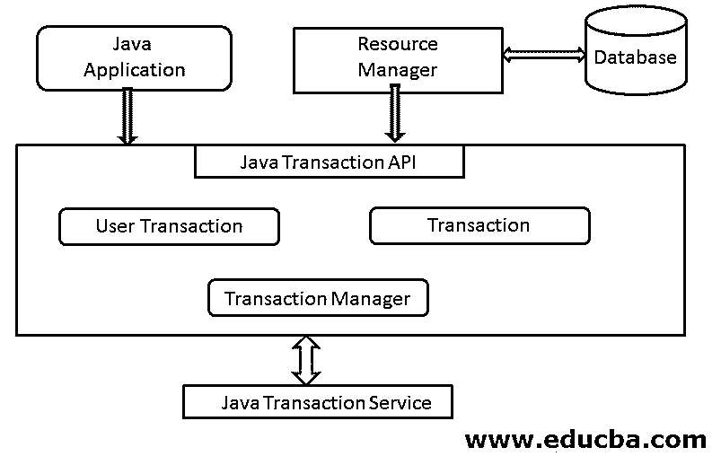

#### 7.javamail

Java Mail 是 API，它允许我们编写、阅读和写电子邮件。这个 API 提供了独立于协议和平台的特性。

##### Java 邮件 API 使用的协议

*   SMTP: SMTP 是一种简单的邮件传输协议，是一种用于传输电子邮件的机制。Apache 服务器，邮件服务器等。可以用作 SMTP 服务器。
*   **POP:** POP 是邮局协议/POP3 它是一种接收电子邮件的机制。支持每个用户一个邮箱。Apache James 服务器，邮件服务器可以作为 POP 使用。
*   **IMAP:** 互联网消息访问协议是接收消息的高级协议。支持每个用户有多个邮箱。
*   MIME: 多重互联网邮件扩展告诉浏览器正在发送的内容，如电子邮件的格式、附件等。

**Java 邮件架构**

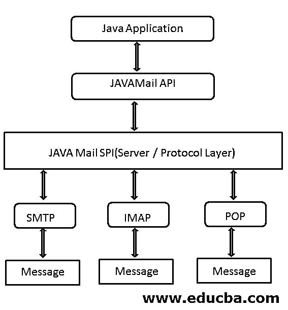

#### 8.Java 命名和目录接口(JNDI)

Java 命名和目录接口是一个用于命名和目录服务的 API，允许用户使用特定的名称发现数据。

*   JNDI 独立于实施。
*   它提供服务提供者接口(SPI)——允许将目录服务插入框架。
*   用于将 java 应用程序连接到外部目录的 API。
*   它提供了一种将对象绑定到名称的机制。
*   事件接口允许客户端确定目录条目何时被修改。

JNDI 使用下列命名和目录服务。

*   轻量级目录访问协议(LDAP)。
*   公共对象请求代理体系结构(CORBA)。
*   公共对象服务(COS)
*   Java 远程方法调用(RMI)。
*   域名服务(DNS)。

**JNDI 建筑**

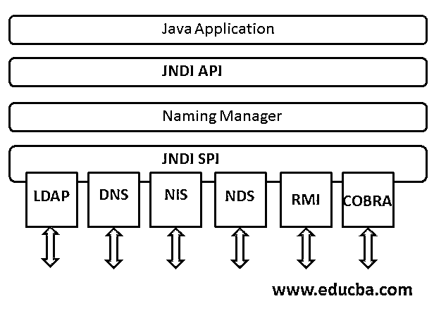

#### 9.J2EE 连接器架构(JCA)

用于将应用服务器连接到 EIS 的 JCA。

*   支持 JCA 的应用服务器与任何符合 JCA 标准的 EIS 集成。
*   资源适配器允许 java 应用程序访问 EIS 的资源管理器并与之交互。
*   还提供基于消息的事务集成，基于 java EE 的 web 服务与 EIS。

JCA 在 Java 应用服务器和资源适配器之间定义了一组标准的系统级契约。如下所述-

*   **连接管理:**支持应用服务器池连接到 EIS，支持应用组件连接。这有利于可扩展的应用环境并支持大量的客户端。
*   **事务管理:**允许一个应用服务器使用事务管理器来管理多个资源管理器的事务。这支持在内部管理事务，而不涉及外部事务管理器。
*   **安全管理:**防止对 EIS 的安全威胁，保护 EIS 管理的宝贵资源。
*   **生命周期管理:**使应用服务器能够管理资源适配器从开始到结束的生命周期。
*   **工作管理:**使资源适配器能够将工作分配给应用服务器执行。应用服务器分派线程来完成分配的工作。
*   **事务流入管理:**允许资源适配器将导入的事务传播到应用服务器。允许 EIS 启动资源适配器传输事务完成和崩溃恢复。
*   **消息流入管理:**允许将消息异步传递到驻留在应用服务器上的消息端点。

**JCA 建筑**

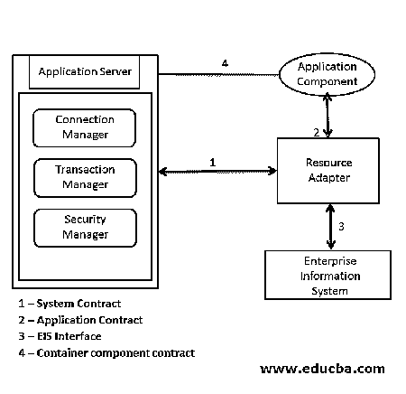

### 结论–J2EE 技术

J2EE 针对能够增强客户端性能的企业计算或企业应用进行了优化。几乎所有的 J2EE 技术都提供了容器或应用服务器，有助于快速开发和部署。由于 java 是平台无关的跨平台开发标准，保证可以在多个平台上运行。J2EE 的大多数技术将设计和开发分开。

### 推荐文章

这是 J2EE 技术指南。在这里，我们讨论 j2ee 技术的介绍和列表，以及 J2EE 技术的特性和架构。您也可以看看以下文章，了解更多信息–

1.  [WebLogic vs WebSphere](https://www.educba.com/weblogic-and-websphere/)
2.  [什么是 Spring 框架？](https://www.educba.com/what-is-spring-framework/)
3.  [计算机新技术](https://www.educba.com/new-technologies-of-computer/)
4.  [如何用 Java 创建 Webservice？](https://www.educba.com/how-to-create-webservice-in-java/)

