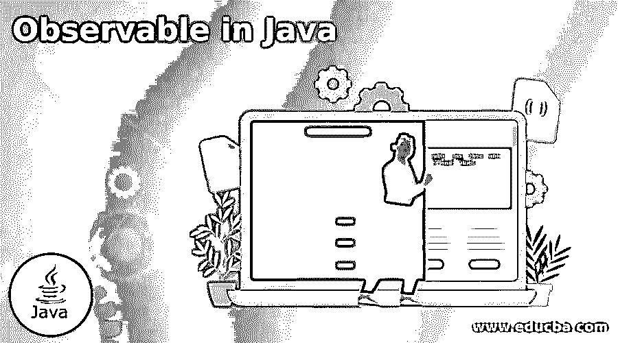
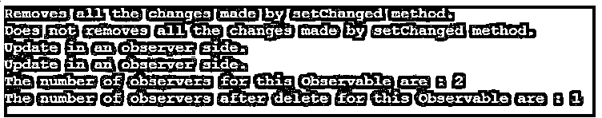

# Java 中可观察到的

> 原文：<https://www.educba.com/observable-in-java/>




## Java 中的 Observable 简介

Observable 是 Java 编程语言中的一个类，它允许您构造程序的其他部分可以观察到的子类。当这个子类的对象改变时，观察类被通知。当观察者被告知有变化时，就会调用 update()方法。java.util 包中提供了 Observable 类。该类的一个子类可以用来描述应用程序需要观察的对象，并且在一个可观察的对象上可能有一个或多个观察者。观察类应该实现 Observer 接口，该接口指定了观察类必须实现的 update()方法。

被观察的对象必须遵守两个基本规则:

<small>网页开发、编程语言、软件测试&其他</small>

*   首先，如果被更改，它必须调用 setChanged()方法。
*   当准备好通知观察者更新时，它必须调用 notifyObservers()方法。因此，将调用观察对象中的 update()方法。

在 update()之前，被观察对象必须同时调用 setChanged()和 notifyObservers()方法。

### Java 中可观察对象的语法

可观察类的声明。

java.util.Observable 类的声明如下:

```
public class Observable extends Object
```

**可观察类的构造器**

下面给出了 observable 类的构造函数:

*   这创建了一个没有观察者的可观察对象。

### 可观察类的方法

下面给出了 observable 类的方法:

*   **void addObserver(Observer o):**这个方法为这样一个对象的观察器集合创建一个新的观察器，只要它与已经存在的观察器不同。
*   **protected void clear changed():**这个方法意味着这个对象没有改变或者它已经通知了它的所有观察者最近的更新，在这种情况下 hasChanged()方法返回 false。
*   **int countObservers():** 这个可观测对象的观测者数量由这个方法返回。
*   **void delete Observer(Observer o):**这个方法从这个对象的观察者列表中删除一个观察者。
*   **void deleteObservers():** 这个方法清除观察者列表，从这个对象中移除所有的观察者。
*   **boolean hasChanged():** 这个方法确定这个对象是否被修改过。
*   **void notifyObservers():** 如果 hasChanged()方法表明这个对象已经发生了变化，那么警告它的所有观察者，然后调用 clearChanged()方法表明它没有发生变化。要更新()方法，将 null 作为第二个参数传递。
*   **void notify observers(Object arg):**如果 hasChanged()方法表明这个对象已经发生了变化，那么就警告它的所有观察者，然后调用 clearChanged()方法表明它没有发生变化。要更新()方法，需要将一个对象作为第二个参数传递。
*   **protected void set changed():**表示这个可观察对象已经被修改，hasChanged()方法现在将返回 true。

### Java 中可观察对象的工作

在一个程序中，一个可观察对象和一个观察者之间的相互作用通常以下列事件序列的形式出现。

*   当公共访问方法修改私有数据，改变内部状态，并调用 setChanged()方法来显示模型的状态已经改变。然后它调用 notifyObservers()让观察者知道有些事情发生了变化。可以从任何地方调用 notifyObservers()，比如在一个单独的线程的更新循环中。
*   接下来，调用每个观察者的 update()方法，表明状态更新已经发生。

### Java 中可观察的例子

下面是 Java 中可观察的例子:

#### 示例#1

Java 中使用或不使用 setChanged()方法执行更改的可观察示例。

**代码:**

```
import java.util.*;
// This is the observer class
class ObserverEx implements Observer
{
public void update(Observable obj, Object arg)
{
System.out.println("Update in an observer side.");
}
}
// This is the obsrvable class
class ObservableEx extends Observable
{
void change_with_setChanged()
{
setChanged();
System.out.println("Change the status with setChanged : " + hasChanged());
notifyObservers();
}
void change_without_setChanged()
{
System.out.println("Change status with setChanged : " + hasChanged());
notifyObservers();
}
}
public class HelloWorld {
public static void main(String args[])
{
ObservableEx Observable = new ObservableEx();
ObserverEx observer1 = new ObserverEx();
ObserverEx observer2 = new ObserverEx();
Observable.addObserver(observer1);
Observable.addObserver(observer2);
Observable.change_with_setChanged();
Observable.change_without_setChanged();
int no = Observable.countObservers();
System.out.println("The number of observers for this Observable are : " + no);
}
}
```

**输出:**


与上面的程序一样，用户定义的可观察类 ObservableEx 是通过扩展 Observable 类创建的，用户定义的观察器类 ObserverEx 也是通过实现 Observer 接口创建的，其中该类提供了 update()方法的实现。接下来，ObservableEx 类包含两个方法 change_with_setChanged()和 change_without_setChanged()。

方法 change_with_setChanged()调用 setChanged()然后通知所有的观察者，这意味着这里用 setChanged 所做的更改将被通知给所有的观察者。然而方法 change_without_setChanged()并不调用 setChanged()并通知所有的观察者，这意味着在没有 setChanged 的情况下所做的改变不会显示给所有的观察者。

然后，在 main 函数中，创建了一个可观察对象和两个观察者对象，并将两个观察者对象都添加到这个可观察对象中。接下来，在观察器对象上，调用 change_with_setChanged()方法，该方法通知观察器并调用 update()方法，该方法打印消息，而 change _ with _ set changed()方法不调用观察器的 update()方法。接下来查找并打印观察者的数量，正如我们在上面的输出中看到的。

#### 实施例 2

Java 中使用或不使用 clearChanged()方法执行更改的可观察示例。

**代码:**

```
import java.util.*;
// This is the observer class
class ObserverEx implements Observer
{
public void update(Observable obj, Object arg)
{
System.out.println("Update in an observer side.");
} }
// This is the obsrvable class
class ObservableEx extends Observable
{
void change_with_clearChanged()
{
setChanged();
System.out.println("Removes all the changes made by setChanged method.");
// clearChanged method
clearChanged();
notifyObservers();
}
void change_without_clearChanged()
{
setChanged();
System.out.println("Does not removes all the changes made by setChanged method. ");
notifyObservers();
}
}
public class HelloWorld {
public static void main(String args[])
{
ObservableEx Observable = new ObservableEx();
ObserverEx observer1 = new ObserverEx();
ObserverEx observer2 = new ObserverEx();
Observable.addObserver(observer1);
Observable.addObserver(observer2);
Observable.change_with_clearChanged();
Observable.change_without_clearChanged();
int no = Observable.countObservers();
System.out.println("The number of observers for this Observable are : " + no);
Observable.deleteObserver(observer2);
no = Observable.countObservers();
System.out.println("The number of observers after delete for this Observable are : " + no);
}
}
```

**输出:**




在上面的程序中，创建了 ObservableEx 和 ObserverEx 类。接下来，类 ObservableEx 包含两个方法 change_with_clearChanged()和 change_without_clearChanged()。方法 change_with_clearChanged()调用 setChanged()，clearChanged()删除 setChanged 方法所做的所有更改。而 change_without_clearChanged()方法不调用 clearChanged()，这意味着 setChanged 方法所做的更改不会被删除。

然后，在 main 函数中，创建了一个可观察对象和两个观察者对象，并将两个观察者对象都添加到这个可观察对象中。接下来，在观察者对象上，调用 change_with_clearChanged()方法，该方法不调用观察者的 update()方法，而 change_without_setChanged()方法调用观察者的 update()方法。接下来，删除 observer1，找到铰孔观察器并打印，正如我们在上面的输出中看到的。

### 结论

java.util 包中提供了 Observable 类。Observable 是 Java 中的一个类，它允许创建一个 Observable 子类，程序的其他部分可以观察到它。

### 推荐文章

这是一个 Java 中的 Observable 指南。这里我们讨论 Java 中 observable 的介绍、构造函数、方法、工作和例子。您也可以看看以下文章，了解更多信息–

1.  [跳过列表 Java](https://www.educba.com/skip-list-java/)
2.  [Java 中的 Shell 排序](https://www.educba.com/shell-sort-in-java/)
3.  [Java 中的桶排序](https://www.educba.com/bucket-sort-in-java/)
4.  [Java 中的排序字符串](https://www.educba.com/sort-string-in-java/)


