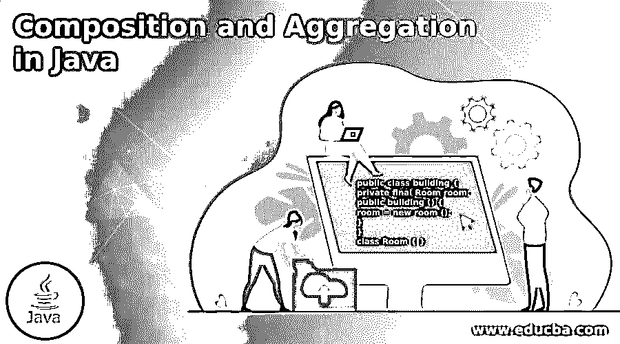

# Java 中的组合和聚合

> 原文：<https://www.educba.com/composition-and-aggregation-in-java/>




## Java 中的组合和聚合简介

Java 提供了可被视为现实生活和编程的对象之间的不同关系。有时候这很难理解，或者我们可以说是为了实现关系。所以 java 向用户提供了组合和聚合关系。在作文中，我们可以建立一种我们称之为“属于”的关系；逻辑上，我们可以说一个物体比其他物体大。在聚合中，我们可以建立一种关系，我们称之为“有一个”关系，其中每个对象彼此独立地行动。聚集关系我们认为是弱关联，组合我们认为是强关联。

### 合成和聚合的语法

合成语法如下:

<small>网页开发、编程语言、软件测试&其他</small>

```
public class building {
private final Room room;
public building () {
room = new room ();
}
}
class Room { }
```

**说明:**

*   在上面的语法中，我们考虑一个 building 的例子，所以首先，我们创建名为 building 的类，房间是上面语法中所示的建筑物的强制部分。
*   这是组合关系的语法，这里我们展示它属于关系。

聚合的语法如下:

```
public class student {
private List students;
public student () {
students = new list_students();
}
}
class student { }
```

**说明:**

*   在上面的语法中，我们考虑学生的例子，首先我们创建一个名为 student 的公共类，然后我们创建学生列表，因为学生可以是 0 或更多，如上面的语法所示。
*   这里我们还展示了对象之间的“有一个”关系。

### Java 中的组合和聚合是如何工作的？

下面给出了 java 中组合和聚合的工作原理:

组合用于指定关系的“所属”。这意味着其中一个项目比其他项目大，或者我们可以说是 object。例如，考虑一个房间作为建筑物的一部分，或者我们可以说建筑物有一个房间。所以从根本上来说，无论我们称之为“属于”还是“拥有-a”只是一个视角的问题。

基本上，组合是一个强关系，因为包含它的对象声明了它。以这种方式，当我们删除对象生命周期时，这意味着当我们删除父节点时，它会自动删除子节点。比如我们可以在破坏房间的时候考虑；然后建筑也被摧毁。请注意，这并不意味着包含对象不能与其任何部分一起存在。例如，我们可以摧毁一个建筑内的所有隔断，从而彻底摧毁房间。尽管如此，这种结构无论如何都会存在。就基数而言，一个包含的文章可以有我们需要的任意多个部分。尽管如此，零件的整体需要精确地具有一个隔间。

聚合在 java 中的工作方式如下:

我们知道组成“有”关系。同样，聚合也有“有”的关系。基本的区别在于聚合不包括父节点或对象。在这种关系中，每一个物体都是相互独立的。例如，我们可以考虑一辆汽车和它不同的车轮，同一个车轮我们可以安装到另一辆汽车，然后它的工作文件没有任何问题。我们知道，没有轮子的汽车是没有用的，所以这就是我们组装物体所有部件的原因，这就是聚合关系。

### Java 中组合和聚合的例子

下面给出了组成和聚合关系的示例:

#### 实施例 1:组合物

**代码:**

```
import java.io.*;
import java.util.*;
class Lib
{
public String name_book;
public String bk_author;
Lib(String name_book, String bk_author)
{
this.name_book = name_book;
this.bk_author = bk_author;
}
}
class Library
{
private final List<Lib> Lib_books;
Library (List<Lib> Lib_books)
{
this.Lib_books =Lib_books;
}
public List<Lib> book_details(){
return Lib_books;
}
}
class composition
{
public static void main (String[] args)
{
Lib book1 = new Lib("Database management", "Rajiv Chopra ");
Lib book2 = new Lib("MySql", "Rajiv Chopra l");
Lib book3 = new Lib("oracle", "Donald Burleson");
List<Lib> Lib_books = new ArrayList<Lib>();
Lib_books.add(book1);
Lib_books.add(book2);
Lib_books.add(book3);
Library library = new Library(Lib_books);
List<Lib> bks = library.book_details();
for(Lib bk : bks){
System.out.println("name_book : " + bk.name_book + " and "
+" bk_author : " + bk.bk_author);
}
}
}
```

**说明:**

*   在上面的例子中，我们试图用 java 实现组合关系。
*   我们使用下面的快照来说明上述程序的最终输出。

**输出:**


#### 示例 2:聚合关系

**代码:**

```
import java.io.*;
import java.util.*;
class stud_class
{
String stud_name;
int roll_no ;
String stud_dept;
stud_class(String stud_name, int roll_no, String stud_dept)
{
this.stud_name = stud_name;
this.roll_no = roll_no;
this.stud_dept = stud_dept;
}
}
class Depofcollege
{
String stud_name;
private List<stud_class> students;
Depofcollege(String stud_name, List<stud_class> students)
{
this.stud_name = stud_name;
this.students = students;
}
public List<stud_class> getStudentsDetails()
{
return students;
}
}
class college
{
String collegeName;
private List<Depofcollege> departments;
college(String collegeName, List<Depofcollege> departments)
{
this.collegeName = collegeName;
this.departments = departments;
}
public int totalstudents()
{
int noOfStudents = 0;
List<stud_class> students;
for(Depofcollege dept : departments)
{
students = dept.getStudentsDetails();
for(stud_class s : students)
{
noOfStudents++;
}
}
return noOfStudents;
}
}
class aggregation
{
public static void main (String[] args)
{
stud_class stud1 = new stud_class("Sameer", 5, "IT");
stud_class stud2 = new stud_class("Pooja", 6, "IT");
stud_class stud3 = new stud_class("Sanddep", 8, "Mech");
stud_class stud4 = new stud_class("Jenny", 2, "Mech");
List <stud_class> i_students = new ArrayList<stud_class>();
i_students.add(stud1);
i_students.add(stud2);
List <stud_class> me_students = new ArrayList<stud_class>();
me_students.add(stud3);
me_students.add(stud4);
Depofcollege IT = new Depofcollege("IT", i_students);
Depofcollege Mech = new Depofcollege("Mech", me_students);
List <Depofcollege> departments = new ArrayList<Depofcollege>();
departments.add(IT);
departments.add(Mech);
college college= new college("MIT", departments);
System.out.print("Count of students: ");
System.out.print(college.totalstudents());
}
}
```

**说明:**

*   在上面的例子中，我们试图用 java 实现一个聚合关系。
*   我们使用下面的快照来说明上述程序的最终输出。

**输出:**


### 结论

我们已经从上面的文章中看到了组合和聚合的基本语法，还看到了组合和聚合的不同例子。从本文中，我们看到了如何以及何时在 java 中使用组合和聚合。

### 推荐文章

这是一本关于 Java 中的组合和聚合的指南。这里我们讨论一下简介，java 中的组合和聚合是如何工作的？还有例子。您也可以看看以下文章，了解更多信息–

1.  [跳过列表 Java](https://www.educba.com/skip-list-java/)
2.  [Java 中的 Shell 排序](https://www.educba.com/shell-sort-in-java/)
3.  [Java 中的桶排序](https://www.educba.com/bucket-sort-in-java/)
4.  [Java 中的排序字符串](https://www.educba.com/sort-string-in-java/)


