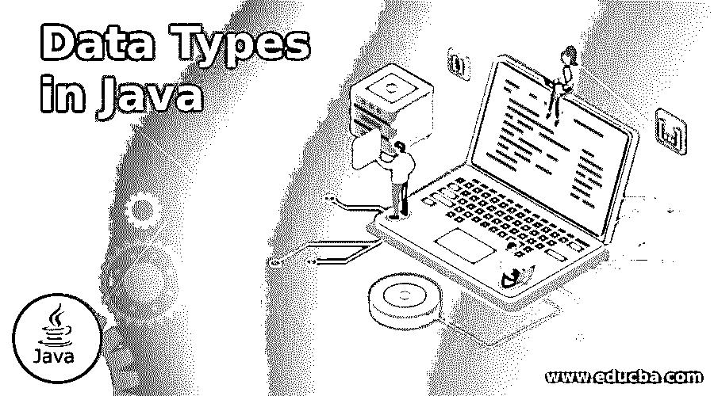
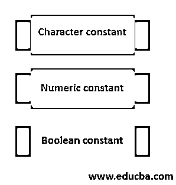
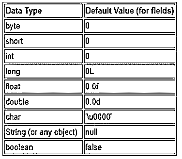
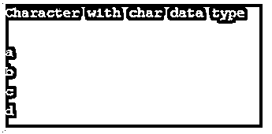
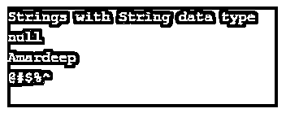
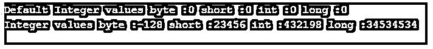
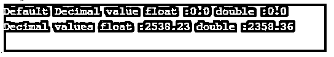

# Java 中的数据类型

> 原文：<https://www.educba.com/data-types-in-java/>




## Java 中的数据类型介绍

数据类型是一个关键字；它描述了数据的类型。数据类型有不同的大小和值，这些值存储在一个变量中。Java 数据类型大致分为基本数据类型和非基本数据类型。原始数据类型有 char、byte、short、int、long、float、double、boolean。非原始数据类型是字符串。

### 数据类型是如何出现的？

Java 允许 3 种类型的常量。

<small>网页开发、编程语言、软件测试&其他</small>




*   字符常数
*   数字常数
*   布尔常数

#### 1.字符常数

字符常量是字母、单词、特殊符号和数字(0-9)。

在 Java 中，有两种类型的字符常量。

*   单字符常数
*   串常数

**a .单字符常量:**单字符常量定义为“用单引号(')”括起来的单个字母”。数据类型是 char。

**举例:** '4 '，' a '，' '(空格)等。

**限制:**我们不应该在单引号中声明一个以上的字符；如果我们这样做，java 编译器会报错。

**举例:**‘12’是错误的声明。

**b .字符串常量:**字符串常量是一组“用双引号括起来的字母”。数据类型是字符串。

**举例:**“Amar deep”，“!@#$、" 1234 "、" 1995 年 3 月 30 日"等

#### 2.数字常数

java 中的所有数字都被认为是数字常量。

有两种类型的数值常量。

*   整数数值常数
*   十进制/实数/浮点数字常数

**a .整数数值常数:**没有小数部分的数称为整数数值常数。数据类型是 int。

**举例:** -1，-2，-5，6，7，8，0 等。

**b .小数/实数/浮点数值常数:**有小数部分的数称为小数或浮点数值常数。数据类型有浮点型和双精度型。

**举例:** -1.23，1.23，5.67，7.0，5.28 等。

#### 3.布尔常数

Java 将布尔值存储为 true，或者数据类型为 Boolean。

**举例:**真，假

### 数据汇总

以下是数据汇总:

*   单字符常数
*   串常数
*   整数常数
*   十进制常数
*   布尔常数

### Java 数据类型

Java 数据类型分为两种类型:

#### 1.无符号的

内存没有符号位分配，意味着字符没有任何正值或负值。

**例子:** a .人物

#### 2.签名

内存分配有一个符号位，表示整数和十进制数有正值和负值。因此，每个第一位分配给-(减号)或+(加号)符号位，其余位分配给数字。对于负数，符号位是 1，正数符号位是 0。

| 符号位 1 | Two | Three | Four | Five | …… | …… | …… | …… | …… |

**例子:**

*   整数
*   小数
*   线

#### 1.整数分类

整数又分为 4 种数据类型。

*   **字节:**字节有 1 字节内存。一个字节有 8 位。正如我们所见，第 1 个<sup>位</sup>是符号位，其余 7 位是数字位。因此字节大小在 java 2^-7 中为(2^7)-1 的意思是-128 到 127。
*   **short:** short 有 2 字节内存。2 个字节有 16 位。正如我们所见，第 1 个<sup>位</sup>是符号位，其余 15 位是数字位。因此爪哇的矮个子 2^-15 到(2^15)-1.
*   int: int 有 4 个字节的内存。4 个字节有 32 位。正如我们所见，第 1 个<sup>位</sup>是符号位，其余 31 位是数字位。因此在爪哇 2^-31 的 int size 为(2^31)-1.
*   **long:** long 有 8 字节内存。8 字节有 64 位。正如我们所见，第 1 个<sup>位</sup>是符号位，其余 63 位是数字位。因此长在爪哇的大小 2^-63 到(2^63)-1.

#### 2.十进分类法

Decimal 又分为两种数据类型。

*   **float:** float 有 4 字节内存。4 个字节有 32 位。正如我们所见，第 1 个<sup>位</sup>是符号位，其余 31 位是数字位。爪哇 3.4E^-38 到 3.4E^38.的浮标尺寸
*   **double:** double 有 8 字节内存。8 字节有 64 位。正如我们所见，第 1 个<sup>位</sup>是符号位，其余 63 位是数字位。爪哇 1.7E^-308 到 1.7E^308.的两倍大

#### 3.线

在 java 中，字符串也是一种无符号数据类型。

**数据类型表:**

| **序列号** | **数据** | **数据类型** | **已签名/未签名** | **尺寸** | **范围** |
| One | 单字符常数 | 茶 | 无符号的 | 2 字节 | 0 到 65535 |
| Two | 整数常数 | 字节 | 签名 | 1 字节 | 2^-7 到(2^7)-1 |
|  |  | 短的 | 签名 | 2 字节 | 2^-15 到(2^15)-1 |
|  |  | （同 Internationalorganizations）国际组织 | 签名 | 4 字节 | 2^-31 到(2^31)-1 |
|  |  | 长的 | 签名 | 8 字节 | 2^-63 到(2^63)-1 |
| Three | 十进制常数 | 漂浮物 | 签名 | 4 字节 | 3.4E^-38 到 3.4E^38 |
|  |  | 两倍 | 签名 | 8 字节 | 1.7E^-308 到 1.7E^308 |
| Four | 布尔常数 | 布尔型 | 签名 | JVM 相关 | 对/错 |
| Five | 串常数 | 线 | 签名 | JVM 相关 | JVM 相关 |

### Java 数据类型的分类

下面给出了 Java 数据类型的分类:

*   原始数据类型
*   参考数据类型

#### 1.原始数据类型

在 9 种数据类型中，有 8 种是原始数据类型。

*   茶
*   字节
*   短的
*   （同 Internationalorganizations）国际组织
*   长的
*   漂浮物
*   两倍
*   布尔代数学体系的

#### 2.参考数据类型

9 种数据类型中只有一种引用类型。

*   **字符串:**也叫类类型。

**为什么 Java char 有 2 字节，其他编程语言有 1 字节内存？**

*   Java 使用 UTF-16 ( Unicode 转换格式)进行设计。
*   最初是用于表示 16 位 Unicode 的 char 数据类型。
*   所以 Java char 有 2 个字节。

### 数据类型在 Java 中是如何工作的？

根据分配给变量的类型，执行相应的操作。

**语法:原始数据类型**

1.茶

```
char variableName=value;
```

2.字节

```
byte variableName=value;
```

3.短的

```
short variableName=value;
```

4.（同 Internationalorganizations）国际组织

```
int varibaleName=value;
```

5.长的

```
long varibaleName=value;
```

6.漂浮物

```
float varibaleName=value;
```

7.两倍

```
double varibaleName=value;
```

8.布尔型

```
booleanvaribaleName=value;
```

**语法:引用数据类型**

1.线

```
String variableName=value;
```

数据类型的默认值如下所示:




### Java 中的数据类型示例

下面是提到的例子:

#### 示例 1:字符值

**代码:**

```
public class Characters
{
//char global declaration
static char global;
public static void main(String[] args) {
//char local decalration
char a='a';
char b='b';
char c='c';
char d='d';
System.out.println("Character with char data type");
System.out.println(global);//gives you default value with empty means '\u0000'
System.out.println(a);
System.out.println(b);
System.out.println(c);
System.out.println(d);
}
}
```

**输出:**




#### 示例 2:字符串

**代码:**

```
public class StringDemo {
static String globalString;
public static void main(String[] args) {
String name1="Amardeep";
String specialChars="@#$%^";
System.out.println("Strings with String data type");
System.out.println(globalString);
System.out.println(name1);
System.out.println(specialChars);
}
}
```

**输出:**




#### 示例 3:整数数据类型

**代码:**

```
public class IntegerDataTypes {
static byte globalByte;
static short globalShort;
static int globalInt;
static long globalLong;
public static void main(String[] args) {
byte b=-128;
short s=23456;
int i=432198;
long l=34534534L;//we can specify long value by suffix L
System.out.println("Default Integer values byte :"+globalByte+" short :"+globalShort+" int :"+globalInt+" long :"+globalLong);
System.out.println("Integer values byte :"+b+" short :"+s+" int :"+i+" long :"+l);
}
}
```

**输出:**




#### 示例 4:十进制数据类型

**代码:**

```
public class DecimalDataType {
static float globalFloat;
static double globalDouble;
public static void main(String[] args) {
float f=2538.23f;//we can specify float value by suffix f
double d=2358.36d;//we can specify double value by suffix d
System.out.println("Default Decimal value float :"+globalFloat+" double :"+globalDouble);
System.out.println("Decimal values float :"+f+" double :"+d);
}
}
```

**输出:**




#### 示例 5:布尔数据类型

**代码:**

```
public class BooleanDataType {
static booleanglobalBoolean;
public static void main(String[] args) {
boolean b=true;
System.out.println("Default booleanvalue :"+globalBoolean);
System.out.println("Boolean value:"+b);
}
}
```

**输出:**


### 结论

Java 中的数据类型分别是基本类型和引用类型 char、byte、short、int、long、float、double、boolean 和 String。数据类型决定了数据的行为。

### 推荐文章

这是一本关于 Java 数据类型的指南。这里我们讨论 Java 中数据类型的介绍，数据类型的分类，这些是如何工作的，以及例子。您也可以看看以下文章，了解更多信息–

1.  Java.net·URI
2.  [Java NullPointerException](https://www.educba.com/java-nullpointerexception/)
3.  [java.net 套餐](https://www.educba.com/java-dot-net-package/)
4.  [Java 哈希码()](https://www.educba.com/java-hashcode/)


