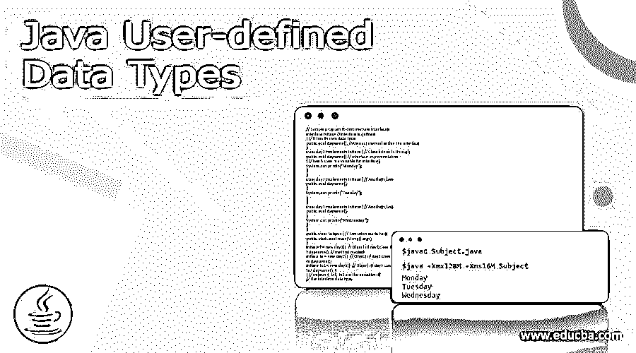
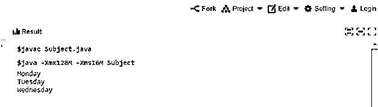

# Java 用户定义的数据类型

> 原文：<https://www.educba.com/java-user-defined-data-types/>




## Java 用户定义数据类型的定义

Java 用户定义的数据类型是开发人员利用 Java 语言提供的特殊功能创建的定制数据类型。这种定制的数据类型将一组数据元素的数据类型与同质或分类的数据类型相结合。它利用 Java 面向对象的功能，允许根据需要创建任何类型的数据。

这些数据类型具有多种多样的特征和行为，它为开发人员提供了更大的灵活性来提高他们的生产力和程序的可维护性。让我们在本文中了解一下这些特殊数据类型的特性。

<small>网页开发、编程语言、软件测试&其他</small>

**语法**

所有变量的数据类型都应该在编译之前声明，并且应该是 Java 提供的标准类型。除了声明的数据类型之外，变量不能包含任何其他数据类型。但是用户定义的数据类型提供了在组级别定义数据类型的灵活性。

### Java 中用户定义的数据类型

两种主要的用户定义数据类型是:

#### 1.班级

Java 是一种真正面向对象的语言，它包含了大量的类，这些类封装了从数据元素到实例变量和处理数据的函数的所有东西。它还提供了创建对象的模板，这些对象是类的实例，包含用于执行定义的函数并与程序的其他部分交互的方法。

**一个类通常包含**

| **Sl** | **语法** | **描述** |
| One | 易接近 | 公共或默认访问 |
| Two | 班级 | 文本定义 |
| Three | 类别名 | 包含字母和数字，通常以大写字母开头 |
| Four | 延伸 | 声明父类(可选) |
| Five | 接口 | 列出该类实现的接口。一个类可以实现多个接口(可选) |
| Six | 数据元素 | 具有混合或统一标准数据类型的变量。这些元素充当实例变量。 |
| Seven | 方法 | Data type of the result方法名称调用数据类型的变量功能代码。 |

##### 对象是如何创建的？

对象是从类创建或实例化的，并用作类的单个实例。为每个对象创建实例变量，以便与程序的其他组件进行交互，并且可以创建尽可能多的对象，每个对象将具有

*   使用唯一的名称来明确身份
*   不同的实例变量集来反映其状态。
*   定义其行为的所有功能

每个类都是用户定义的数据类型，其数据元素的所有数据类型的组合效果，每个对象都是可变数据。

**例子#1:类定义**

**代码:**

```
// Sample program to define Class, Object and Method
class ValueStore //Class definition with default access
{
int Rate; // Variables with standard data types
int Qty;
void AssignData(int A, int B) // method definition
{
Rate = A; // Assigning the values
Qty = B;
}
int ComputeValue() // Another method to compute value
{
int value; // variable definition
value = Rate * Qty;
return(value); // Returning the value
}
}
```

定义了具有默认访问权限的名为 ValueStore 的类。它有两个实例变量 Rate，QTY 用于方法交互。在该类中创建了两个方法 AssignData，ComputeValue，它们分别具有各自的函数代码。

**例 2**

```
public class OrderValueCompute // Public class
{
public static void main(String[] args) // Execution starts here
{
int value1; // variable definition
int value2;
ValueStore VS1; // Object VS1 definition
VS1 = new ValueStore(); // Object VS1 instantiated
ValueStore VS2; // Object VS2 definition
VS2 = new ValueStore(); // Object VS2 instantiated
VS1.AssignData (200,10); // Assigndata method in Object VS1 invoked
//with values
value1 = VS1.ComputeValue(); // Computedata method in object VS1
// invoked
VS2.AssignData (500,20); // Assigndata method in Object VS2
// invoked with values
value2 = VS2.ComputeValue(); // Computedata method in object VS2
//invoked
System.out.println("Order value 1 " +value1); // Output 1 displayed
System.out.println("Order Value 2 " +value2); // Output 2 displayed
}
}
```

在执行类中，另一个类中的对象被定义、实例化。方法被调用。获得并显示结果。类是用户定义的数据类型，每个对象都是其中的一个变量。

**结果:**


#### 2.连接

接口类似于架构中的类。它有数据变量和方法。它大体上建议了调用它的类应该做什么，但没有建议应该如何执行。

接口中的方法与类中的普通方法的不同之处在于

*   它还不成熟
*   它只是一个抽象概念，它只有一个定义，它的本体是空的。
*   它本身不会执行任何功能

接口不能像类一样实例化任何对象。但是它促进了抽象、多重继承和类的松散耦合。

类通过一个级别扩展到另一个超类。接口通过一个级别扩展到另一个超接口。类实现接口，间接实现多重继承，否则在类中是不可能的。

用户创建的每个界面都有一个独特的数据类型，其数据元素具有组合效果。在这些类中创建的对象也使用接口，每个对象都是接口数据类型的变量。

**例子**

下面的例子展示了类如何实现接口，如何创建这些类的对象来链接接口，以及如何执行它们。

**代码:**

```
// Sample program to demonstrate Interfaces
interface Intface //Interface is defined
{ // It has its own data type
public void dayname(); //Abstract method within the interface
}
class day1 implements Intface { // Class interacts through
public void dayname() // interface implementation
{ // (each class is a variable for interface)
System.out.println("Monday");
}
}
class day2 implements Intface { // Another class
public void dayname()
{
System.out.println("Tuesday");
}
}
class day3 implements Intface { // Another class
public void dayname()
{
System.out.println("Wednesday");
}
}
public class Subject { // Execution starts here
public static void main(String[] args)
{
Intface t = new day1(); // Object of day1 class thru interface
t.dayname(); // method invoked
Intface tx = new day2(); // Object of day2 class thru interface
tx.dayname();
Intface tx2 = new day3(); // Object of day3 class thru interface
tx2.dayname(); }
} // objects t, tx1, tx2 are the variables of
// the interface data type
```

**结果:**




### 结论

类和接口是主要的用户定义的数据类型。一些论坛认为字符串和数组也是用户定义类型的一部分。严格地说，它们是 Java 标准数据类型的一部分，因此不做讨论。

### 推荐文章

这是一个 Java 用户定义异常的指南。这里我们讨论一下引言、语法、对象是如何创建的？代码实现示例。您也可以看看以下文章，了解更多信息–

1.  [Java 集合类型](https://www.educba.com/java-collection-types/)
2.  [跳过列表 Java](https://www.educba.com/skip-list-java/)
3.  [Java 集合排序](https://www.educba.com/java-collection-sort/)
4.  [Java 中的 Servlet](https://www.educba.com/servlet-in-java/)


