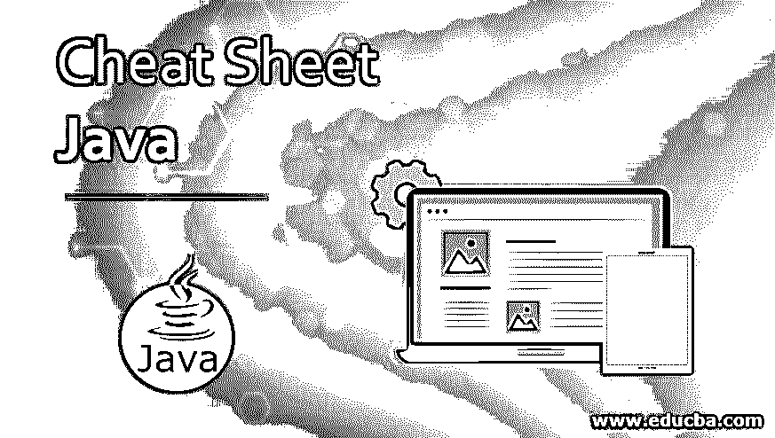

# 备忘单 Java

> 原文：<https://www.educba.com/cheat-sheet-java/>

## 备忘单 Java 简介

Java 基本上是一种高级的、面向对象的计算机编程语言，Sun Microsystems 在 1995 年开发了它。基于 Java 的应用程序主要被执行成字节码，该字节码可以在任何 Java 虚拟机上执行，而与任何计算机架构无关。詹姆斯·高斯林最初在 1991 年开始了 Java 语言项目，最初，它被命名为“橡树”,是以高斯林办公室外的一棵橡树命名的。

### Java 语言的重要特征

1.  它基本上是一种面向对象的编程语言。
2.  它是独立于平台的，因此与其他编程语言不同，Java 的编译不依赖于任何特定于平台的系统。
3.  从学习的角度来看，它更容易实现。
4.  它与体系结构无关，因此是可移植的。
5.  从安全角度来看，它有 3 层身份验证补丁。
6.  从性能角度来看，它总能确保正确的时间码编译和高性能输出。
7.  它比它的竞争对手更加动态，因此为开发者提供了额外的优势。
8.  它是多线程的。
9.  它为分布式互联网环境提供支持。

### 备忘单 Java 上的命令和内容

Java 有一个丰富的库，是交互式的，可扩展的，并包含许多计算常见操作的内置方法。下面是提到的 Java 命令备忘单，它执行不同种类的操作:

<small>网页开发、编程语言、软件测试&其他</small>

| **命令** | **描述** |
| **+** | 显示下一个内存部分(类似 hexdump 的格式) |
| **–** | 显示前一个内存部分(类似 hexdump 的格式) |
| **coreinfo** | 显示平台、版本信息和命令行参数 |
| **基础信息** | 显示主要基本信息 |
| **信息类** | 显示特定类的继承链和数据信息 |
| **信息存储器** | 显示和分析内存管理(树形格式) |
| **信息锁** | 显示锁定对象和可用监视器的列表 |
| **额外存储器** | 将提到的内存范围转换保存到二进制文件 |
| **堆转储** | 生成到文件的堆转储 |
| **信息符号** | 显示可用模块的列表 |
| **javaclass** | 要显示 Java 类的列表 |
| **javaobject** | 要显示特定的地址，java 对象 |
| **javamonitor** | 显示特定地址的 java-monitor |
| **javathread** | 要显示特定的 java 线程信息 |
| **显示堆转储** | 显示当前堆转储值的设置 |
| **显示日志记录** | 要显示当前日志记录设置的值 |
| **快照跟踪** | 将跟踪缓冲区提取到指定文件 |

**运算符:**Java 中不同类型的[运算符有比较(关系)运算符、赋值运算符、逻辑运算符、按位运算符、成员运算符和恒等运算符。不同类型的数字运算符有 int(有符号和无符号)、long、float 和复数。](https://www.educba.com/java-operators/)

**比较运算符:**在备忘单下面找到 Java 基本比较运算符。

| **操作员** | **描述/含义** |
| > | 大于 |
| < | 不到 |
| >= | 大于或等于 |
| <= | 小于或等于 |
| == | 等于 |
| != | 不相等 |

**打印语法:**在下面找到 Java 备忘单中使用的打印语法。

| **语法** | **输出** |
| void System.out.print(字符串 S) | 印刷 |
| void System.out.println(字符串 S) | 打印 S，后跟一个新行 |
| void System.out.println() | 打印新的一行 |

**循环:**Java 中的循环运算符有 while、for 和 nested。嵌套循环有 while、for、do…while 等。不同的循环控制语句是 break、continue 和 pass 语句。

**标识符:**用于标识任何函数、类、变量、对象或模块等。在 java 的情况下，标识符允许的字符是所有字母数字字符([a-z]、[A-Z]、[0-9])、' $ '(美元符号)和' _ '。Java 标识符也区分大小写。

**java . lang . math 类的方法:**Java . lang . math 类可用的备忘单 Java 方法如下

| **方法** | **描述** |
| 静态双 abs(双 a) | 返回双精度值的绝对值 |
| 静态 int abs(int a) | 返回整数值的绝对值 |
| 静态浮动 abs(浮动 a) | 返回浮点值的绝对值 |
| 静态 int max(int a，int b) | 返回两个整数值中较大的一个 |
| 静态浮动最大值(浮动 a，浮动 b) | 返回两个浮点值中较大的一个 |
| 静态长最大值(长 a 长 b) | 返回两个长整型值中的较大值 |
| 静态 int min(int a，int b) | 返回两个整数值中较小的一个 |
| 静态浮动最小值(浮动 a 浮动 b) | 返回两个浮点值中较小的一个 |
| 静态龙敏(长 a 长 b) | 返回两个长整型值中较小的一个 |
| 静态双随机() | 返回大于或等于 0.0 但小于 1.0 的正双精度值 |
| 静态双 ulp(双 d) | 返回参数 ulp 的大小 |
| 静态双 ulp(浮点 f) | 返回参数 ulp 的大小 |
| 静态双 sin(双 a) | 返回双精度值的双曲正弦值 |
| 静态双棕(双 a) | 返回一个角度的三角正切值 |

### 使用备忘单 Java 命令的免费提示和技巧

Java 备忘单可以使用命令行窗口并以不同的相关方法运行命令来运行。

1.  从编程的角度来看，Java 比其竞争对手提供了一套非常丰富和广泛的库方法，因此它已经成为程序员更喜欢的语言。
2.  在 java 的情况下，原语类比包装类更受欢迎，因此它消除了包装类的缓慢性。
3.  Java 程序可以通过运行窗口中的代码并同时执行程序来解释。
4.  映射功能将应用于输入列表中的所有项目。
5.  reduce 函数用于对列表进行一些计算，并返回一个值。
6.  在 Java 中，如果不使用构造函数直接启动字符串对象，从性能角度来看会更好。
7.  作为一种动态编程语言，在 Java 中使用“new”关键字进行内存分配是必要的。不使用“new”关键字将导致在代码中显示空指针异常。
8.  条件表达式可用于编写条件语句来执行所需的计算。

### 结论

Java 很容易使用，它的语法也更容易记忆和编写程序。通过使用支持 Java 的不同框架和技术，可以在 web 开发技术中使用 Java。基于项目需求的类型、工作时间和其他讨论的方面，应该使用 java 来达到预期的目标。

### 推荐文章

这是一本 Java 备忘单指南。这里我们讨论了重要的 java 语言特性、命令和内容，以及使用备忘单 Java 的技巧和诀窍。你也可以看看下面的文章来了解更多。

1.  [备忘单 SQL](https://www.educba.com/cheat-sheet-sql/)
2.  [备忘单 CSS3](https://www.educba.com/cheat-sheet-css3/)
3.  [备忘单 HTML](https://www.educba.com/cheat-sheet-html/)
4.  【UNIX 备忘单

