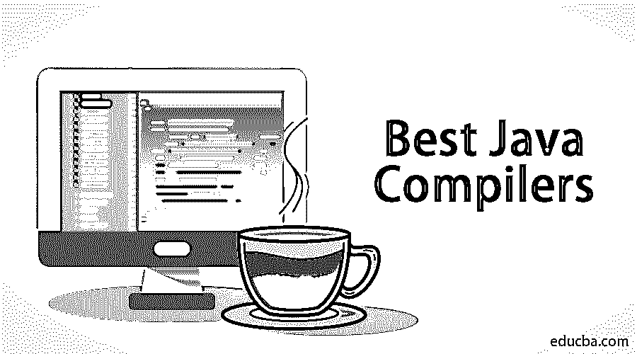
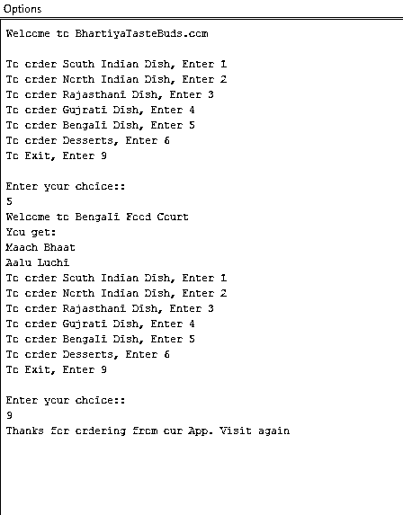

# 最佳 Java 编译器

> 原文：<https://www.educba.com/best-java-compilers/>




## 最佳 Java 编译器简介

Java 编译器是在 Java 平台内部编译或执行 Java 代码的编译器。Java 类文件是最常见的 Java 编译器类型，有些机器会为特定的硬件或操作系统发出本机代码。硬件或操作系统在编译中起着至关重要的作用。不同的操作系统有不同的标准，用于在不同的平台上编译不同的代码。在 JSR 199 中给出了一个关于 Java 编译器如何被指定的标准。 [Java 虚拟机(JVM)](https://www.educba.com/java-virtual-machine/) 用于加载类文件，并使用 [Java 编程语言](https://www.educba.com/java-programming-language-features/)内的编译技术转换成字节码或即时码。有 BlueJ 这样的编译器，编译器的基本功能是把用户代码转换成机器码然后执行，有各种功能和编程感。

### 工作

今天，在编程行业中使用了许多 Java 编译器。有许多在线 ide 或接口可以让 Java 代码非常流畅地运行，以执行大量代码。它们中的一些提供了超越桌面选项的显著优势。以下是其中的一些要点:

<small>网页开发、编程语言、软件测试&其他</small>

*   易于设置–无需下载和安装程序。
*   快速启动——否则 Eclipse 需要一分钟才能打开
*   轻松分享——老师和学生之间的分享，也就是他们的作业。

### Java 编译器

在本文中，我们将看到一些用于运行代码的 Java 编译器。它们如下:

#### 1.科迪瓦

*   Codiva.io 是最好的 Java 编译器，广泛用于 Java 语言接口的编码和编程。
*   Codiva 的最大优势在于，它可以在用户输入代码时立即编译代码，处理编译错误并在编辑器中显示出来。完成输入后，我们会看到编译的最终结果，显示在相应编译器的编辑器中。
*   还有一个很好的自动完成的规定。这是在编译器中处理简单或复杂代码时节省大量时间的两个特性。
*   Codiva 有一个功能，可以启用多个文件和软件包。它还可以有文件名，文件名可以定制。
*   Codiva 在移动平台上也可以非常流畅地工作。Codiva 的一些缺点是它只支持 Java、C 或 C++。Codiva 支持 Java 9 但不支持 Java 9 模块，其他在线编译器也不支持 Java 模块。所以，它不支持 Java 9 模块是很自然的。

#### 2.Jdoodle

*   JDoodle 是一个广泛使用的在线编译器，用于在 Java 平台上广泛运行 Java 代码。它支持近 70 种语言。JDoodle 只允许一个文件，但是你不需要指定任何文件名。这些是通过搜索文件名找到的。
*   它对运行与实时代码一对一交互的程序有很好的终端支持。程序以 10 秒计时运行。
*   Android Studio 使用 Java 来构建 Android 程序，Jdoodle 是那里使用的极少数编译器之一。
*   如果一个人懂很多语言，知道如何在语言之间切换，那将是一个很棒的选择。
*   JDoodle 也有缺点。其中一个缺点是，代码是在编写或起草后编译的。用户必须找到错误消息，然后转到发生错误的那一行，进行必要的修改。以前使用过 Codiva 的人会发现首先处理 JDoodle 非常困难。其次，JDoodle 的缺点是只支持一个文件。在[封装](https://www.educba.com/encapsulation-in-java/)的系统中，不能示教包。JDoodle 有很多缺点。尽管有这些缺点，JDoodle 还是很受欢迎，因为它有很多用途。

#### 3.雷克斯测试仪

*   Rextester 最初是一个正则表达式测试器。后来它成长为一个在线界面。它很受 C#用户的欢迎，可以用于 30 多种编程语言，包括 Java。
*   在 Rextester 中，多个编辑器小部件之间存在差异。
*   它拥有 Java 编程语言中最好的实时协作支持。网址可以共享，打字可以很轻松的开始。到目前为止没有出现任何故障，多个用户可以同时编辑。
*   Netbeans 也是一个广泛使用 Rextester 的平台。
*   它只支持单个文件，并且该文件的类名应该是 Rextester 才能得到支持。此外，该类不应公开。

### 在 Blue J 平台上运行的代码示例

在这段代码中，我们将看到一个 Java 代码的酒店应用程序。下面给出了代码和输出。

**样本代码**

```
import java.util.Scanner;
public class HotelMenu {
public static void main(String[] args){
Scanner scan = new Scanner(System.in);
System.out.println("Welcome to BhartiyaTasteBuds.com");
System.out.println();
//Creating Menu
while(true){
System.out.println("To order South Indian Dish, Enter 1");
System.out.println("To order North Indian Dish, Enter 2");
System.out.println("To order Rajasthani Dish, Enter 3");
System.out.println("To order Gujrati Dish, Enter 4");
System.out.println("To order Bengali Dish, Enter 5");
System.out.println("To order Desserts, Enter 6");
System.out.println("To Exit, Enter 9");
System.out.println();
System.out.println("Enter your choice::");
int choice = scan.nextInt();
switch(choice){
case 1: System.out.println("Welcome to South Indian Food Court");
southIndianFood();
break;
case 2: System.out.println("Welcome to North Indian Food Court");
northIndianFood();
break;
case 3: System.out.println("Welcome to Rajasthani Food Court");
rajasthaniFood();
break;
case 4: System.out.println("Welcome to Gujrati Food Court");
gujratiFood();
break;
case 5: System.out.println("Welcome to Bengali Food Court");
bengaliFood();
break;
case 6: System.out.println("Welcome to Desserts Food Court");
desserts();
break;
case 9: System.out.println("Thanks for ordering from our App. Visit again");
System.exit(0);
break;
default: System.out.println("Incorrect input!!! Please re-enter choice from our menu");
}
}
}
public static void southIndianFood(){
System.out.println("You get:");
System.out.println("Idli : 2 Pieces:");
System.out.println("Butter Cheese Dosa : 1 Pieces:");
System.out.println("Vada : 2 Pieces:");
}
public static void northIndianFood(){
System.out.println("You get:");
System.out.println("Chole Bhature : 2 Pieces:");
System.out.println("Litti Chokha : 4 Pieces:");
}
public static void rajasthaniFood(){
System.out.println("You get:");
System.out.println("Dal Baati Churma");
System.out.println("Laal maas");
System.out.println("Methi Bajra puri");
}
public static void gujratiFood(){
System.out.println("You get:");
System.out.println("Dhokla : 2 pieces");
System.out.println("Khandvi");
System.out.println("Methi ka Thepla");
}
public static void bengaliFood(){
System.out.println("You get:");
System.out.println("Maach Bhaat");
System.out.println("Aalu Luchi");
}
public static void desserts(){
System. out. println(" You get: ");
System. out. println("Rasmalai");
System. out. println("Rasgulla : 2 Pieces");
System.out.println("Emarti : 2 Pieces");
System.out.println("Gajar ka halwa");
}
}
```

**输出:**

[

](https://cdn.educba.com/academy/wp-content/uploads/2019/09/Sample-Code-Basic-Java-Compilers.bmp) 

### 结论

Java 中有许多编译器，但本文展示了一些最好的 Java 编译器。在桌面编程中，Java 使用 BlueJ 或 Eclipse 平台来执行 Java 代码。编译时间和效率取决于硬件或我们使用的操作系统的配置。

### 推荐文章

这是一本最佳 Java 编译器指南。在这里，我们用适当的例子和输出来详细讨论不同的 java 最佳编译器的基本含义。您还可以浏览我们推荐的其他文章——

1.  [Java 中的同步是什么？](https://www.educba.com/what-is-synchronization-in-java/)
2.  [Java 中的析构函数](https://www.educba.com/destructor-in-java/)
3.  [Java 集合面试问题](https://www.educba.com/java-collection-interview-questions/)
4.  [Java 9 的特性](https://www.educba.com/java-9-features/)


