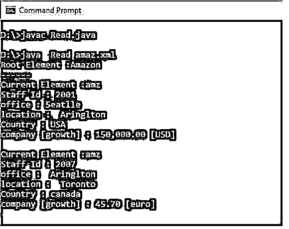
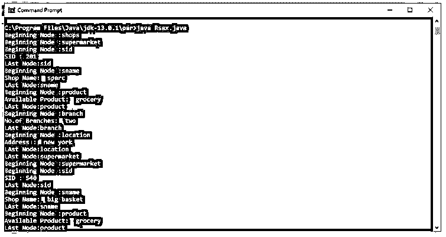

# Java XML 解析器

> 原文：<https://www.educba.com/java-xml-parser/>


## Java XML 解析器简介

下面的文章提供了 Java XML 解析器的概要。XML parsing for Java 是一个独立的 XML 组件，它解析 XML 文档(在某些情况下，还解析独立的 DTD 或 XML 模式),以便用户程序可以处理它。它还可能包括一个 XSL 转换(XSLT)处理器，用于使用 XSL 样式表进行 XML 数据转换。我们可以简单地用 XSLT 处理器将 XML 文档从 XML 转换成 XML，从 XML 转换成 HTML，或者几乎任何其他基于文本的格式。

### Java XML 解析器的语法

通用解析格式如下所示:

<small>网页开发、编程语言、软件测试&其他</small>

1.使用 DOM

```
DOMParser parser = new DOMParser();
```

2.使用 SAX

```
Parser parser = new SAXParser();
```

XML(可扩展标记语言)是一种标记语言，它指定了一组编码文本的规则。为了解析和处理 XML 文档，Java 提供了几个库。Java xml 解析器示例提供了读取和更改 XML 文件的基本功能。

### Java XML 解析器是如何工作的？

说到解析 XML 文档，Java 有很多可能性。

以下是一些最广泛使用的 Java XML 解析器:

*   数字正射影像图
*   萨克斯管
*   JAXB
*   XML 流 API(Stax)

JAXB 和 Stax 是 Java 的新版本。Stax 解析器使用游标甚至迭代器 API 来解析 XML 文档。它使用两个接口事件读取器和事件写入器，应用程序在整个文档中循环，等待下一个事件。Stax 的 API 类型是拉取和流式传输的，与 Xpath 不兼容。拉解析允许客户端根据需要控制应用程序线程和调用解析器方法。另一方面，推处理允许解析器控制应用程序线程，而客户机只接受来自解析器的调用。抽象基类是 XMLParser。实例化解析器的 parse()方法用于读取 XML 文档。

**Java XML 解析器工作:**

*   Java 的 XML 解析器接收一个 XML 文档作为输入。
*   使用 DOM 或 SAX 解析器接口解析 XML 文档。
*   应用程序接收解析后的 XML 并做进一步的工作。

### SAX 解析器

SAX 代表 Simple API for XML，Push 解析器是一个面向流的 XML 解析器。主要目标是读取 XML 文件并创建一个事件来执行调用功能或使用回调例程。这个解析器的工作方式与 Java 事件处理程序相同。需要注册处理程序来解析页面和处理各种事件。

为了提供以下回调，SAX 解析器扩展了默认的处理程序类:

*   **startElement:** 当发现一个开始标签时，这个事件被触发。
*   **endElement:** 当遇到结束标签时，该事件被触发。
*   **字符:**当发现一些文本数据时，触发此事件。

### Java XML 解析器的例子

下面是提到的例子:

#### 示例#1

Java DOM 解析器。

**代码:**

**Read.java:**

```
import org.w3c.dom.Document;
import org.w3c.dom.Element;
import org.w3c.dom.Node;
import org.w3c.dom.NodeList;
import org.xml.sax.SAXException;
import javax.xml.parsers.DocumentBuilder;
import javax.xml.parsers.DocumentBuilderFactory;
import javax.xml.parsers.ParserConfigurationException;
import java.io.File;
import java.io.IOException;
import java.io.InputStream;
public class Read {
private static final String FILENAME = "D:\\parser\\amaz.xml";
public static void main(String[] args) {
DocumentBuilderFactory dbf = DocumentBuilderFactory.newInstance();
try {
DocumentBuilder db = dbf.newDocumentBuilder();
Document doc = db.parse(new File(FILENAME));
doc.getDocumentElement().normalize();
System.out.println("Root Element :" + doc.getDocumentElement().getNodeName());
System.out.println("------");
// get <staff>
NodeList list = doc.getElementsByTagName("amz");
for (int temp = 0; temp < list.getLength(); temp++) {
Node node = list.item(temp);
if (node.getNodeType() == Node.ELEMENT_NODE) {
Element element = (Element) node;
String id = element.getAttribute("id");
String office = element.getElementsByTagName("office").item(0).getTextContent();
String location = element.getElementsByTagName("location").item(0).getTextContent();
String Country = element.getElementsByTagName("Country").item(0).getTextContent();
NodeList companyNodeList = element.getElementsByTagName("company");
String company = companyNodeList.item(0).getTextContent();
String growth = companyNodeList.item(0).getAttributes().getNamedItem("growth").getTextContent();
System.out.println("Current Element :" + node.getNodeName());
System.out.println("Staff Id : " + id);
System.out.println("office : " + office);
System.out.println("location : " + location);
System.out.println("Country : " +Country);
System.out.printf("company [growth] : %,.2f [%s]%n%n", Float.parseFloat(company), growth);
}
}
} catch (ParserConfigurationException | SAXException | IOException e) {
e.printStackTrace();
}
}
}
```

**无。xml:**

这个 xml 文件包含 xml 属性以及 XML 元素。

```
<?xml version="1.0"?>
<company>
<staff id="1001">
<firstname>yong</firstname>
<lastname>mook kim</lastname>
<nickname>mkyong</nickname>
<salary currency="USD">100000</salary>
</staff>
<staff id="2001">
<firstname>low</firstname>
<lastname>yin fong</lastname>
<nickname>fong fong</nickname>
<salary currency="INR">200000</salary>
</staff>
</company>
```

**说明:**

*   在上面的代码中，首先，将 dom 解析器包导入应用程序。
*   接下来，将创建 DocumentBuilder 对象。XML 文件被带到文档对象。最后，解析 XML 文件并将其保存在 document 类中。

**输出:**




#### 实施例 2

Java SAX 解析器。

**代码:**

**Read.java:**

```
import javax.xml.parsers.SAXParser;
import javax.xml.parsers.SAXParserFactory;
import org.xml.sax.Attributes;
import org.xml.sax.SAXException;
import org.xml.sax.helpers.DefaultHandler;
public class Read
{
public static void main(String args[])
{
try
{
SAXParserFactory f = SAXParserFactory.newInstance();
SAXParser saxP= f.newSAXParser();
DefaultHandler hdl = new DefaultHandler()
{
boolean fid = false;
boolean fname = false;
boolean fproduct = false;
boolean discount = false;
boolean dataware = false;
public void startElement( String sg, String pp,String q, Attributes a) throws SAXException
{
System.out.println("First Node :" + q);
if(q.equalsIgnoreCase("FID"))
{
fid=true;
}
if (q.equalsIgnoreCase("FNAME"))
{
fname = true;
}
if (q.equalsIgnoreCase("FPRODUCT"))
{
fproduct = true;
}
if (q.equalsIgnoreCase("DISCOUNT"))
{
discount = true;
}
if (q.equalsIgnoreCase("DATAWARE"))
{
dataware = true;
}
}
public void endElement(String u, String l, String qNa) throws SAXException
{
System.out.println("Final Node:" + qNa);
}
public void characters(char chr[], int st, int len) throws SAXException
{
if (fid)
{
System.out.println("FID : " + new String(chr, st, len));
fid = false;
}
if (fname)
{
System.out.println("Shop details: " + new String(chr, st, len));
sname = false;
}
if (fproduct)
{
System.out.println("Remaining Product: " + new String(chr, st, len));
fproduct = false;
}
if (discount)
{
System.out.println("discount given: " + new String(chr, st, len));
discount = false;
}
if (dataware)
{
System.out.println("location : " + new String(chr, st, len));
dataware= false;
}
}
};
saxParser.parse("D:\\parser\\amaz.xml", handler);
}
catch (Exception ex)
{
ex.printStackTrace();
}
}
}
```

**无。xml:**

```
<?xml version="1.0"?>
<onlineshop>
<flipkart>
<fid>301</fid>
<fname> ethinic</fname>
<fproduct> kurtas</fproduct>
<discount> 10</discount>
<dataware> bangalore</dataware>
</flipkart>
<flipkart>
<fid>401</fid>
<fname> partywear</fname>
<fproduct> saree</fproduct>
<discount> 20</discount>
<dataware> mumbai</dataware>
</flipkart>
<flipkart>
<fid>501</fid>
<fname> kids</fname>
<fproduct> t-shirts</fproduct>
<discount> 12</discount>
<dataware> Uttarpradesh</dataware>
</flipkart>
</onlineshop>
```

**说明:**

*   上面的代码实现了一个 SAX 解析器，它从 Flipkart 购物文件中获取一个新实例。它一个节点一个节点地解析。

**输出:**




### 结论

Java XML 解析器用于读取和验证 XML 文档。在上面的文章中，我们通过一个例子介绍了不同类型的解析器。SAX 解析器比 DOM 解析器快。

### 推荐文章

这是一个 Java XML 解析器的指南。这里我们讨论一下入门，Java XML 解析器是如何工作的？SAX 解析器和例子。您也可以看看以下文章，了解更多信息–

1.  [跳过列表 Java](https://www.educba.com/skip-list-java/)
2.  [Java 中的 Shell 排序](https://www.educba.com/shell-sort-in-java/)
3.  [Java 中的桶排序](https://www.educba.com/bucket-sort-in-java/)
4.  [Java 中的排序字符串](https://www.educba.com/sort-string-in-java/)


