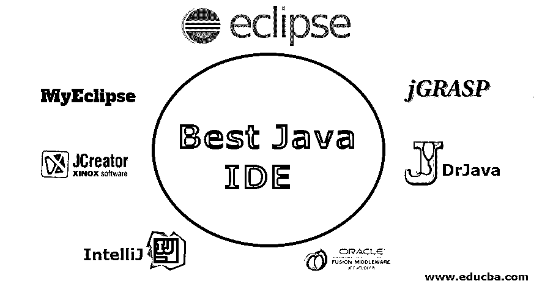

# 最佳 Java IDE

> 原文：<https://www.educba.com/best-java-ide/>

## 最佳 Java IDE 简介

Java 是一种非常流行的语言，几乎在全世界都在使用——Android 应用程序、游戏控制台，甚至超级计算机。产品的简单性和难以置信的便携性得到了认可。我们今天的文章研究了有史以来最好的 10 个 Java IDEs。Java IDE， [IDE](https://www.educba.com/what-is-ide/) 代表集成开发环境。IDE 是一个单独的程序，允许你编辑和编译你的代码，支持资源管理，允许你在整个项目中使用高级的[调试](https://www.educba.com/what-is-debugging/)功能，并提供部署和版本控制的可能性。

### IDE 是什么？

IDE 的意思是集成开发环境。这是一个促进应用成长的应用。一般来说，IDE 是基于 GUI 的图形用户界面。它旨在支持开发人员使用设置和所有必要的工具来构建软件应用程序。优秀 IDE 的选择取决于语言支持、操作系统要求和费用等变量。

<small>网页开发、编程语言、软件测试&其他</small>

让我们简要介绍一下它的优点。

#### 优势

使用 JAVA 程序 IDE 可以节省很多精力。一些好处包括:

1.  一群程序员将通过在相同的开发环境中工作，简单地链接到传统的做事方式。
2.  如果 IDE 提供了预定义的模板，或者代码库在从事同一项目的团队成员/团队之间共享，则可以进一步实施标准。
3.  IDE 的目的完全是为了促进和加速开发过程。不同的工具和功能帮助您安排资源、避免错误和提供快捷方式。
4.  许多 ide 都有文档工具，可以自动完成设计者的注释，或者让开发人员对不同的字段进行注释。

### 顶级 Java IDE

我们来看看顶级的 Java IDE。

#### 1.黯然失色

Eclipse 是一个新的、开源的、跨平台的免费分布式 IDE，用于公司 web 开发。1998 年，IBM 软件集团设计了一个 IDE，可以深入竞争的 IDE 房间，成为领导者。这导致了 Eclipse 成为 web 开发最好的 Java IDEs 之一。这是一个 Java IDE，被列为最好的 Java IDE 之一。在桌面版和云版中，都可以访问著名的嵌入式开发环境。Eclipse Cloud edition 是 Eclipse Che，使程序员能够通过 web 浏览器创建应用程序。由于大部分是用 Java 编写的，Eclipse 本身就是一个更好的 Java 应用程序的例子。对于现代 web 应用程序的开发，它应该是一个坚实、全面的商业平台。

**Eclipse IDE 的特性**

*   [Eclipse IDE 提供了对 Java 8.0 和 9.0 版本的](https://www.educba.com/eclipse-vs-intellij/)支持。
*   它帮助你重构代码，编辑及时验证，编译增量，交叉引用，代码建议。
*   完成智能编码和快速修正。
*   Eclipse 提供了出色的性能和可用性。Eclipse 还支持像 mac os / [Linux / Windows](https://www.educba.com/linux-vs-windows-server/) 这样的操作系统。
*   想要创建特定 Eclipse 特性的 Java 程序员可以访问 PDE。

#### 2\. IntelliJ

IntelliJ IDEA 也是最好的 Java IDEs 之一。它有两个不同的版本，一个是 Apache 2 的授权社区版，另一个是 Ultimate(商业)版的独家付费版。IntelliJ IDEA 提供了跨语言重构和信息流评估等特性，以使开发人员能够更深入地了解 Java 代码，它是一个开源 IDE，旨在用于 JVM( [Java 虚拟机](https://www.educba.com/what-is-jvm/))和 Android 的开发。它支持 SBTs、Git、SVN、Mercurials、CVs 和 TFS Javas、Colin、Groovies 和 Scalas。除了其他版本控制系统，终极版是针对 web 和公司的开发。它推广 [JavaScript](https://www.educba.com/what-is-javascript/) ，Java EE，GWT，Vaadin，Grails 和 Spring，玩其他框架。还支持数据库工具和 SQL。

**IntelliJ 的特性**

*   安装开源 IDE 很简单，在各种平台上使用也很简单。
*   它适用于移动应用，是移动增长领域中著名的 IDE。
*   第三方 Java 开发团队也可以在以后为插件扩展它。
*   Java 编辑器通过在语法和语义上突出显示 Java 代码，使程序员能够创建定制的软件应用程序。
*   NetBeans 工具还可以帮助开发人员修改和编写无错误的代码。

#### 3.JDeveloper

JDeveloper 是 Oracle 公司的免费 IDE。它提供了 Java、XML、SQL、PL / SQL、HTML、JavaScript、BPEL 或 PHP 开发特性。JDeveloper 包括从概念到编码、调试、优化和部署的完整开发生命周期。JDeveloper 包括从概念到编码、调试、优化和部署的完整开发生命周期。

**JDeveloper 的特性**

它使得开发解决应用程序生命周期每一步的 Java 应用程序变得更加容易。它提供了一个集成的开发框架，具有多种特性和几个主要用于可视化开发的工具。
为了使应用程序开发更加容易，可以将这个 Oracle J Developer 集成到 Oracle 应用程序开发框架(Oracle ADF)中。
除了 Java，JDeveloper 还可用于 HTML、JavaScript、PHP、SQL 和 XML 应用程序。
它还包括一个完整的开发生命周期:编码、设计、调试、优化、分析和部署。

#### 4.MyEclipse

MyEclipse 有助于构建一个简单而动态的前沿，并开发一个强大的后端。它在今天的公司中有着极其重要的作用。一家著名的公司 Genuitec 是 Eclipse 基金会的创始人之一，它已经建立并保留了它。MyEclipse 为 Windows、Linux 和 Mac 等多个系统提供了业界领先的特性。

**髓磷脂酶的特性**

具有高级 JavaScript 功能的工具 Ajax 和 Web 2.0。MyEclipse 支持 maven 配置。
·高级报告工具。
业界领先的 Java 持久性工具等等。

#### 5.DrJava

DrJava 是另一个轻量级的，主要面向 Java 初学者。莱斯大学的 JavaPLT 小组是积极创建和维护的。它对于老练的用户也有很强的特性。DrJava 是免费的。即使它不像其他伟大的名字那样对 Java 的发展有强大的影响力，DrJava 也有一个非常不受控制的接口。

**dr Java 的特性**

Java 博士鼓励从控制台评估 Java 代码，并以交互方式呈现控制台的输出。
它帮助程序员排队寻找或[替换功能](https://www.educba.com/replace-function-in-javascript/)。
它为经验丰富的程序员提供自动缩进、括号匹配、注释和语法着色。
与其他 Java IDEs 不同，DrJava 在不同的平台上是不变的。它旨在与 Sun Microsystems 的 swing 工具包一起使用。
·dr Java 也可以通过插件与 Eclipse 整合。

#### 6.JGRASP

JGRASP 是 Java 最好的轻量级 ide 之一。为了确保复杂图形剖面和 UML 类图的有效生成，它没有为 Java 开发人员提供嵌入式调试器和工作台。

**j grasp 的特点**

它特别旨在自动化软件可视化，增强对任何软件的总体理解。这是一个轻量级系统，可以在运行时生成源代码框架的静态可视化以及数据结构可视化。作为一个有用的源代码编辑器，它也适用于其他语言。免费的 IDE 可以配置为使用大多数商业编译器运行不同的编程语言。
在应用 Java 的同时，jGRASP 能够为其他编程语言生成 CSD。

#### 7.JCreator

JCreator 是一个 Xinox 软件 Java IDE。它显示了与微软的 Visual Studio 相当的界面。是一个小型的 Java IDE。Xinox Software 声称 Jcreator 比竞争对手的基于 Java 的 ide 更快，因为它完全是用 C++编程的(除了第一个基于 Java 的(0.1)变体)。只有在 Windows 操作系统上才能访问 JCreator。但是，JCreator 的 LE 和 Pro 变体都可以在 Linux 上正常运行(使用 Wine)。没有计划立即发布 Linux 版本，但是为了交叉兼容性，正在构建新的部分。此外，免费的 LE 版本缺少某些功能，比如代码完成，它包括其他免费的 ide。与当前主流的 Java ide 相比，JCreator 缺乏流行的 Java ide 中普遍存在的第三方插件的可扩展性。

**Jcreator 的特性**

精简版、专业版和 Life-Pro 版有三种不同的版本。有三种不同的版本，分别是精简版、专业版和终身专业版。
虽然 JCreator 完全是用 C++创建的；还有其他主要的 Java IDEs。此外，JRE 对于 Java 代码的执行并不是必需的。这就是为什么 JCreador 比大多数标准的基于 Java 的 ide 更快地被开发人员社区所提倡。

### 结论

在本文中，我们已经了解了 JAVA IDE 及其优点。在这里，我们还讨论了各种 ide 及其特性。

### 推荐文章

这是最佳 Java IDE 的指南。在这里，我们讨论了 Best Java IDE 的介绍、它的优势以及 top IDE 和它的特性。您也可以浏览我们推荐的其他文章，了解更多信息——

1.  [什么是 Java 接口？](https://www.educba.com/what-is-java-interface/)
2.  [Java 中的同步是什么？](https://www.educba.com/what-is-synchronization-in-java/)
3.  [Java EE 面试问题](https://www.educba.com/java-ee-interview-questions/)
4.  [Java 开发人员职业](https://www.educba.com/careers-as-java-developer/)

