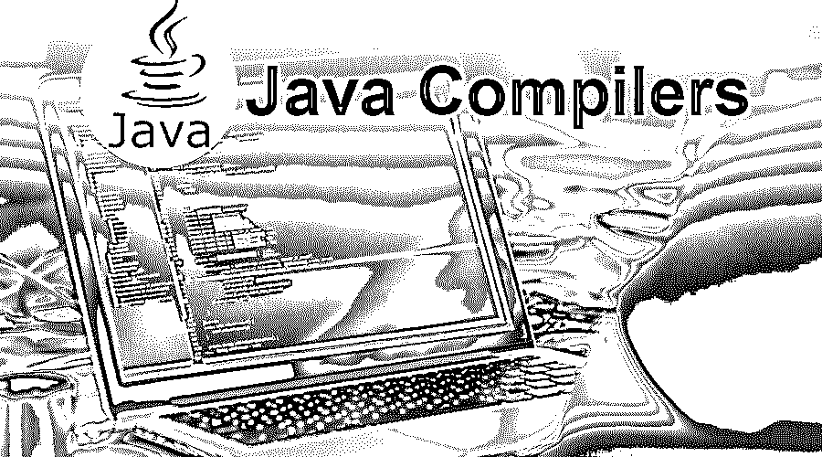

# Java 编译器

> 原文：<https://www.educba.com/java-compilers/>

## Java 编译器简介

Java 编译器是为编程语言设计的。每一种[编程语言](https://www.educba.com/what-is-a-programming-language/)都有其执行代码返回的程序——将人类可以理解的代码转换成机器可以理解的语言。Java 很容易理解。如果我们用 java 写程序，就要把它们转换成机器语言。

机器语言无非就是 0 和 1，要把这种代码转换成字节码，java 有自己的一套编译器。一般来说，我们只知道几个编译器。如果你是 java 新手，那么你可能只知道一个叫做 javac 的编译器。编译器给了我们与其他平台交互的能力。我们可以在任何平台上运行用 Java 编写的程序，如 Windows、Linux、MAC 等。对于应该使用哪种编译器没有限制。但是我们暂时应该知道不同编译器的可用性。现在让我们看看它到底是什么意思。

<small>网页开发、编程语言、软件测试&其他</small>

### 什么是 Java 编译器？

编译器是人类语言和机器可理解语言之间的接口。Java 编译器在。java 文件，并将。java 文件转换到其对应的。类文件。这个。类文件可以在任何操作系统上运行。

因此，java 是一种独立于平台的语言。编译器 javac 将我们的 java 文件转换成机器语言。字节码称为字节码。是时候去看看不同的环境了。

### Java 编译器的类型

1.  Javac
2.  爱迪生设计集团
3.  GCJ
4.  ECJ
5.  Jikes
6.  功率 J
7.  吉特舞乐
8.  客户端编译器
9.  服务器端编译器

让我们详细研究以下不同类型的编译器:

#### 1.Javac

Martin Odersky 在甲骨文进一步拥有的 Sun Microsystems 实现了它。这个 javac 编译器必须与任何 IDE 一起安装才能运行 java 程序。Javac 本身是用 Java 语言编写的。该编译器可用于

#### 2.爱迪生设计集团

这是一家生产 EDG 编译器的公司。j .斯蒂芬“史蒂夫”亚当奇克在 1988 年实现了它。他们主要编写编译器进行预处理和解析。该编译器也可用于 Windows、UNIX 和其他操作系统，但是该编译器不可用于任何 IDE。

#### 3.GCJ

GCJ 代表 Java 的 GNU 编译器。这是一个可用于 Java 编程语言的免费编译器。这个编译器将 java 源代码编译成机器可理解的格式。它还可以编译包含字节码的 jar。这个编译器只对 UNIX 可用，对 Windows 等其他操作系统不可用，而且对任何 IDE 都不可用。该编译器还可以编译 C、C++、Fortran、Pascal 和其他编程语言。

#### 4.ECJ

这是一个 Eclipse Java 编译器，随 Eclipse IDE 提供，可用于 Windows、UNIX 等操作系统。使用这个编译器，如果代码的某个部分有编译时错误，可以测试代码的另一部分是否工作正常。javac 不是这种情况，因为您需要在编译之前修复所有的错误。使用 Eclipse 编译器，如果您的 java 源代码有任何编译时错误，它将作为运行时异常来处理。此外，该编译器可以在 IDE 的后台运行，与 javac 相比，它加快了编译速度。

#### 5\. Jikes

这个编译器是由 IBM 的 Dave Shields 和 Philippe Charles 开发的，它是一个 OSI 认证的开源 Java 编译器[，用 C++](https://www.educba.com/introduction-to-c-plus-plus/) 编写。它是一个用于大型项目的高性能编译器，在编译小型项目时比 Sun 的编译器快得多。Jikes 是 1998 年为 Linux 发布的。Jikes 编译器的问题是它不支持 Java 5 和更高版本，因为没有来自 IBM 的更新。该编译器最适合 JDK 1.3 及以下版本。

#### 6.功率 J

这个编译器是在 Sybase 上编写的，Sybase 进一步被 SAP 拥有。这适用于 Windows，也适用于 ide。

#### 7.吉特舞乐

它代表实时编译器，用于提高 Java 应用程序的性能。默认情况下，此编译器是启用的。当 java 中的任何方法被调用时，它被激活。JIT 将该方法的字节码编译成机器码。它是 Java 运行时环境的一个组件，可以提高运行时的性能。

#### 8.客户端编译器

客户端编译器是 C1，它是通过 JVM 启动命令行选项中的–client 启用的。它用于资源非常少的客户端应用程序，减少了应用程序的启动时间。

#### 9.服务器端 Java 编译器

这用于在服务器端运行的应用程序，如服务器端企业应用程序。对于运行在服务器端的应用程序来说，客户端编译器是不够的。因此，服务器端编译器是 C2，这个编译器是通过服务器 JVM 启动命令行选项启用的。更高级的算法和技术可以通过服务器端编译器与应用程序一起使用。

要使用 Java，我们需要知道所有的编译器吗？

不，您不需要在编译过程中接触每个环境；根据您的需求和工具，您可以从上面选择任何人。

### 结论

Java 是一种[面向对象的编程语言](https://www.educba.com/object-oriented-programming-in-java/)，它将代码编译成字节码，然后在任何支持 Java 虚拟机的计算机系统上运行这些代码。编译器是一种将开发者编写的编程语言的高级源代码处理成机器可理解格式的程序。这些编译器也是用 Pascal、C、Basic、Java 等编程语言编写的。一般来说，编译器可以用任何强大到足以编写编译器的语言来编写。

### 推荐文章

这是 Java 编译器的指南。这里我们讨论了一些不同类型的 Java 编译器的基本概念。您也可以浏览我们推荐的其他文章，了解更多信息——

1.  [js vs Java 性能](https://www.educba.com/node-js-vs-java-performance/)
2.  什么是 JavaBeans？
3.  [PHP 编译器](https://www.educba.com/php-compiler/)
4.  [JavaScript 编译器](https://www.educba.com/javascript-compilers/)

