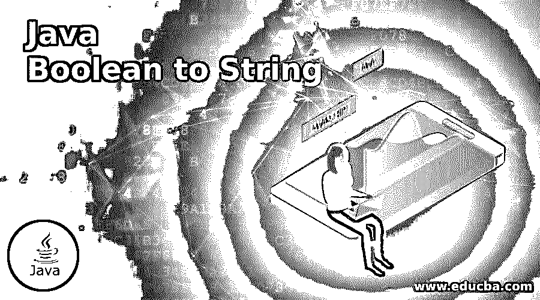
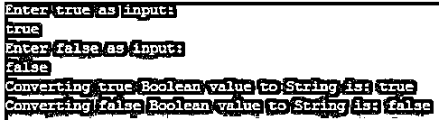
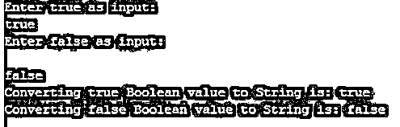

# Java 布尔值到字符串

> 原文：<https://www.educba.com/java-boolean-to-string/>




## Java 布尔到字符串简介

Java 布尔值到字符串的转换有两种方式。第一种方法是使用 valueOf()方法，第二种方法是使用 toString()方法。Java 中用真或假值表示的布尔值。人的肉眼可能会把它当作细绳，但它可能是也可能不是。如果是字符串类型就没有问题，但如果是布尔值，我们在对字符串执行任何操作时都会有问题。所以在处理布尔值之前，我们必须转换成字符串。

**实时场景:**大多数浏览器直接读取字符串数据，因此如果我们有任何布尔值，最好将其转换为字符串。

<small>网页开发、编程语言、软件测试&其他</small>

### Java 中如何把 Boolean 转换成 String？

在 java 中，可以通过两种方式进行转换:

*   使用 valueOf()方法
*   使用 toString()方法

#### 1.使用 valueOf()方法

这个方法直接用在 String 上，像 String.valueOf()方法，把布尔值转换成字符串值。它是静态方法，所以我们使用了字符串的类名。下面给出了方法签名。

**语法:**

```
public static String valueOf(boolean bool)
Internal implementation of valueOf() method:
public static String valueOf(boolean bool) {
returnbool ? "true" : "false";
}
```

#### 2.使用 toString()方法

该方法直接用于 Boolean like Boolean.toString()方法，将布尔值转换为字符串值。它是静态方法，所以我们使用了布尔的类名。下面给出了方法签名。

**语法:**

```
public static String toString(boolean bool)
Internal implementation of toString() method:
public static String toString(boolean bool) {
returnbool ? "true" : "false";
}
```

**Note:** There is no much performance difference between valueOf() and toString() method.

### 例子

下面是提到的例子:

#### 示例#1

使用 valueOf()方法将静态布尔值转换为字符串。

**代码:**

StaticBooleanStringValueOf.java

```
//importing packages
//package com.bool.string;
//creating a class
public class StaticBooleanStringValueOf {
// main method to run the java application
public static void main(String[] args) {
// declaring true boolean value
boolean trueValue = true;
// declaring false boolean value
boolean falseValue = false;
// converting Bolean to String by using valueOf() method
String trueString = String.valueOf(trueValue);
String falseString = String.valueOf(falseValue);
// displaying boolean to string output
System.out.println("Converting true Boolean value to String is: " + trueString);
System.out.println("Converting false Boolean value to String is: " + falseString);
}
}
```

**输出:**


#### 实施例 2

使用 valueOf()方法将动态布尔值转换为字符串。

**代码:**

DynamicBooleanStringValueOf.java

```
//importing packages
//package com.bool.string;
import java.util.Scanner;
//creating a class
public class DynamicBooleanStringValueOf {
// main method to run the java application
public static void main(String[] args) {
Scanner scanner = new Scanner(System.in);
boolean trueValue = false, falseValue = false;
try {
System.out.println("Enter true as input:");
// Asking user to enter true boolean value
trueValue = scanner.nextBoolean();
System.out.println("Enter false as input:");
// Asking user to enter false boolean value
falseValue = scanner.nextBoolean();
} catch (Exception e) {
System.out.println("You have entered incorrect boolean value");
System.exit(0);
}
// converting Boolean to String by using valueOf() method
String trueString = String.valueOf(trueValue);
String falseString = String.valueOf(falseValue);
// displaying boolean to string output
System.out.println("Converting true Boolean value to String is: " + trueString);
System.out.println("Converting false Boolean value to String is: " + falseString);
scanner.close();
}
}
```

**输出:**




**如果您输入了错误的布尔值，则:**


#### 实施例 3

使用 to String()方法将静态布尔值转换为字符串。

**代码:**

StaticBooleanStringtoString.java

```
//importing packages
//package com.bool.string;
//creating a class
public class StaticBooleanStringtoString {
// main method to run the java application
public static void main(String[] args) {
// declaring true boolean value
boolean trueValue = true;
// declaring false boolean value
boolean falseValue = false;
// converting Boolean to String by using toString() method
String trueString = Boolean.toString(trueValue);
String falseString = Boolean.toString(falseValue);
// displaying boolean to string output
System.out.println("Converting true Boolean value to String is: " + trueString);
System.out.println("Converting false Boolean value to String is: " + falseString);
}
}
```

**输出:**


#### 实施例 4

使用 to String()方法将动态布尔值转换为字符串。

**代码:**

DynamicBooleanStringtoString.java

```
//importing packages
//package com.bool.string;
import java.util.Scanner;
//creating a class
public class DynamicBooleanStringtoString {
// main method to run the java application
public static void main(String[] args) {
Scanner scanner = new Scanner(System.in);
boolean trueValue = false, falseValue = false;
try {
System.out.println("Enter true as input:");
// Asking user to enter true boolean value
//enter TRUE or true and false or FALSE both are same in java
trueValue = scanner.nextBoolean();
System.out.println("Enter false as input:");
// Asking user to enter false boolean value
falseValue = scanner.nextBoolean();
} catch (Exception e) {
System.out.println("You have entered incorrect boolean value");
System.exit(0);
}
// converting Boolean to String by using toString() method
String trueString = Boolean.toString(trueValue);
String falseString=  Boolean.toString(falseValue);
// displaying boolean to string output
System.out.println("Converting true Boolean value to String is: " + trueString);
System.out.println("Converting false Boolean value to String is: " + falseString);
scanner.close();
}
}
```

**输出:**




**如果您输入了错误的布尔值，则:**


### 推荐文章

这是一个 Java 布尔到字符串的指南。为了更好地理解，我们在这里讨论如何在 java 中将布尔值转换为字符串，并给出了相应的编程示例。您也可以看看以下文章，了解更多信息–

1.  [Java 哈希码()](https://www.educba.com/java-hashcode/)
2.  [Java min()](https://www.educba.com/java-min/)
3.  [java.net 套餐](https://www.educba.com/java-dot-net-package/)
4.  [爪哇的 EJB](https://www.educba.com/ejb-in-java/)


