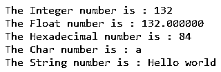
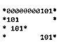
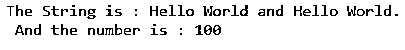

# sprintf java

> 原文：<https://www.educba.com/sprintf-java/>


## sprintf Java 的定义

Java 中的 String.format()相当于 sprintf()。绳子。format()方法返回一个带有格式化字符串的 String 对象。java string format()方法是一个内置方法，根据传递给它的语言环境、格式和参数返回格式化的字符串。如果字符串中未指定区域设置，则为。format()方法，则通过调用 Locale.getDefault()来使用默认区域设置。在 Java 语言中，format()方法类似于 c 语言中的 sprintf()方法。绳子。方法可用于将一个带格式的字符串赋给或存储到另一个字符串。

### 字符串的语法。Java 中的 format()方法

string format()方法根据其接受的参数有两种风格

<small>网页开发、编程语言、软件测试&其他</small>

1.

```
public static String format(String format, Object... args)
{
// code
}
```

和

2.

```
public static String format(Locale locale, String format, Object... args)
{
// code
}
```

**参数:**

*   **区域设置**–这不是一个可选参数。它指定要应用于 format()方法的区域设置
*   **格式**–这不是可选参数。它指定要应用于字符串的格式。
*   **args**–这是一个可选参数。它指定格式化字符串的参数。它可以是零个或多个参数。
*   **返回值**–该函数的返回值是格式化字符串。

**string . format()方法在 Java 中的实现**

```
public static String format(String format, Object... args) {
return new Formatter().format( format, args ).toString( );
}
```

### 管柱的工作。Java 中的 format()方法

琴弦的运转。Java 中的 format()方法字符串。Java 中的 format()方法接受三个参数。假设我们必须打印在 10 个指定宽度范围内用零填充的数字。所以我们可以用绳子。format()方法作为" String.format("编号为:%010d "，13002)；"，其中第一个参数是格式字符串，第二个参数是对象。format()方法返回字符串“数字是:0000013002”。

### sprintf Java 的例子

字符串的示例。Java 中的 format()方法来显示不同的格式指定–

#### 示例#1

**代码:**

```
package jex;
import java.util.*;
public class Ex {
public static void main( String[] args ) {
// Integer value
String s1 = String.format( "The Integer number is : %d" , 132 );
// Float value
String s2 = String.format( "The Float number is : %f" , 132.00 );
// Hexadecimal value
String s3 = String.format( "The Hexadecimal number is : %x" , 132 );
// Char value
String s4 = String.format( "The Char number is : %c" , 'a');
// String value
String s5 = String.format( "The String number is : %s" , "Hello world" );
System.out.println( s1 );
System.out.println( s2 );
System.out.println( s3 );
System.out.println( s4 );
System.out.println( s5 );
}
}
```

上述代码的输出是–




和上面的程序一样，字符串。format()方法用于创建格式化字符串。在 String.format()方法中，使用不同的格式指定不同的数据类型，如%d(整数)、%f(浮点)、%x(十六进制)、%c(字符)和%s(字符串)。接下来，打印格式化的字符串，正如我们在上面的输出中看到的。
字符串示例。Java 中的 format()方法来显示具有不同宽度的格式说明符

#### 实施例 2

**代码:**

```
package jex;
import java.util.*;
public class Ex {
public static void main( String[] args ) {
// Filling with zeroes
String s1 = String.format( "*%011d*" , 101 );
// Left-justifying within the specified width
String s2 = String.format( "*%-11d*" , 101 );
String s3 = String.format( "*% d*" , 101 );
// Specifying length of integer
String s4 = String.format( "*%11d*" , 101 );
System.out.println( s1 );
System.out.println( s2 );
System.out.println( s3 );
System.out.println( s4 );
}
}
```

上述代码的输出是–




和上面的程序一样，字符串。format()方法用于创建格式化字符串。绳子。format()方法对整数格式说明符使用了不同的宽度。接下来，打印不同格式的字符串，正如我们在上面的输出中看到的。

字符串的示例。Java 中的 format()方法来显示指定的参数位置–

#### 实施例 3

**代码:**

```
package jex;
import java.util.*;
public class Ex {
public static void main( String[] args ) {
String str1 = "Hello World";
int no = 100;
// Specifying argument positions. The %1$ is for the first argument and the %2$ is for the second argument.
String str2 = String.format( "The String is : %1$s and %1$s. \n And the number is : %2$s" , str1, no );
System.out.println( str2 );
}
}
```

上述代码的输出是




和上面的程序一样，字符串。format()方法用于创建格式化字符串。绳子。format()方法使用字符串和整数格式说明符的参数位置。%1$指定第一个参数，%2$指定第二个参数，依此类推。接下来，打印不同格式的字符串，正如我们在上面的输出中看到的。

### 结论

java string format()方法根据传递给它的地区、格式和参数返回一个格式化的字符串。Java 中的 String.format()相当于 sprintf()。绳子。方法可用于将一个带格式的字符串赋给或存储到另一个字符串。

### 推荐文章

这是一个 sprintf Java 的指南。这里我们讨论字符串的描述、语法和工作方式。带有代码实现的 Java 示例中的 format()方法。您也可以看看以下文章，了解更多信息–

1.  [Java 中的 Servlet](https://www.educba.com/servlet-in-java/)
2.  [Java 中的 Shell 排序](https://www.educba.com/shell-sort-in-java/)
3.  [跳过列表 Java](https://www.educba.com/skip-list-java/)
4.  [Java 中的排序字符串](https://www.educba.com/sort-string-in-java/)


