# Java 中的比较运算符

> 原文：<https://www.educba.com/comparison-operators-in-java/>

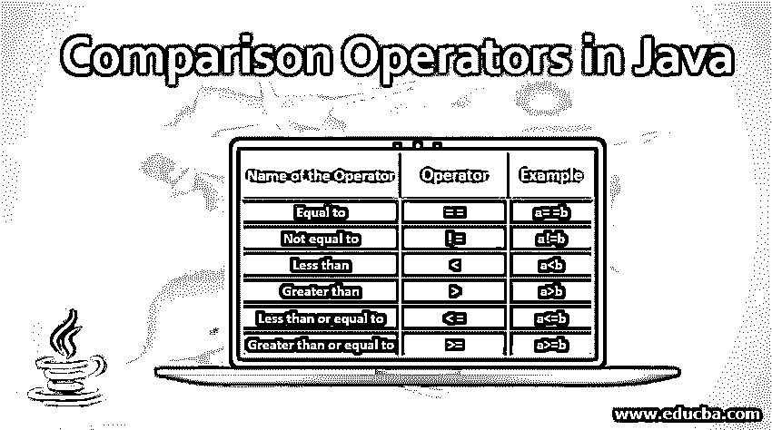


## Java 中的比较运算符简介

运算符被认为是用于对变量或值(操作数)执行特定运算的特殊字符或符号。在 Java 中，有几个用于操作变量的运算符。包括算术运算符、[位运算符](https://www.educba.com/bitwise-operators-in-c-plus-plus/)、比较运算符、[逻辑运算符](https://www.educba.com/logical-operators-in-java/)、杂项运算符、[赋值运算符](https://www.educba.com/assignment-operators-in-python/)等。在本文中，我们将讨论 java 中比较运算符的更多细节。

### Java 中的比较运算符

下面是 Java 中的各种比较运算符。

<small>网页开发、编程语言、软件测试&其他</small>

| **操作者姓名** | **操作员** | **例子** |
| 等于 | = = | a= =b |
| 不等于 | != | 答！=b |
| 不到 | < | a |
| 大于 | > | a>b |
| 小于或等于 | <= | a<=b |
| 大于或等于 | >= | a>=b |

#### 1.等于

该运算符检查运算符左侧的值是否等于右侧的值。

**举例:**

```
import java.util.Scanner;
public class ComparisonExample {
public static void main(String[] args) {
int x, y;
Scanner sc= new Scanner(System.in);
//take the value of x as input from user and store it in variable x
System.out.print("Enter the value of x : ");
x = sc.nextInt();
//take the value of y as input from user
System.out.print("Enter the value of y : ");
//store the value in variable y
y = sc.nextInt();
//checks whether x and y are equal; Return true if it is same, else returns false
System.out.println(x == y);
}
}
```

**输出:**

**案例一:**x = 3；y = 5；当它们不相等时返回 false

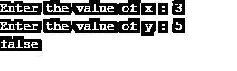


**案例二:**x = 4；y = 4；当它们相等时返回 true

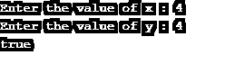


#### 2.不等于

该运算符检查运算符左侧的值是否不等于右侧的值。

**举例:**

```
import java.util.Scanner;
public class ComparisonExample {
public static void main(String[] args) {
int x, y;
Scanner sc= new Scanner(System.in);
//take the value of x as input from user and store it in variable x
System.out.print("Enter the value of x : ");
x = sc.nextInt();
//take the value of y as input from user
System.out.print("Enter the value of y : ");
//store the value in variable y
y = sc.nextInt();
//checks whether x and y are not equal; Return true if it is not equal, else returns false
System.out.println(x != y);
}
}
```

**输出:**

**案例一:**x = 3；y = 4；当它们不相等时返回 true

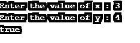


**案例二:**x = 3；y = 3；当它们相等时返回 false

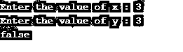


#### 3.不到

该运算符检查运算符左侧的值是否小于右侧的值。

**举例:**

```
import java.util.Scanner;
public class ComparisonExample {
public static void main(String[] args) {
int x, y;
Scanner sc= new Scanner(System.in);
//take the value of x as input from user
System.out.print("Enter the value of x : ");
//store the value in variable x
x = sc.nextInt();
//take the value of y as input from user
System.out.print("Enter the value of y : ");
//store the value in variable y
y = sc.nextInt();
//Returns true if x is less than y, else false
System.out.println(x < y);
}
}
```

**输出:**

**案例一:**x = 4；y = 6；当 x 小于 y 时返回 true


**案例二:**x = 44；y = 32 当 x 不小于 y 时返回 false

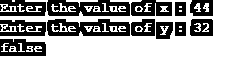


#### 4.大于

该运算符检查运算符左侧的值是否大于右侧的值。

**举例:**

```
import java.util.Scanner;
public class ComparisonExample {
public static void main(String[] args) {
int x, y;
Scanner sc= new Scanner(System.*in*);
//take the value of x as input from user
System.out.print("Enter the value of x : ");
//store the value in variable x
x = sc.nextInt();
//take the value of y as input from user
System.out.print("Enter the value of y : ");
//store the value in variable y
y = sc.nextInt();
//Returns true if x is greater than y, else false
System.out.println(x > y);
}
}
```

**输出:**

**案例一:**x = 67；y = 66 当 x 大于 y 时返回 true

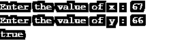


**案例二:**x = 43；y = 57 当 x 小于 y 时返回 false

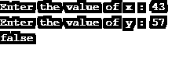


#### 5.小于或等于

该运算符检查运算符左侧的值是否小于或等于右侧的值。

**举例:**

```
import java.util.Scanner;
public class ComparisonExample {
public static void main(String[] args) {
int x, y;
Scanner sc= new Scanner(System.in);
//take the value of x as input from user and store it in variable x
System.out.print("Enter the value of x : ");
x = sc.nextInt();
//take the value of y as input from user and store it in variable y
System.out.print("Enter the value of y : ");
y = sc.nextInt();
//Returns true x is less than or equal to y, else false
System.out.println(x <= y);
}
}
```

**输出:**

**案例一:**x = 45；y = 45 当 x 等于 y 时返回 true

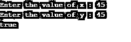


**案例二:**x = 45；y = 54 当 x 小于 y 时返回 true

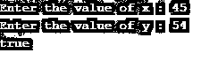


**案例三:**x = 45；y = 43 当 x 大于 y 时返回 false

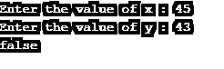


#### 6.大于或等于

该运算符检查运算符左侧的值是否大于或等于右侧的值。

**举例:**

```
import java.util.Scanner;
public class ComparisonExample {
public static void main(String[] args) {
int x, y;
Scanner sc= new Scanner(System.in);
//take the value of x as input from user
System.out.print("Enter the value of x : ");
//store the value in variable x
x = sc.nextInt();
//take the value of y as input from user
System.out.print("Enter the value of y : ");
//store the value in variable y
y = sc.nextInt();
//Returns true x is greater than or equal to y, else false
System.out.println(x >= y);
}
}
```

**输出:**

**案例一:**x = 54；y = 67 当 x 小于 y 时返回 false

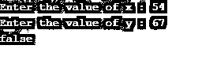


**案例二:**x = 45；y = 36 当 x 大于 y 时返回 true

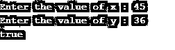


**案例三:**x = 55；y = 55 当 x 等于 y 时返回 true

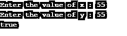


### 推荐文章

这是 Java 中比较运算符的指南。这里我们讨论 java 中的简介和前 6 个比较运算符，并给出例子和代码实现。你也可以看看下面的文章来了解更多-

1.  [c#中的前 4 个逻辑运算符](https://www.educba.com/logical-operators-in-c-sharp/)
2.  [PHP 中的比较运算符](https://www.educba.com/comparison-operators-in-php/)
3.  [c++中的赋值运算符](https://www.educba.com/assignment-operators-in-c-plus-plus/)
4.  [C 语言中的逻辑运算符](https://www.educba.com/logical-operators-in-c/)


