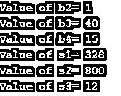

# Java 中的赋值运算符

> 原文：<https://www.educba.com/assignment-operators-in-java/>


## Java 中赋值运算符的介绍

Java 赋值操作符分为两类，比如简单和复合赋值操作符。顾名思义，赋值运算符用于将值赋给运算中涉及的变量。简单的赋值操作符处理简单的运算，如加、减、乘、除。当代码中需要更多的逻辑操作时，使用复合赋值操作符，如^、&、%、<>、>>、<

赋值运算符通常有两种类型。它们是:

<small>网页开发、编程语言、软件测试&其他</small>

*   简单赋值运算符
*   复合赋值运算符

简单的赋值操作符与“=”符号一起使用，左边是操作数，右边是值。右侧的值必须与左侧定义的数据类型相同。

复合运算符用于+、-、*和/与=运算符一起使用的情况。

### 赋值运算符的类型

有各种任务操作符。赋值后会产生目标变量的值。

#### 简单赋值运算符

首先，我们将在 Java 程序的帮助下查看和检查简单赋值操作符的工作情况。该程序包括将两个值分配给数字 1 和数字 2，然后在输出中打印出来，以显示这些值已被分配给这些数字。

**代码:**

```
class AssignmentOperator
{
public static void main(String[] args)
{
int n1, n2;
// Assigning 5 to number1
n1 = 5;
System.out.println(n1);
// Assigning value of variable number2 to number1
n2 = n1;
System.out.println(n2);
}
}
```

当我们执行 print 语句时，我们得到以下输出。我们可以看到，之前初始化的两个数字已经打印出来。这两个数字都用值 5 初始化。

**输出:**


#### 复合赋值运算符

这里，我们将检查复合赋值操作符的工作情况。下面是复合赋值运算符的列表。

*   +=复合附加赋值运算符
*   -=复合减法赋值运算符
*   *=复合乘法赋值运算符
*   /=复合除法赋值运算符。

上面提到的是四个基本的复合赋值操作符。还有其他复合赋值运算符，例如:

*   %=复合模赋值运算符。
*   &=复合按位赋值运算符。
*   ^=复合按位^赋值运算符。
*   复合右移位赋值运算符。
*   复合右移填充 0 赋值运算符。
*   < < =复合左移赋值运算符。

在本文中，我们将详细检查前四个复合赋值操作符以及其他操作符。复合赋值操作符的基本优点是它节省了 Java 语言程序中的大量代码。

##### 1.复合附加赋值运算符

该运算符用于在整个循环中不断地向变量添加数字。我们将看到一个程序，在这个程序中，借助于一个循环，我们得到了第一个自然数的和。在 for 循环中，我们将使用一个复合附加运算符。

**代码:**

```
//Program to print the sum uptil ith natural number
import java.io.*;
public class Main
{
public static void main(String []args)throws IOException
{
BufferedReader br=new BufferedReader(new InputStreamReader(System.in));
System.out.println("Enter the number upto which you want to find the sum");//Print statement
int i=Integer.parseInt(br.readLine());//Taking input from user
int sum=0;//Initializing sum=0
//Beginning of for loop
for (int j=1; j<i; j++)
{
sum+= j;//Compound assignment operator being used here
}//end of for loop
System.out.println("Sum of first " +i+ " natural numbers = " +sum);
}// end of main
}// end of class
```

我们看到，当我们输入值为 10 时，也就是说，我们得到的是像 45 这样的前 10 个自然数之和。

**输出:**


##### 2.复合减法赋值运算符

这个程序可以用来从一个现有的大号码中删除一个号码。在下一期节目中，我们将看到从一个更大的数字 100 中删除一些数字。

**代码:**

```
//Program to print the sum when certain numbers are subtracted
import java.io.*;
public class Subtract
{
public static void main(String []args)throws IOException
{
BufferedReader br=new BufferedReader(new InputStreamReader(System.in));
System.out.println("Enter the number upto which you want to subtract from the sum");//Print statement
int i=Integer.parseInt(br.readLine());//Taking input from user
int sum = 100;//Initializing sum=0
//Beginning of for loop
for (int j=1; j<=i; j++)
{
sum-= j;//Compound assignment operator being used here
}//end of for loop
System.out.println("Result " +sum);
}// end of main
}// end of class
```

在示例代码中，我们看到输入了数字 5，从数字 100 减去 5，我们得到的答案是 85。

**输出:**


##### 3.复合乘法赋值运算符

这个程序可以用来将数字相乘，直到用户输入一个特定的数字。我们看到一个程序，用来打印一个循环中某个数与 a 内的数的乘积。

**代码:**

```
//Program to print the multiplication uptil ith natural number
import java.io.*;
public class Multiply
{
public static void main(String []args)throws IOException
{
BufferedReader br=new BufferedReader(new InputStreamReader(System.in));
System.out.println("Enter the number upto which you want to print the multiplication");//Print statement
int i=Integer.parseInt(br.readLine());//Taking input from user
int prod=1;//Initializing prod=1
//Beginning of for loop
for (int j=1; j<=i; j++)
{
prod*= j;//Compound assignment operator being used here
}//end of for loop
System.out.println("Result " +prod);
}// end of main
}// end of class
```

我们输入数字 5，然后我们看到结果是这个数字和下面的数字相乘。换句话说，这个程序用简单的术语显示了一个数的阶乘。我们在下面的屏幕中看到了程序的输出。

**输出:**


##### 4.复合除法赋值运算符

在这种情况下，我们将看到使用除法运算符对一个数进行除法运算。在这种情况下，我们不会使用任何形式的循环，但是我们会看到分子和分母。我们将输入分子的值并除以 10，然后向用户输出。

**代码:**

```
//Program to print the division of a number
import java.io.*;
public class Divide
{
public static void main(String []args)throws IOException
{
BufferedReader br=new BufferedReader(new InputStreamReader(System.in));
System.out.println("Enter the numerator");//Print statement
int i=Integer.parseInt(br.readLine());//Taking input from user
i/=10;// Compound Division assignment operator
System.out.println("Result " +i);
}// end of main
}// end of class
```

在程序中，我们输入 100 作为一个数字，并使用复合除法赋值运算符将其除以 10。我们最终得到的输出是 10，如下图所示。

**输出:**


##### 5.复合运算符(剩余运算符)

在下面的程序中，我们将看到其余操作员的工作情况。剩下的运算符是%，，^，&，>>，<< and > > >下面是代码和输出。

**代码:**

```
class CompoundAssignment
{
public static void main(String args[])
{
byte b2 = 127;
b2 %= 7;
byte b3 = 120;
b3 &= 40;
short s1 = 300;
s1 ^= 100;
byte b4 = 127;
b4 >>= 3;
short s2 = 100;
s2 <<= 3;
short s3 = 200;
s3 >>>= 4;
System.out.println("Value of b2= "+b2);
System.out.println("Value of b3= "+b3);
System.out.println("Value of b4= "+b4);
System.out.println("Value of s1= "+s1);
System.out.println("Value of s2= "+s2);
System.out.println("Value of s3= "+s3);
}
}
```

在输出中，我们看到了剩下的复合赋值操作的结果。相应地打印了输出。

**输出:**




### 结论 Java 中的赋值运算符

本文介绍了两种赋值操作符——简单赋值操作符和复合赋值操作符。我们看到在编码示例的帮助下工作。使用复合赋值运算符既有优点也有缺点。[赋值操作符](https://www.educba.com/assignment-operators-in-python/)用于所有其他编程语言，如 C、C++、Python，以及任何需要给变量赋值的地方。唯一的约束是该值必须与声明的变量具有相同的数据类型。

### 推荐文章

这是 Java 中赋值操作符的指南。这里我们讨论 Java 中赋值运算符的介绍和类型，包括简单赋值运算符、复合赋值运算符。您也可以阅读以下文章，了解更多信息——

1.  [c#中的逻辑运算符](https://www.educba.com/logical-operators-in-c-sharp/)
2.  [JavaScript 赋值运算符](https://www.educba.com/javascript-assignment-operators/)
3.  [c++中的赋值运算符](https://www.educba.com/assignment-operators-in-c-plus-plus/)
4.  [C 语言中的逻辑运算符](https://www.educba.com/logical-operators-in-c/)


