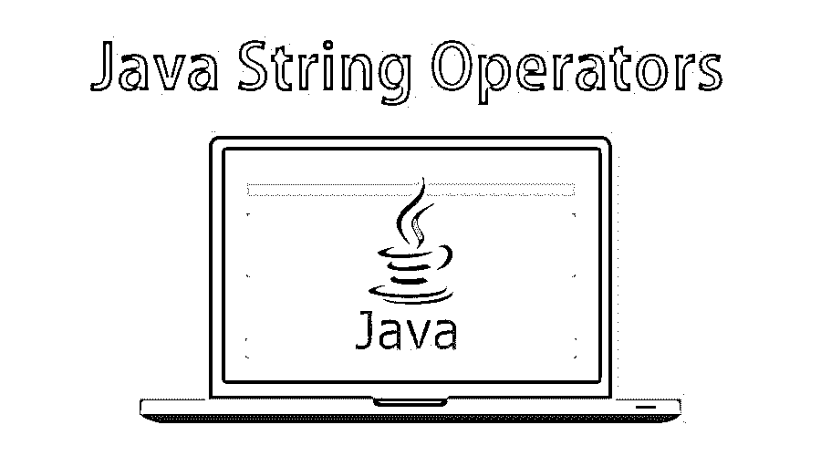

# Java 字符串运算符

> 原文：<https://www.educba.com/java-string-operators/>




## Java 字符串运算符概述

下一篇文章 Java String Operators 概述了 Java String 中使用的操作符和方法。字符串通常是一系列字符，可以是文字常量，也可以是某种变量。在 Java 中，字符串被视为对象，Java 平台提供了 String 类来创建和操作这样的字符串。Java String 是使用最广泛的类之一，在 java.lang 包中有定义。运算符通常是一个符号，要求编译器执行特定的数学或逻辑操作。它们将输入作为操作数，并将某个值作为输出返回。java 中的操作符也类似于用来执行操作的符号。比如:+、-、*、/等。

### Java 字符串操作

该字符串与双引号文本形式的字符串文字相关联，例如“Hello，world！”.因此，我们可以直接将字符串赋给字符串变量，而不是调用构造函数来创建字符串实例。

<small>网页开发、编程语言、软件测试&其他</small>

在 Java 中，String 是唯一允许操作符重载的类。例如，我们可以使用+运算符连接两个字符串。

**例如:**

```
"a"+"b"=" ab"
```

创建 Java 字符串对象的两种方法:-

**1。使用字符串文字:** Java 字符串文字可以使用双引号创建。例如:

```
String s="Hello";
```

**2。使用新关键字:** Java 字符串也可以使用关键字“new”来创建。例如:

```
String s=new String("Hello");
```

Java String 类实现了三个接口，即–Serializable、Comparable 和 CharSequence *。由于 Java 字符串是不可变的和固定的，每当我们需要进行字符串操作时，我们都需要创建一个新的字符串。由于[字符串操作](https://www.educba.com/string-manipulation-in-java/)消耗资源，java 提供了两个实用程序类:StringBuffer 和 StringBuilder。使用这两个实用程序类，操纵 java 字符串变得更加容易。让我们看一些例子。*

### 字符串类中的方法

让我们看看 String 类中的方法。

#### 1.字符串长度

Java 字符串基本上是一个对象，它曾经有一些方法对字符串执行一些操作。举个例子，借助于方法“length()”，我们可以求出一个字符串的长度。**举例*:*T3】**

```
public class MyClass
public static void main(String[] args) {
String txt = "ABCDEFGHIJKLMNOPQRSTUVWXYZ";
int len = txt.length();
System.out.println("The length of the txt string is: " + len);
}
}
```

**输出:**


#### 2.大写字母和小写字母

要使字符串大写和小写，字符串方法有:toUpperCase()和 [toLowerCase()](https://www.educba.com/javascript-tolowercase/)

**举例:**

```
public class MyClass {
public static void main(String[] args) {
String txt = "Hello World";
System.out.println(txt.toUpperCase());
System.out.println(txt.toLowerCase());
}
}
```

**输出**:


#### 3.在给定字符串中查找索引

我们可以使用“index of()”方法在 Java 中找到给定字符串的索引。它返回特定文本的第 1 个<sup>第 1 个</sup>出现的索引位置，也包括空格。

**代码:**

```
public class MyClass {
public static void main(String[] args) {
String txt = "Please locate where 'locate' occurs!";
System.out.println(txt.indexOf("locate"));
}
}
```

**输出:**


名词（noun 的缩写）b:在 Java 中，计数位置被认为是从零(0)开始的。这意味着“0”是给定字符串中的位置 1 或第一个位置，而“1”被认为是第二个位置，“2”被认为是第三个<sup>和第三个</sup>位置，并且它很快就会结束。

#### 4.Java 字符串连接

如果我们考虑运算符“+”，它用于数字相加(在 java 字符串连接中)，意思是“在一起”，那么在 Java for string 中，我们可以对字符串的相加使用相同的运算符来创建一个新的字符串。该操作被称为[字符串连接](https://www.educba.com/string-concatenation-in-c/)。

**例#1**

**代码:**

```
public class MyClass {
public static void main(String[] args) {
String firstName = "Raju";
String lastName = "Raj";
System.out.println(firstName + " " + lastName);
}
}
```

**输出:**


Note*:* We have added an empty text (“”) to create a space between firstName and lastName on print.

我们还可以使用 concat()方法连接两个字符串:

**例 2**

**代码:**

```
public class MyClass {
public static void main(String[] args) {
String firstName = "Raju ";
String lastName = "Raj";
System.out.println(firstName.concat(lastName));
}
}
```

**输出:**


#### 5.修剪绳子

如果我们有一个开头和结尾都有空格的字符串，这个方法将帮助我们删除它们。

**举例:**

**代码:**

```
class StringTrim{
public static void main(String args[]){
String s1 = new String(" AbodeQA ");
s1 = s1.trim();
System.out.println(s1);
}
}
```

**输出**:


### Java 字符串类方法

java.lang.string 类提供了许多有用的方法来执行操作。

下面是 String 类支持的一些方法:

| **方法** | **描述** |
| **char charAt(int index)** | 返回索引的字符值 |
| **字符串串联(String str)** | 它将字符串连接到末尾 |
| **布尔等于(对象另一)** | 检查字符串是否与给定的相等 |
| **int compareTo(Object o)** | 将字符串与其他对象进行比较 |
| **静态字符串格式(String format，Object… args)** | 它返回一个格式化的字符串 |
| **布尔结束(字符串后缀)** | 用于测试字符串是否以后缀结尾 |
| **字节的 getBytes()** | 将字符串编码为字节序列 |
| **int indexOf(int ch)** | 返回字符值索引 |
| **布尔型 isEmpty()** | 它检查字符串是否为空 |
| **int lastIndexOf(字符串正则表达式)** | 返回最右边匹配项的索引 |
| **String intern()** | 它返回互联网字符串 |
| **int length()** | 返回刺的长度 |
| **int hashCode()** | 它返回哈希代码 |
| **布尔匹配(字符串正则表达式)** | 检查字符串是否与正则表达式匹配 |
| **String trim()** | 它删除字符串的开始和结束空格 |
| **String[]split(String regex)** | 它返回一个匹配正则表达式的拆分字符串 |
| **String toLowerCase()** | 将字符串转换为小写 |
| **String substring(int begin index)** | 它返回起始索引的子字符串 |
| **String toUpperCase()** | 将字符串转换为大写 |
| **字符串替换(char old，char new)** | 它替换 char 值的出现 |

### 推荐文章

这是 Java 字符串操作符的指南。在这里我们讨论了基本概念、方法、如何在 Java 编程中使用字符串运算符，以及实例的帮助。您也可以浏览我们推荐的其他文章，了解更多信息——

1.  [SQL 字符串运算符](https://www.educba.com/sql-string-operators/)
2.  [Java 字符串字节](https://www.educba.com/java-string-getbytes/)
3.  [Java 流过滤器](https://www.educba.com/java-stream-filter/)
4.  [Java 线程优先级](https://www.educba.com/java-thread-priority/)


