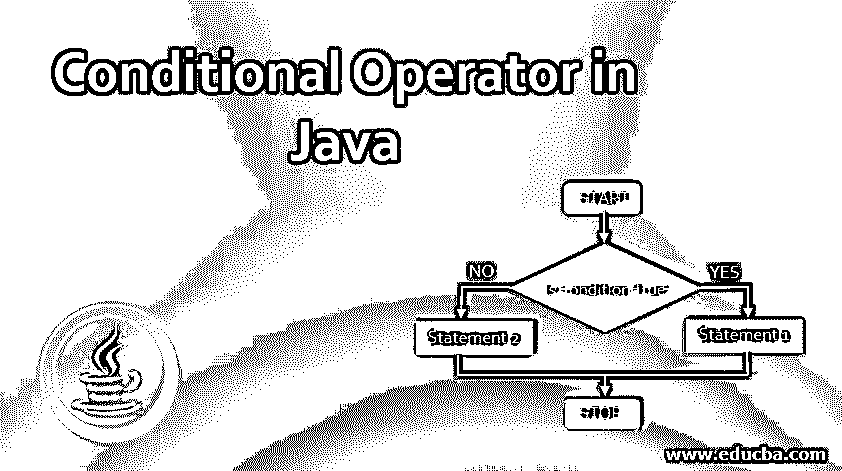
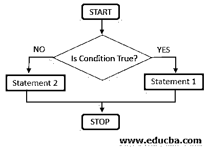
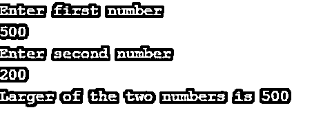
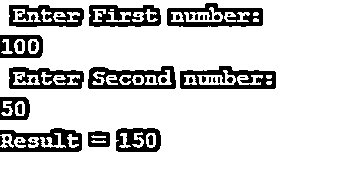
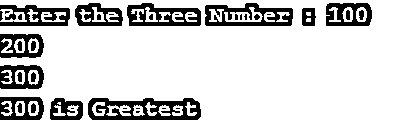
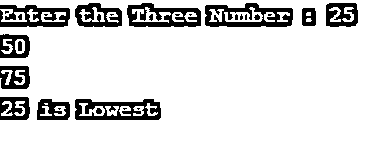

# Java 中的条件运算符

> 原文：<https://www.educba.com/conditional-operator-in-java/>




## Java 中条件运算符简介

Java 中的条件运算符是使用三个操作数的运算符，它们用于处理条件。它是一个唯一的运算符，用于代替 If-Else 语句。条件操作符的主要优点是只需一句话就可以完成，而 if-else 语句使用了多行代码。然而，条件运算符也有一个缺点:它不能用于多个条件，或者换句话说，当使用多行代码时，程序会变得非常复杂，非常难以理解。条件运算符在 Java 中也称为三元运算符。

### 条件运算符的语法

在 Java 中，使用三元运算符或条件运算符有特定的语法。使用三元运算符的[的语法如下所示。通常，条件运算符用在 main()中，或者用在执行条件后返回特定值的特定函数中。一旦条件被执行，那么满足条件的表达式被执行，并根据用户的命令返回或打印。](https://www.educba.com/c-sharp-ternary-operators/)

<small>网页开发、编程语言、软件测试&其他</small>

变量=表达式 1？表达 2:表达 3

上述条件操作符的工作原理与 If-Else 语句相同。相应的 if-else 语句如下所示:

**语法:**

```
if(Expression 1)
{
Variable= Expression 2;
}
else
{
Variable= Expression 3;
}
```

**流程图:**




### Java 中条件运算符的示例

以下是条件运算符的示例:

#### 示例#1

在示例 1 中，我们将看到使用三元运算符的两个数字[中较大的一个。我们将看到两个数字变量的输入，然后检查在该上下文中哪个数字更大。我们可以看到下面的例子，已经写到下面了。](https://www.educba.com/ternary-operator-javascript/)

**代码:**

```
// Java program to find largest among two numbers using ternary operator
import java.io.*;
class Ternary
{
public static void main(String[] args)throws IOException
{
// Taking user input of the variables
BufferedReader br= new BufferedReader(new InputStreamReader(System.in));
System.out.println("Enter first number " );
int n1= Integer.parseInt(br.readLine());
System.out.println("Enter second number " );
int n2= Integer.parseInt(br.readLine());
int max;//Variable to store the larger of the two values
// Larger among n1 and n2
max = (n1 > n2) ? n1 : n2; //Using ternary operator
// Print the largest number
System.out.println("Larger of the two numbers is " + max);
}
}
```

在上面的代码中，我们看到了如何从一个用户那里获取两个数字，然后执行运算来计算这两个数字中较大的一个。我们将看到操作产生的两个输出。首先，我们将数字输入为(100，200)，然后我们将数字输入为(500，200)。我们将看到相应的输出。

**输出:**





#### 实施例 2

在示例 2 中，我们将看到对两个变量执行的操作，这两个变量都是数字。如果第一个数字大于第二个数字，则两个数字相加，并按照用户给定的方式打印。但是，如果第一个数字小于第二个数字，则从第一个数字中减去第二个数字，并打印结果。

**代码:**

```
// Java code to illustrate ternary operator
import java.io.*;
class Ternary2
{
public static void main(String[] args)throws IOException
{
// variable declaration
int res;
BufferedReader br= new BufferedReader(new InputStreamReader(System.in));
System.out.println(" Enter First number: ");
int n1= Integer.parseInt(br.readLine());
System.out.println(" Enter Second number: ");
int n2= Integer.parseInt(br.readLine());
// Performing ternary operation
res = (n1 > n2) ? (n1 + n2) : (n1 - n2);//Calculating the sum
// Print the result
System.out.println("Result = " + res);
}
}
```

在这种情况下，我们将看到一个输出。我们将输入两个数字作为(100，50)。由于第一个数字大于第二个数字，程序应该打印出两个变量的总和[，这是输出。我们看到示例输出，如下所示。](https://www.educba.com/summation-in-matlab/)

**输出:**




#### 实施例 3

在第三个示例中，我们将看到用户输入了三个数字，我们将检查这三个数字中最大的一个。同样，我们可以使用类似的逻辑找到三个数字中最低的一个。使用三元运算符的优点是，它节省了程序中的大量代码，并且使代码运行得非常快和流畅。

**代码:**

```
//Program to Find greatest of three numbers using Conditional Operator
import java.io.*;
public class ConditionalOperator
{
public static void main(String[] args)throws IOException
{
int a,b,c,result;
//Taking input from the user
BufferedReader br= new BufferedReader(new InputStreamReader(System.in));
System.out.print("Enter the Three Number : "); //prompt for input
a=Integer.parseInt(br.readLine());   //Read First number
b=Integer.parseInt(br.readLine());    //Read Second number
c=Integer.parseInt(br.readLine());    //Read third number
//Calculate the result based on conditional operator
result = (a>b)? ((a>c)?a:c) : ((b>c)?b:c);
System.out.println( result  + " is Greatest");//Printing the greatest number
}
}
```

现在，我们将输入三个数字(100，200，300)，我们将看到三个数字中最大的一个，程序将打印出来。按照程序，打印三个数字中最大的，300 最大，打印流畅。因此，程序运行良好。

**输出:**




#### 实施例 4

在示例 4 中，我们将检查用户输入的三个数字中最小的一个。下面给出了示例代码。

**代码:**

```
//Program to Find greatest of three numbers using Conditional Operator
import java.io.*;
public class ConditionalOperator
{
public static void main(String[] args)throws IOException
{
int a,b,c,result;
//Taking input from the user
BufferedReader br= new BufferedReader(new InputStreamReader(System.in));
System.out.print("Enter the Three Number : "); //prompt for input
a=Integer.parseInt(br.readLine());   //Read First number
b=Integer.parseInt(br.readLine());    //Read Second number
c=Integer.parseInt(br.readLine());    //Read third number
//Calculate the result based on conditional operator
result = (a<b)? ((a<c)?a:c) : ((b<c)?b:c);
System.out.println( result  + " is Lowest");//Printing the greatest number
}
}
```

我们将输入三个数字，并检查其中最小的一个。这三个数字是(25，50，75)，最小的数字应该是 25，如下面的输出所示。

**输出:**




### 结论

在本文中，我们遇到了强调条件操作符不同方面的不同程序，我们看到了不同的功能以及使用条件操作符的不同优势。在 Java 编程语言中，条件运算符是独一无二的。它们是 If-Else 条件的替代，根据程序的条件平滑地执行语句。

### 推荐文章

这是 Java 中条件运算符的指南。在这里，我们讨论介绍和语法，以及不同的例子和它的代码实现。您也可以看看以下文章，了解更多信息–

1.  [Java 中的最终类](https://www.educba.com/final-class-in-java/)
2.  [Java 中的嵌套类](https://www.educba.com/nested-class-in-java/)
3.  [C 语言中的条件运算符](https://www.educba.com/conditional-operator-in-c/)
4.  [c#中的条件运算符](https://www.educba.com/conditional-operators-in-c-sharp/)


