# Java 关键字

> 原文：<https://www.educba.com/java-keywords/>

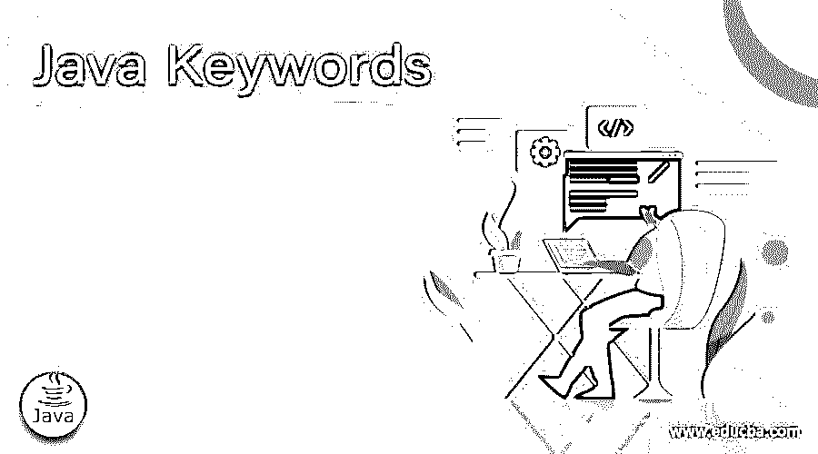

## Java 关键字介绍

Java 关键字是编程语言中的保留字，不用作标识符。Java 关键字被称为保留字，因为它们被您正在使用的语言“保留”。它们有特殊的含义，在语言库中有定义。

### Java 编程语言中的概念

像任何其他编程语言一样，Java 编程语言中的关键字是一个保留字，具有特殊的含义。关键字是为内部流程保留的，并且具有一些预定义的操作。在 Java 中，如果以其他方式使用关键字，程序或代码将遇到“编译时错误”为了便于程序员使用和识别关键字[，一般来说，它们在 Java 中有点“突出”。](https://www.educba.com/c-keywords/)

<small>网页开发、编程语言、软件测试&其他</small>

### Java 中的关键字列表

我们试图按字母顺序列出 Java 中目前使用的重要关键字。你也可以观察每一个关键字的工作情况，就像下面的例子一样。让我们一个一个来看这些关键词。

**1。Abstract** : Abstract 关键字用于声明一个类，这个类将在抽象程序中使用。与类声明一起使用的 Abstract 使该类成为抽象类，并指定该类将在稍后阶段在子类中实现。下面是“Abstract”关键字的用法示例。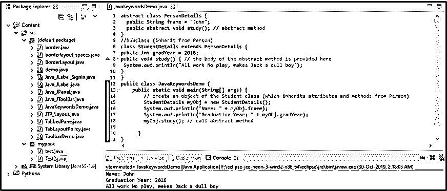

**2\. Assert**: The ‘assert’ keyword was added to Java 1.4\. This keyword allows a programmer to test his assumptions in the program.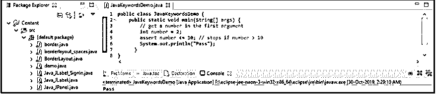

**3\. Boolean**: Boolean is a data type that can hold only two values; it’s either a ‘True’ or a ‘False’.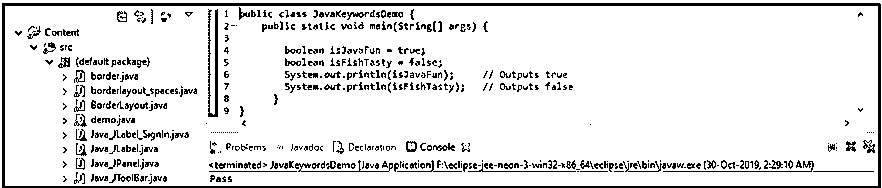

**4\. Break**: This keyword helps the programmer want his code to jump out of a loop, for example, a For loop. It’s a [control statement](https://www.educba.com/control-statements-in-c/) that breaks the current flow of the execution on a specific condition provided by the programmer.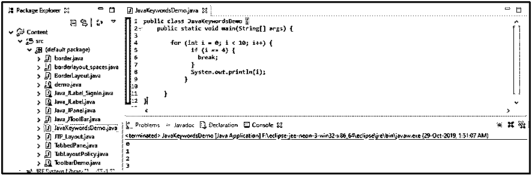

**5\. Byte**: Byte keyword is one of the data types that are able to store whole numbers. The numbers range from -128 to 127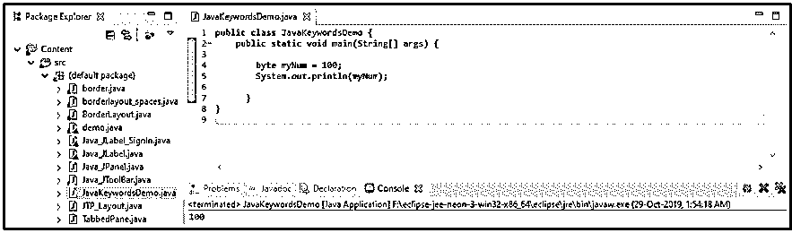

**6\. Case**: Case keyword is used in a switch statement. The ‘case’ keyword creates a block of code and marks it.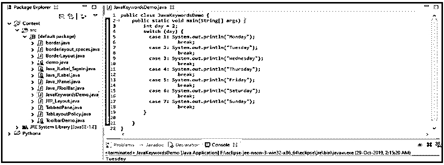

**7\. Catch**: The ‘catch’ keyword catches the exceptions that were created by the ‘try’ statements. The catch block is used after Try block.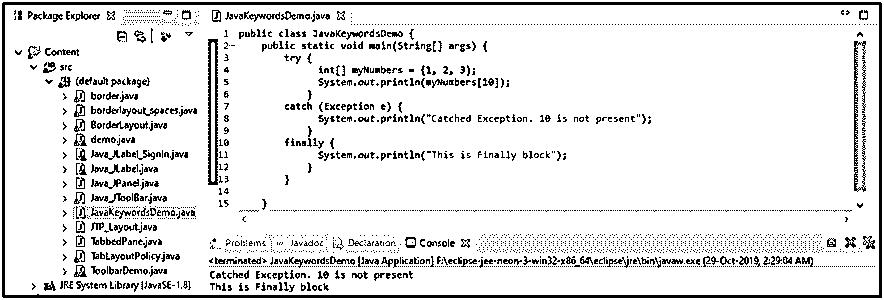

**8\. Char**: The ‘char’ is one of the data types that is used to hold one character at a time.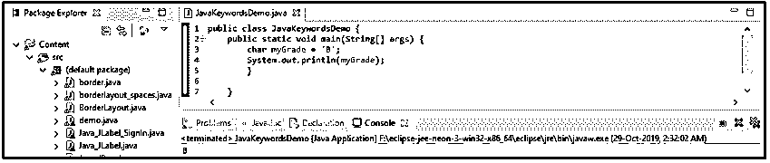

**9\. Class**: The class keyword is used to create a class in java. Everything that runs in Java programming resides inside a class.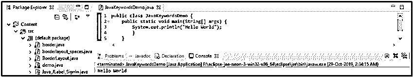

**10\. Continue**: The ‘continue’ keyword is used to skip the current execution and continues to the next step in a loop like a For loop or a While loop.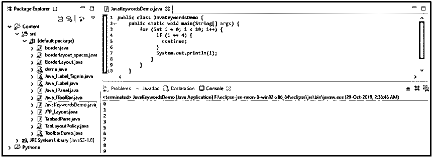

**11\. D****efault**: The ‘Default’ keyword is used to create a default block of code containing a set of statements executed by default if the required case is not present.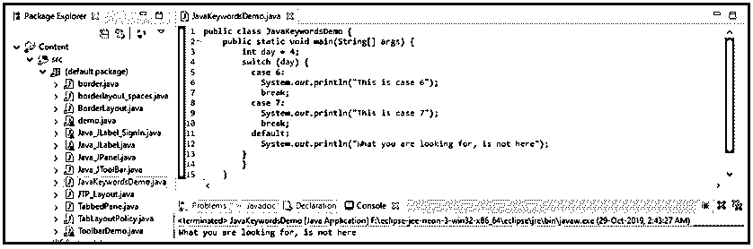

**12\. D****o**: The ‘do’ keyword is used when creating a ‘do-while’ loop. The ‘do’ block is executed at least once before checking the condition in a while block.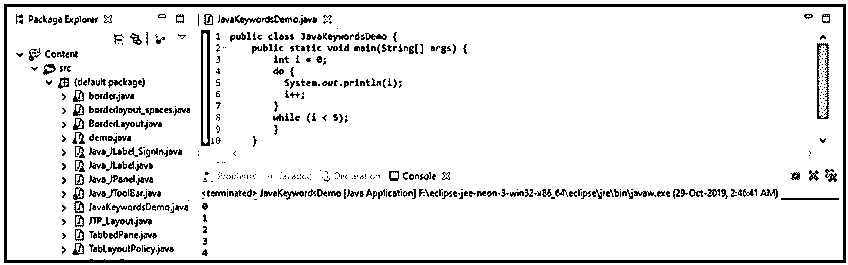

**13\. Double**: The ‘double’ keyword is one of the data types used for holding fractional numbers. The fractional numbers range from 1.7e – 308 to 1.7e + 308\. While declaring a fraction, the value is ended with a ‘d’.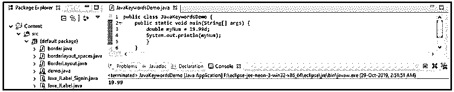

**14\. E****lse**: The ‘Else’ keyword is used to create a block of code that will be executed if the condition is not ‘True’ in an ‘If’ statement.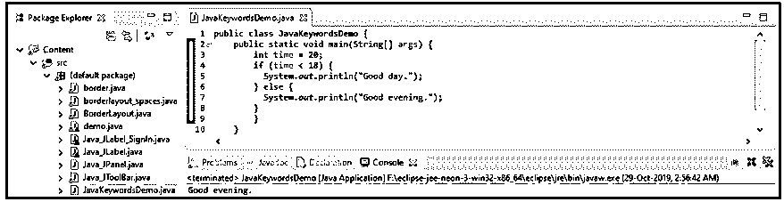

**15\. Enum**: The ‘enum’ keyword is used to create enumerations, unchangeable data types. The [enum keyword](https://www.educba.com/enum-in-c-sharp/) defines a fixed set of constants.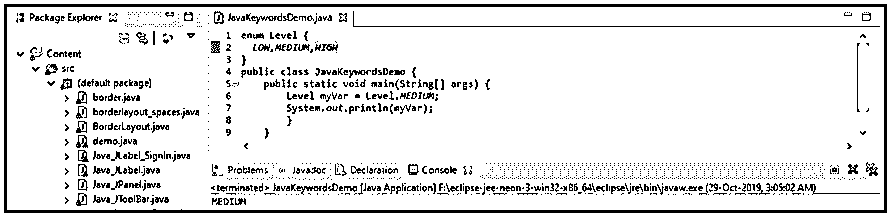

**16\. Extends**: Extends keyword is used to inherit properties of a superclass’s attributes and methods by a subclass.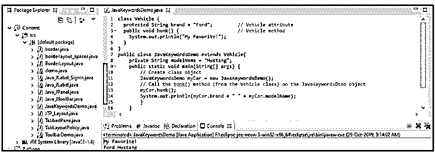

**17\. Final**: The ‘Final’ keyword is used to set a final value to a variable, making it impossible to overwrite or change altogether. If the value of a final variable is tried to change, it throws an error.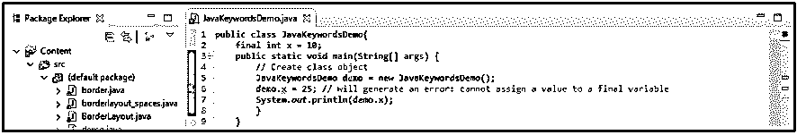

When hovered over, it shows the following error.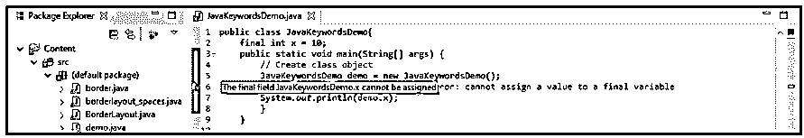

**18\. Finally**: Finally keyword is used along try and catch statements, which has a block that is executed even if the exception is not handled.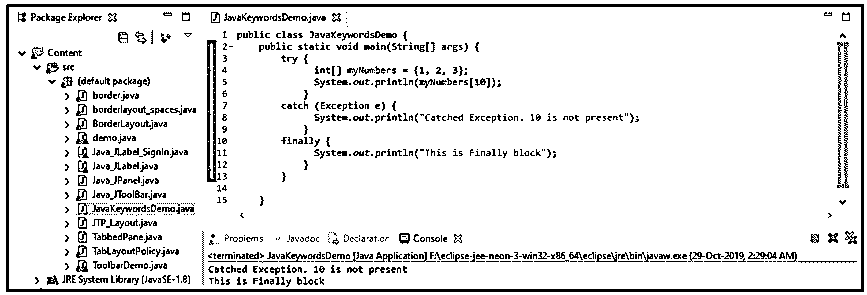

**19\. Float**: The float keyword is a data type that holds fractional numbers that range from 3.4e−038 to 3.4e+038\. While declaring a fractional number, the value should be ended with an ‘f’.

**20\. For**: The ‘For’ keyword is used to create a loop, a for a loop. The for loop executes the enclosed set of code a number of times, which is defined inside the for loop condition statement.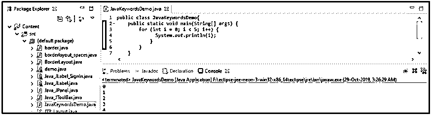

**21\. If**: The ‘If’ keyword is used to create a set or block of code or statements that are executed if the condition is ‘True’.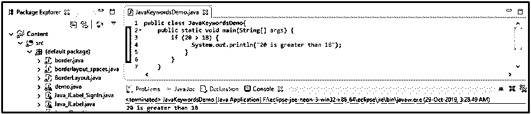

**22\. I****mplements**: Implement is another keyword that is reserved for declaring interfaces. It is used during the declaration of the class and specifies one or more interfaces.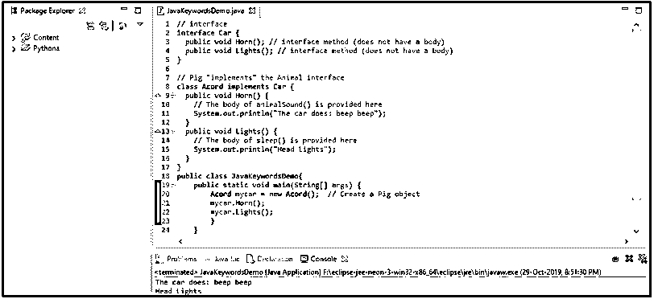

**23\. Import**: The import keyword is used for importing packages or a class or classes or maybe an interface as well.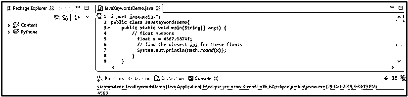

**24\. I****nstanceof**: The [‘instanceof’ keyword is used](https://www.educba.com/instanceof-in-java/) to check if the object in question is an instance of the class or the interface.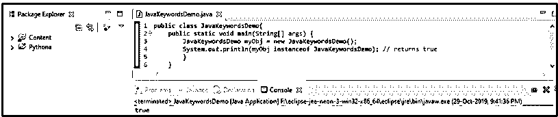

**25\. Int**: The ‘int’ keyword is one of the data types for declaring an integer type.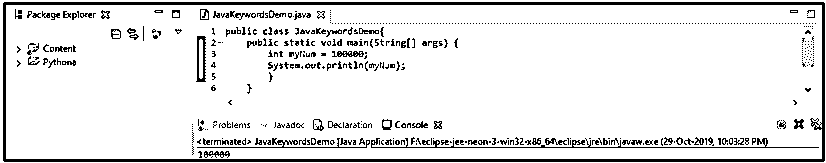

**26\. Interface**: The interface keyword is used to declare a special type of class that will only contain abstract methods. For accessing the interface methods, the interface must be “implemented” like we [use the inheritance](https://www.educba.com/inheritance-in-php/) concept by another class by using the ‘implements’ keyword.

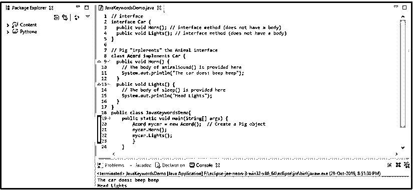

**27。****Long**:Long 关键字也是保存整数的数据类型之一。范围从-9223372036854775808 到 9223372036854775808。整数值应以“L”结尾。

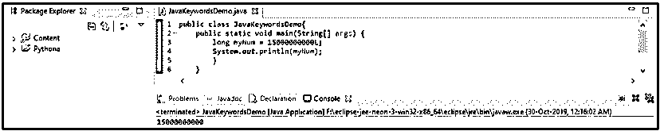

**28。new**:‘new’关键字用于创建一个对象。

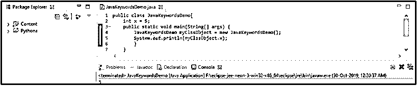

**29。package**:package 关键字用于创建包。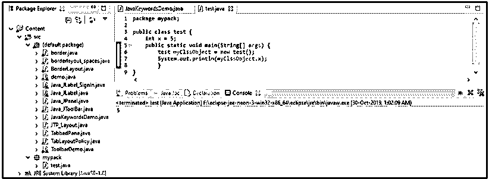

**30\. Private**: The ‘private’ keyword is used to create attributes or methods for a private mode class. ‘Private’ is an access modifier that allows only the declared class to use private properties or attributes or methods.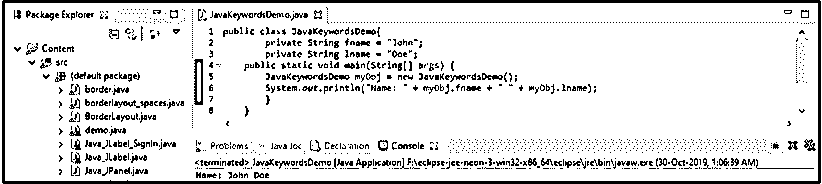

**31\. Protected**: ‘Protected’ is an access modifier that allows the properties or methods to be used only by the same package or subclasses.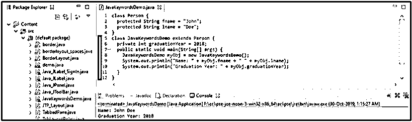

**32\. Public**: The ‘public’ keyword is another access modifier that allows one class to use a publicly defined class’s attributes or methods or etc., within itself.
Below is a publicly defined class ‘test.java’ and another class, class ‘Test2.java’, access it.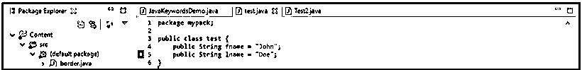

Class – Test2.java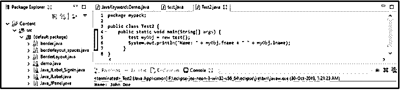

**33\. Return**: The ‘return’ keyword can be used as an execution end for a method, and also, it is used to return a value from a method.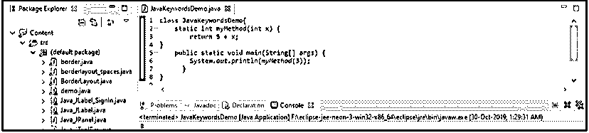

**34\. Short**: The ‘short’ keyword is a type of data type that is used to hold the whole number ranging from -32768 to 32767.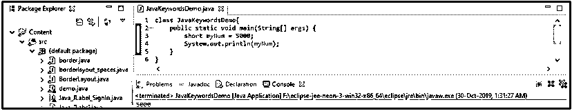

**35\. Static**: The ‘static’ keyword is used to create a method static, which means that method can be called without creating its object.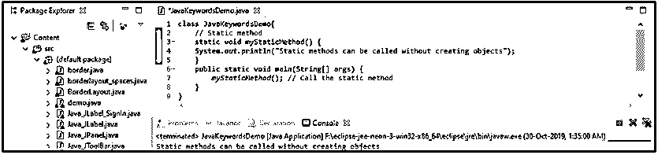

**36\. Super**: The ‘super’ keyword is used to call the super or parent class or objects.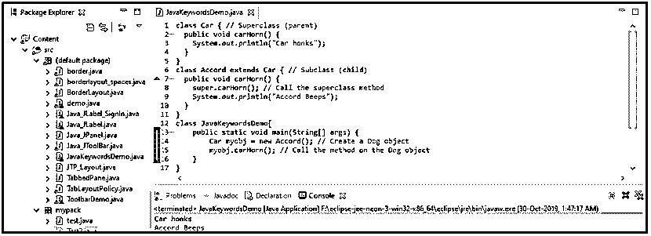

**37\. Switch**: The ‘switch’ keyword is used to create different scenarios into different cases and is used to select one out of them. The switch statement contains a value or expression, which then is compared with all the cases present, and the match one is selected.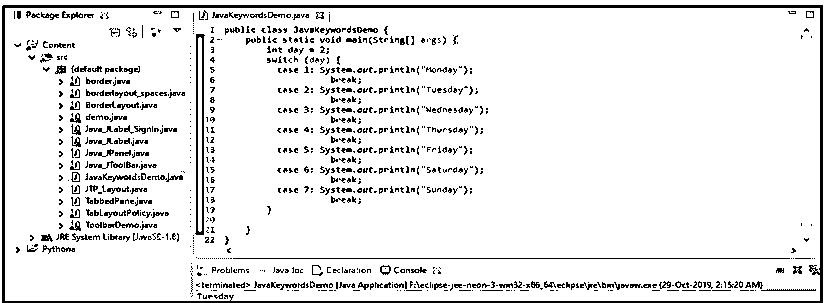

**38\. This**: the ‘this’ keyword is used to refer to the current object of a method or a constructor.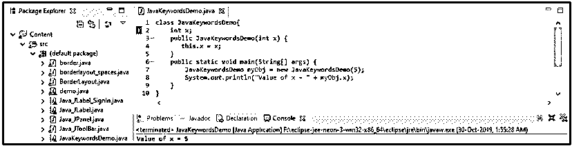

**39\. Throw**: The ‘throw’ keyword is used to throw an exception message on the screen for the user.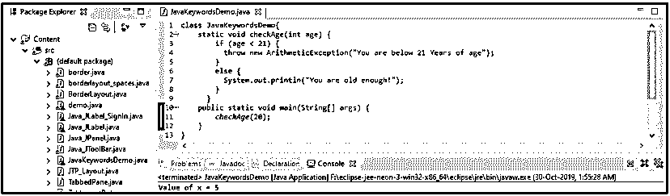

**40\. Throws**: The ‘throws’ keyword is used when the programmer want to decide and throw a type of exception.41 specifically**. Try**: The ‘try’ keyword starts a ‘try-catch’ block. The ‘try’ block is where the exceptions are tested.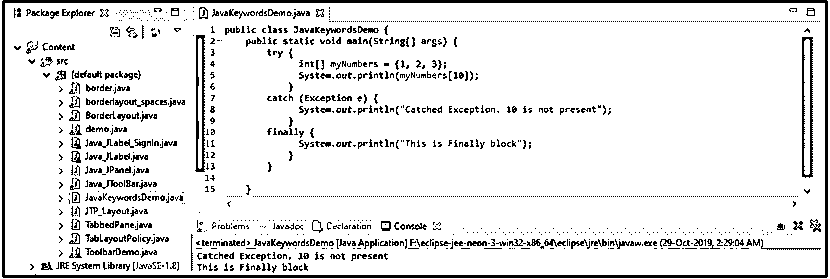

**42\. Void**: The ‘void’ keyword, when used with a method, specifies that the method will not have a return value.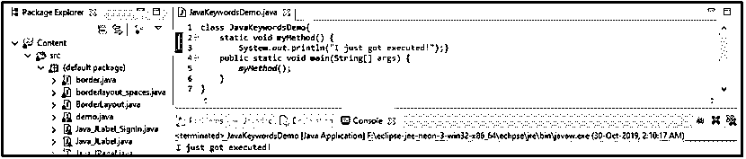

**43\. While**: The ‘while’ keyword creates a loop with a condition in its statements. The loop is executed until the statement is true.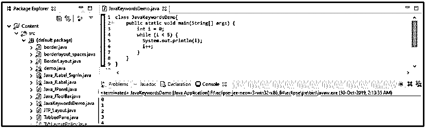

[关键字是](https://www.educba.com/php-keywords/)Java 编程语言中保留的、有特殊含义的记号。它们在语言中有保留的用法和预先定义的动作。

### 推荐文章

这是一个 Java 关键字的指南。这里我们讨论 Java 关键字的介绍，目前在 Java 中使用的重要关键字列表。您也可以浏览我们推荐的其他文章，了解更多信息——

1.  [Java 中的 Case 语句](https://www.educba.com/case-statement-in-java/)
2.  [Java 中的泛型是什么？](https://www.educba.com/what-is-generics-in-java/)
3.  [备忘单 JavaScript](https://www.educba.com/cheat-sheet-javascript/)
4.  [Java 命令](https://www.educba.com/java-commands/)

