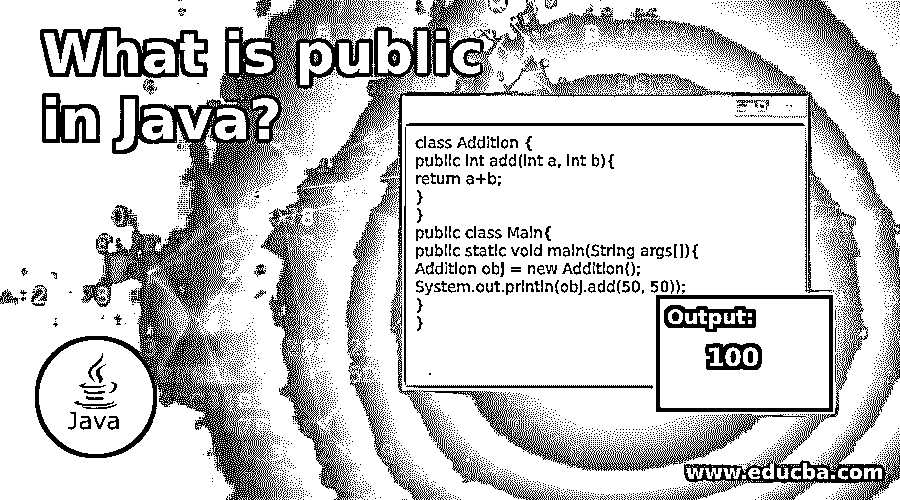

# Java 里什么是 public？

> 原文：<https://www.educba.com/what-is-public-in-java/>




## 用 Java 向公众介绍

public 是 Java 中的一个关键字，用于程序中的函数和变量。每当我们在变量前面使用关键字 public 时，变量在没有声明它的方法中也是可用的。同样，当我们在 Java 中声明一个方法时，我们也可以在没有声明的类中使用这个函数。public 是 Java 中的访问修饰符。Java 中还有其他访问修饰符——如 private、protected 和 default。Java 中的 Private 关键字是这样的，一旦一个函数被声明为 private，那么相应的函数就不能在没有定义它的其他类中被访问。访问修饰符基本上是对程序中不能在其他类或方法中访问的方法、函数和类的限制。

### java 中 public 的语法

public 的语法如下所示。在下面的例子中，变量 word 在类 example 中被声明为 public。变量 word 在函数中可用。这些函数是 Sum()和 average()。因此，变量 word 在其他函数中也很容易使用，尽管在相应的函数中没有专门调用它。如果变量被声明为 private，则不能在其他函数或类中访问。因此，在不允许在其他函数中访问变量的情况下，使用访问修饰符 private。

<small>网页开发、编程语言、软件测试&其他</small>

**代码:**

```
class Example
{
public int hello;
public void sum(int a)
{
}
public void average(int a)
{
}
}
```

### Java 中的 public 示例

下面是提到的例子:

#### 示例#1

现在我们看到一个代码示例，其中使用了公共访问修饰符，然后用它将两个数字相加。有两类。一个是 main()，我们在其中创建一个加法对象()，然后通过两个数字调用另一个类。创建的对象名为 obj，在计算总和时非常有用。还可以有其他函数和类，如乘法和除法。编码示例是一个简单的程序，其中有两个类。

**代码:**

```
class Addition {
public int add(int a, int b){
return a+b;
}
}
public class Main{
public static void main(String args[]){
Addition obj = new Addition();
System.out.println(obj.add(50, 50));
}
}
```

**输出:**


包含的两个数字都是 50。当我们将这两个数字相加时，我们得到的最终输出是 100，如图所示。用于将两个数相加的函数是 add()，并且创建了一个对象。我们还可以创建其他类，在这些类中我们可以拥有其他功能，我们可以在程序的 main()中创建那个对象。

#### 实施例 2

在这个代码示例中，我们在 main()中创建一个对象。下面的程序用于将两个数相乘并产生乘法输出。创建了一个对象 obj，用于调用两个号码。一个是类型为 double 的数字，用于同一类。在 Hello 类中，创建了一个 main()，用于调用 square()和类型为 double 的 number。

**代码:**

```
class XYZ{
public double num = 100;
public int square(int a){
return a*a;
}
}
public class Hello{
public static void main(String args[]){
XYZ obj = new XYZ();
System.out.println(obj.num);
System.out.println(obj.square(10));
}
}
```

**输出:**


示例输出是对两个变量的清晰描述，这两个变量在 main()中被调用。首先，显示了类型为 double 的数字 100 以及函数中数字的平方。有一个函数 square()，它显示一个数的平方，是在另一个类中创建的，然后在另一个类中，有一个 main()，它调用 square()，这个数显示为输入。在这种情况下，显示为输入的数字是 10，相应数字的平方是 100，显示在输出面板中。

### Java 中 public 的优势

*   与 private 访问修饰符不同，它是最受限制的修饰符，当函数用于在类中调用时，使用 public。
*   它在类、包、子类(在同一个包中)和子类(在其他包中)中可用。
*   同样，这些函数在其他类中也是可用的。
*   公共函数用于运行只有一个 main()的程序，还有多个其他函数具有不同的功能，这些函数在 main()内部调用。

### 结论

在本文中，我们看到了大量的编码示例以及 Java 中公共访问修饰符的各种优点。我们还看到了其他访问修饰符，如 private、protected 和 default。私有制的弊端也是存在的，它有很大的局限性。其他访问修饰符的可访问性也显示在本文的图表中。

### 推荐文章

这是一本关于 Java 中什么是公共的指南？这里我们讨论 Java 中的 public 的介绍，以及用 Java 实现 public 关键字的例子。您也可以看看以下文章，了解更多信息–

1.  [Java 中的 TreeMap 是什么？](https://www.educba.com/what-is-treemap-in-java/)
2.  [Java 中的 API 是什么？](https://www.educba.com/what-is-api-in-java/)
3.  [Java 中什么是泛型？](https://www.educba.com/what-is-generics-in-java/)
4.  [Java 中的 BinarySearch()](https://www.educba.com/binarysearch-in-java/)


