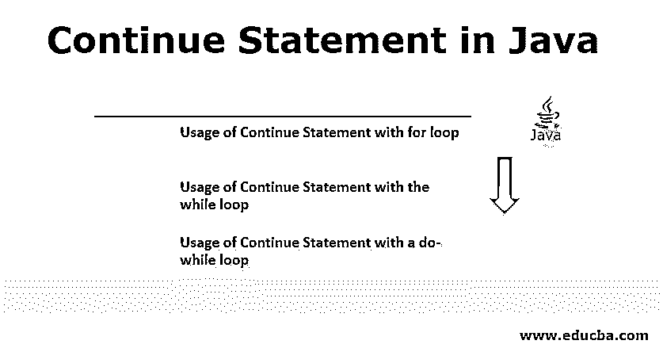
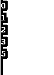
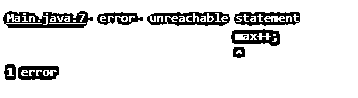

# Java 中的 Continue 语句

> 原文：<https://www.educba.com/continue-statement-in-java/>




## Java 中的 Continue 语句简介

Java 中的 Continue 语句属于分支语句的范畴。其他分支语句是 break 和 return 语句。Continue 是 java 的 51 个关键字之一。java 中的关键字也称为有特定用途的保留字。这些[关键字不是](https://www.educba.com/c-keywords/)应该用作变量名、方法名、类名。用 java 代码写一个 [continue 语句的目的是跳过一个循环的当前迭代，比如 for、while 和 do-while。控制主要被处理到同一个循环(如果没有中断)或传递到代码的下一个语句(如果当前循环中断)。](https://www.educba.com/continue-statement-in-java/)

continue 语句在其他编程语言(如 C 和 C++)中也有同样的作用。在 C 和 C++中也是一个关键字。continue 语句与 break 语句正好相反[；如果遇到 break 语句，它会自动中断循环。而 return 语句完全从程序中退出。在 C、C++和 Java 中，return 和 break 都是保留关键字。它们都不应该用来命名变量、方法或类。](https://www.educba.com/break-statement-in-java/)

<small>网页开发、编程语言、软件测试&其他</small>

**语法:**

```
for (i =0; i<max; i++)
// for loop is a sample loop, max is the maximum count at which the loop breaks
{
<Statements> //code statements
If (done with this iteration)
// if this condition validates to true the continue statement is executed
{
Continue; // statement itself
}
<Statements> // code statements
}
```

### Java 中 Continue 语句的示例

以下是 java 中该语句的一些示例:

#### 示例#1

在 for 循环中使用 Continue 语句。

**代码:**

```
public class DemoContinueUsingFor {
public static void main(String[] args){
for(int p=0;p<6;p++){
if(p==3){
continue;
}
System.out.print(p+" ");
}
}
}
```

**输出** **:**


**说明:**

*   在这个循环中，“p”从 0 到 5。除了 3 之外，p 的所有值都被打印出来，因为只要 p 变成 3，if 条件就变成真，并且执行 [continue 语句](https://www.educba.com/continue-in-c-sharp/)，这跳过了 print 语句。因此，在输出中看不到 3。
*   这里不使用 system.out.print，如果使用 system.out.println，则可以看到垂直形式的输出，如下所示。

**输出:**




#### 实施例 2

在 while 循环中使用 Continue 语句。

**代码:**

```
public class DemoContinueUsingWhile {
public static void main(String[] args){
int max = 0;
while(max <= 10){
if(max == 6){
max++;
continue;
}
System.out.print(max+" ");
max++;
}
}
}
```

**输出** **:**


**说明:**

*   在上面的代码中，最大值被初始化为 0。在 while 循环中，首先检查最大值，如果满足条件，则执行下一个代码，在代码结束时，打印相应的最大值。在本例中，除了 6 之外的所有最大值都被打印出来，因为一旦最大值变为 6,“if”条件就验证为真，并执行相应的语句。continue 语句一执行，它就跳过 print 和 max++等其他语句的执行。因此，它完全忽略了打印值 6。
*   这里不使用 system.out.print，如果使用 system.out.println，那么可以在垂直形式中看到输出。
*   在上面的例子中，如果在 continue 语句之后写 max++会怎么样？

**代码:**

```
public class DemoContinueUsingWhile {
public static void main(String[] args){
int max = 0;
while(max <= 10){
if(max == 6){
continue;
max++;
// Here the max ++ is written after continue statement
}
System.out.println(max+" ");
}
}
}
```

**说明:**

*   java 编译器将“continue”语句之后编写的代码段视为不可及的代码，因为 continue 语句本身的全部目的就是忽略/跳过它后面的行。上面的代码被证明是一个经典的例子，它解释了 continue 语句的存在。
*   只要在 continue 语句后立即编写代码，java 编译器就会抛出以下错误。

**输出:**




#### 实施例 3

在 do-while 循环中使用 Continue 语句。

**代码:**

```
public class DemoContinueUsingDoWhile {
public static void main(String[] args) {
int k=10;
do
{
if (k==6)
{
k--;
continue;
}
System.out.print(k+ " ");
k--;
}
while(k>0);
}
}
```

**输出** **:**


**说明:**

*   在上面的代码中，代码 k 被初始化为 10；如前所述，在 do-while 循环中，在测试条件之前，代码至少执行一次。按照上面的理论，代码开始执行，如果条件被检查，k 是否等于 6。
*   如果满足条件，则执行“If”块中的代码，在这里，首先，一旦遇到 continue 语句，k 就递减，它跳过其余的代码，控制流回到 do-while 循环，但在此之前，检查 while 中的条件。这就是输出中不打印 6 的原因。

### 结论

上面的文章解释了[continue 语句](https://www.educba.com/continue-statement-in-c-plus-plus/)的用途；提供的三个示例清楚地描述了实时场景中的用法。For、while 和 do-while 被视为示例，continue 语句的用法在它们的基础上进行解释。就像 continue 一样，还有 2 个称为 break 和 return 的语句，它们在 java 企业应用程序中有自己的用途和应用。

### 推荐文章

这是 Java 中 Continue 语句的指南。这里我们讨论 java 中 continue 语句的介绍和 Java 中 continue 语句的几个主要例子。您也可以浏览我们的其他相关文章，了解更多信息-

1.  [JavaScript 中的条件语句](https://www.educba.com/conditional-statements-in-javascript/)
2.  [JavaScript 中的 Case 语句](https://www.educba.com/case-statement-in-javascript/)
3.  [JavaScript 中的 Switch 语句](https://www.educba.com/switch-statement-in-javascript/)
4.  [Python Break 语句](https://www.educba.com/break-statement-in-python/)


