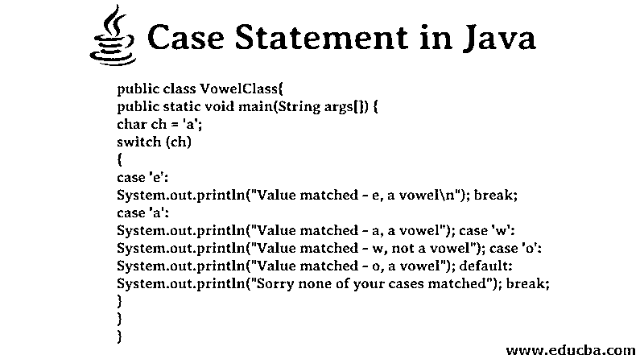
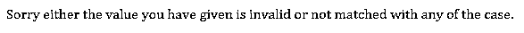
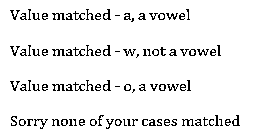
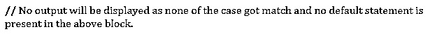

# Java 中的 Case 语句

> 原文：<https://www.educba.com/case-statement-in-java/>




## Java 中的 Case 语句是什么？

在编程时，很难处理不同条件下的不同操作。虽然在 Java 和许多其他编程语言中，像 if-else、if-else-if 这样的语句在各种情况下都会用到。但是，如果在每种情况下有“n”个场景需要单独的操作呢？此时，多个 if 和 [else-if 语句](https://www.educba.com/else-if-statement-in-java/)可能会在代码的某个地方给程序员造成混乱，因为它涉及到多个大括号和每个条件的一组语句。为了在 Java 中处理这种情况，Switch-Case 语句用于方便程序员，并减少代码行和复杂性。

switch 语句是一个分支语句。case 是与 Switch 语句一起使用的关键字。当表达式的值与大小写值匹配时，它执行一条或多条语句，并且特定语句的代码以 break 关键字结束。Java 中的 Case 值可以是 byte、int、short、byte 数据类型。使用 Java JDK7，case 的值也可以是字符串、包装器和枚举类型。如果 Case 的任何值与表达式不匹配，则执行 default 语句。尽管 default 和 break 关键字在 Switch-Case 语句中不是强制性的。

<small>网页开发、编程语言、软件测试&其他</small>

### Java 中的 Case 语句是如何工作的？

如上所述，当表达式的值与 Case 值匹配时，执行特定 Switch 语句中的 Case。如果没有一个值与 case 值匹配，则执行 Switch 块中定义的 default 语句；否则，不会执行任何操作。

总结要点:

*   根据不同的条件，程序中可以有多个开关块。
*   在单个 Switch 块中可以有任意数量的 Case 语句。
*   Case 语句中不允许出现重复值。
*   switch 语句变量的数据类型需要与 Case 语句值相同。
*   事例值不允许使用变量。值可以是常量或文字。
*   Break 关键字在每个 case 中都用于终止该 Case 的特定语句序列。如果在任何 case 语句中都不使用 break，那么就不会有错误；相反，将执行匹配案例的所有案例。
*   Beak 和 default 关键字在 Switch 块中是可选的。

### Java 中 Switch Case 语句的语法

```
switch (expression)
{
// case statements
// same data type for switch expression and case value Case value1:
//Statement /statements to be executed
break;
case value 2:
//Statement /statements to be executed
break;
case value'n':
//Statement /statements to be executed
break;
// There can be as many Cases as the user wants in a Switch block
//default is an optional case and executed if none of the case values matches the expression
default:
//statement
}
```

### Switch Case 语句流程图

上面的流程图清楚地显示了 Switch 和 Case 语句在 Java 中是如何工作的。它显示了在 Switch 语句中定义的匹配表达式如何与从顶部开始直到最后一步的 Case 值相匹配。如果值直到最后一步才匹配，即在每种情况结束时返回“false ”,则执行“default”中的代码。如果任何 case 的值与表达式匹配，即在任一 Case 语句中返回“true ”,则执行特定块的代码，然后执行退出 Switch 块。


### Java 中 C **ase** 语句的例子

下面的例子清楚地展示了 Case 语句在 Java 中是如何工作的。

#### 示例#1

当开关表达式的值与大小写值匹配时

**代码:**

```
public class MyClass {
public static void main(String args[]) {
int value = 8;
switch (value)
{
case 3:
System.out.println("Congratulations here is the case 3 executed"); break;
case 4:
System.out.println("Congratulations here is the case 4 executed"); break;
case 8:
System.out.println("Congratulations here is the case 8 executed"); break;
default:
System.out.println("Sorry none of your cases matched"); break;
}
}
}
```

**输出:**


#### 实施例 2

当没有值与开关表达式匹配时

**代码:**

```
public class MonthClass {
public static void main(String args[]) {
int month= 13;
switch (month)
{
case 1:
System.out.println("Month is January"); break;
case 2:
System.out.println("Month is February"); break;
case 4:
System.out.println("Month is April");
break;
default:
System.out.println("Sorry either the value you have given is invalid or not matched with any of the case.");
break;
}
}
}
```

**输出:**




#### 实施例 3

当 Case 语句中缺少 break 关键字时

**代码:**

```
public class VowelClass{
public static void main(String args[]) {
char ch = 'a';
switch (ch)
{
case 'e':
System.out.println("Value matched - e, a vowel\n"); break;
case 'a':
System.out.println("Value matched - a, a vowel"); case 'w':
System.out.println("Value matched - w, not a vowel"); case 'o':
System.out.println("Value matched - o, a vowel"); default:
System.out.println("Sorry none of your cases matched"); break;
}
}
}
```

**输出:**




#### 实施例 4

当切换块中没有默认块时

**代码:**

```
public class NoOutputClass {
public static void main(String args[]) {
char grades = 'D';
switch (grades)
{
Case 'A':
System.out.println("Grade A - Excellent");
break;
case 'B':
System.out.println("Grade B - Good");
break;
case 'C':
System.out.println("Grade C - Poor");
break;
}
}
}
```

**输出:**




### 结论

在上面的文章中，我们已经提到了 switch 语句的几乎所有场景以及它们可以生成的输出。虽然处理 Switch 语句很容易，但程序员在处理它们之前应该彻底理解它，因为如果出现一些错误，有时会产生意想不到的结果。通常情况下，开关应该用在需要在特定条件下执行操作的场景中，并且条件很多。在只有 2-3 个条件的情况下，事情可以用 if-else -if 语句来解决。

### 推荐文章

这是 Java 中 Case 语句的指南。这里我们讨论 Java 中 Switch-Case 语句的流程图以及语法和例子。您也可以浏览我们推荐的其他文章，了解更多信息——

1.  [Java 中的星型模式](https://www.educba.com/star-patterns-in-java/)
2.  [Java 中的框架](https://www.educba.com/frameworks-in-java/)
3.  [最佳 Java 编译器](https://www.educba.com/best-java-compilers/)
4.  [JavaScript 中的 Case 语句](https://www.educba.com/case-statement-in-javascript/)


