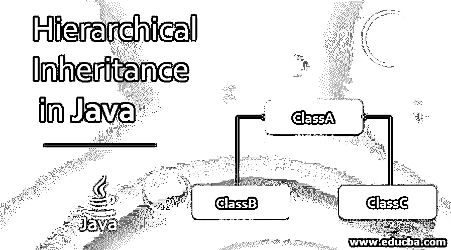
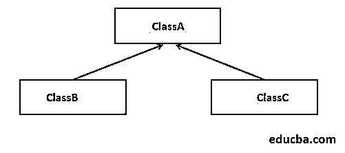

# Java 中的层次继承

> 原文：<https://www.educba.com/hierarchical-inheritance-in-java/>




## Java 中的层次继承是什么？

java 中的层次继承是 Java 中继承类型的一种。继承是面向对象编程系统(oops)的重要特征之一。继承是一种机制，其中一个类继承或获得其他类的所有属性和行为。类继承的属性和行为称为父类或超类或基类，而类继承的属性和行为称为子类或派生类。在分层继承中，多个子类继承单个类，或者单个类由多个子类继承。在 Java 中使用继承是为了代码的可重用性和动态多态性(方法覆盖)。

### 它在 Java 中是如何工作的？

借助下图，我们可以更清楚地理解[层次继承](https://www.educba.com/hierarchical-inheritance-in-c-plus-plus/)。

<small>网页开发、编程语言、软件测试&其他</small>




如上图所示，ClassB 和 ClassC 继承了同一个或单个类 ClassA。因此 ClassA 变量和方法在 ClassB 和 ClassC 两个类中都被重用。上图显示了不止一个子类拥有相同的父类，因此这种类型的继承称为层次继承。

**Java 中单一继承的语法:**

```
class Subclassname1 extends Superclassname
{
// variables and methods
} 
```

**Java 中层次继承的语法:**

```
class Subclassname1 extends Superclassname
{
// variables and methods
}
class Subclassname2 extends Superclassname
{
// variables and methods
}
```

“扩展”的意思是增加功能。extends 关键字指示继承；也就是说，我们正在创建一个从现有类派生的新类。

### Java 中层次继承的例子

以下是不同的例子:

#### 示例#1

Java 中从超类继承变量的层次继承示例。接下来，我们编写 Java 代码来理解层次继承，以下面的例子从超类继承一个变量。

**代码:**

```
package P1;
class Employee{
float salary = 40000;
}
class PermanentEmp extends Employee{
double hike = 0.5;
}
class TemporaryEmp extends Employee{
double hike = 0.35;
}
public class HerInheritanceDemo
{
public static void main(String args[]){
PermanentEmp p = new PermanentEmp();
TemporaryEmp t = new TemporaryEmp();
// All objects of inherited classes can access the variable of class Employee
System.out.println("Permanent Employee salary is :" +p.salary);
System.out.println("Hike for Permanent Employee is:" +p.hike);
System.out.println("Temporary Employee salary is :" +t.salary);
System.out.println("Hike for Temporary Employee is :" +t.hike);
}
}
```

**输出:**


在上面的代码中，PermanentEmp 类和 TemporaryEmp 类是子类，Employee 是超类，这些子类的对象访问超类的变量，这显示了 Java 中的层次继承概念或特性。

#### 实施例 2

Java 中从超类继承方法的层次继承示例。接下来，我们用下面的例子编写 Java 代码来更清楚地理解这一点。

**代码:**

```
package P1;
class Employee{
float salary = 40000;
void dispSalary()
{
System.**out**.println("The Employee salary is :" +salary);
}
}
class PermanentEmp extends Employee{
double hike = 0.5;
void incrementSalary()
{
System.out.println("The Permanent Employee incremented salary is :" +(salary+(salary * hike)));
}
}
class TemporaryEmp extends Employee{
double hike = 0.35;
void incrementSalary()
{
System.out.println("The Temporary Employee incremented salary is :" +(salary+(salary * hike)));
}
}
public class HerInheritanceDemo
{
public static void main(String args[]){
PermanentEmp p = new PermanentEmp();
TemporaryEmp t = new TemporaryEmp();
// All objects of inherited classes can access the method of class Employee
p.dispSalary();
p.incrementSalary();
t.dispSalary();
t.incrementSalary();
}
}
```

**输出:**


在上面的代码中，PermanentEmp 类和 TemporaryEmp 类是子类，Employee 是超类，这些子类的对象调用超类的方法，这显示了 Java 中的层次继承概念或特性。

#### 实施例 3

例如，使用 super 关键字调用超类的方法。接下来，我们重写上面的 Java 代码，通过下面的例子更清楚地理解 super 关键字的工作原理。

**代码:**

```
package P1;
class Employee{
float salary = 40000;
void dispSalary()
{
System.out.println("The Employee salary is :" +salary);
}
}
class PermanentEmp extends Employee{
double hike = 0.5;
void incrementSalary()
{
super.dispSalary();
System.out.println("The Permanent Employee incremented salary is :" +(salary+(salary * hike)) );
}
}
class TemporaryEmp extends Employee{
double hike = 0.35;
void incrementSalary()
{
super.dispSalary();
System.out.println("The Temporary Employee incremented salary is :" +(salary+(salary * hike)) );
}
}
public class HerInheritanceDemo
{
public static void main(String args[]){
PermanentEmp p = new PermanentEmp();
TemporaryEmp t = new TemporaryEmp();
// All objects of inherited classes can access the variable of class Employee
p.incrementSalary();
t.incrementSalary();
}
}
```

**输出:**


在上面的代码中，PermanentEmp 类和 TemporaryEmp 类是子类，Employee 是超类，在子类方法中，超类方法调用前缀为“super”的关键字。super 关键字是 Java 中的引用变量，用来引用父类对象的变量和方法。在 main 方法中，子类的对象调用它们自己的方法，这再次显示了 Java 中的概念或特性。

### 结论

继承是一个类继承另一个类的所有属性和行为的特性。Java 中的继承类型之一是 Java 中的层次继承。在分层继承中，多个类从单个类继承属性和方法。

### 推荐文章

这是一本关于 Java 中层次继承的指南。这里我们讨论 Java 中的层次继承的介绍和例子，以及代码实现。您也可以阅读以下文章，了解更多信息——

1.  [什么是 Java 继承？](https://www.educba.com/what-is-java-inheritance/)
2.  [Java 中的控制语句](https://www.educba.com/control-statement-in-java/)
3.  [Java 中的哈希表](https://www.educba.com/hashtable-in-java/)
4.  [Java 中的单一继承](https://www.educba.com/single-inheritance-in-java/)


