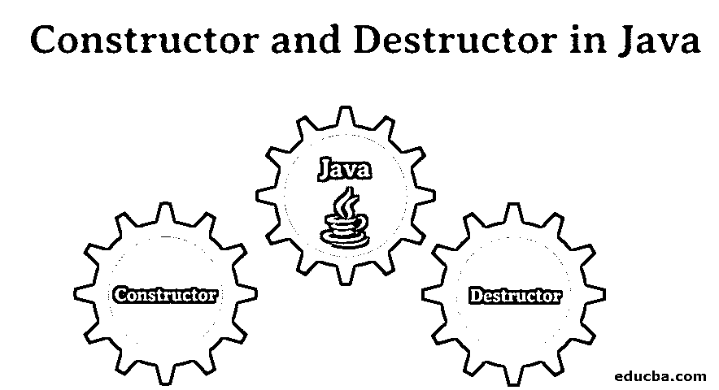
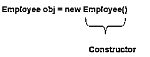
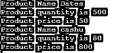

# Java 中的构造函数和析构函数

> 原文：<https://www.educba.com/constructor-and-destructor-in-java/>




## Java 中的构造函数和析构函数简介

下面这篇文章，Java 中的构造函数和析构函数，提供了用 Java 创建构造函数和析构函数的详细概要。每种编程语言都有这个概念，叫做构造函数和析构函数。Java 是一种面向对象的编程语言。如果你知道面向对象的概念，将有利于更清楚地理解它们。构造函数初始化对象，析构函数破坏初始化。Java 有自动垃圾收集功能，它使用了标记和清除算法。

### Java 中的构造函数和析构函数是什么？

构造函数被用来初始化一个变量，这意味着它为同一个变量分配内存。每当程序创建一个对象的时候，构造函数就会被自动调用。不需要显式调用这个方法。析构函数用于释放初始化时分配的内存。一般来说，在 java 中，我们不需要显式调用析构函数。Java 有一个自动垃圾收集的特性。

<small>网页开发、编程语言、软件测试&其他</small>

### 为什么 Java 中需要构造函数和析构函数？

构造函数和析构函数主要用于高效地处理内存分配和释放。构造函数和析构函数在任何编程语言中都起着非常重要的作用，它们在使用后初始化和销毁它以释放内存空间。

### Java 中构造函数和析构函数的工作原理

构造函数只是 java 中的一个方法，与类名同名。构造函数方法没有任何返回类型。

为了更清楚起见，请看下面的例子:

```
class Employee {
Employee() {
}
}
```

如果你在上面的例子中看到，我们没有给这个方法任何像 int 或 void 这样的返回类型，它和一个类名同名。

它主要用于初始化对象。当我们创建一个类的对象时，构造函数被调用。

下面的代码片段会更清楚。




### 如何在 java 中创建构造函数和析构函数？

**看下面这个例子**

```
class Employee {
Employee() { //This is constructor. It has same name as class name.
System.out.println("This is the default constructor");
}
}
```

#### 构造函数的类型

有两种类型的构造函数；根据类型，我们可以添加和删除变量。

*   默认构造函数
*   参数化构造函数

这样，我们也会看到构造函数重载。

##### 1.默认构造函数

这是一种类型的构造函数。默认情况下，在没有任何参数的情况下，此构造函数发生。此构造函数中没有任何参数。

**例如:**

```
class Abc{
Abc(){
System.out.println("This is the example of  default constructor.");
}
}
```

##### 2.参数化构造函数

顾名思义，参数化构造函数在初始化对象时有一些参数或自变量。

**举例:**

```
import java.util.*;
class Square{
int width,height;
Square( int a , int b){
width = a;
height = b;
}
int area(){
return width * height;
}
}
class Cal{
public static void main(String[] args){
{
Square s1 = new Square(10,20);
int area_of_sqaure = s1.area();
System.out.println("The area of square is:" + area_of_sqaure);
}
}
}
```

**输出:**


现在，是时候谈谈 java 中的构造函数重载了。这意味着有多个带有不同参数的构造函数。有了这个，每个构造器可以做不同的任务。有时根据需求，我们需要以不同的方式初始化构造函数。

**例子**

```
import java.util.*;
public class Main{
String name;
int quantity;
int price;
Main( String n1, int q1, int p1){
name = n1;
quantity = q1;
price = p1;
}
Main( String n2, int p2){
name = n2;
price = p2;
quantity = price/10;
}
void display(){
System.out.println("Product Name "+ name);
System.out.println("Product quantity is "+ quantity);
System.out.println("Product price is "+ price);
}
public static void main(String[] args){
Main product1;
product1 = new Main("Dates",500,50);
product1.display();
product1 = new Main("cashu",800);
product1.display();
}
}
```

**输出:**




尝试上面的程序，你会清楚构造函数重载到底发生了什么。

### 破坏者

在开始讨论析构函数之前，让我告诉你 java 里没有析构函数。析构函数是 C++编程语言。如果我们说的是 java，那么 java 有一个特性叫做自动垃圾收集器。这在没有使用时释放动态分配的内存。这个概念非常重要，你可以在 java 中探索更多关于这种垃圾收集的内容。

*   Java 使用 garb 收集技术来自动分配内存。
*   不需要像 C++那样显式使用析构函数。
*   对于在 java 中分配内存，我们没有像在 C 编程中那样的 malloc 函数。
*   java 中的 new 运算符执行同样的内存分配过程。
*   new 关键字在堆内存上为对象分配内存空间。
*   在程序执行的时候，一个新的关键字为对象分配一些内存空间。最终用户需要担心这一点，因为程序处理内存分配。当程序中使用的对象完成工作时，用于该对象的内存被用于另一个任务。这个有效利用内存的过程就是 java 中垃圾收集的工作。

那我们来谈谈析构函数吧。正如我们所知，java 中没有析构函数，因为它有 finalize()方法来做这件事。以下是需要注意的一些要点。

#### Finalize()方法

*   正如我们前面看到的，Finalize 方法的工作方式类似于析构函数，而与构造函数相反。
*   通常，finalize 方法用于移除对象。
*   为了使用这个方法，我们必须在 java 中显式定义这个方法。
*   finalize 方法在垃圾收集完成其工作后开始工作。
*   这仅仅意味着，在通过从对象中释放内存空间来释放内存空间之后，内存利用率仍有可能存在于其他事物中，如字体等。为了删除那个内存空间或者释放那个空间，我们使用 finalize()方法。

### 结论

在任何编程语言中，构造函数和析构函数(java 中的垃圾收集)都是非常重要的事情，因为这是您实际了解如何在后台管理内存空间的开始。

### 推荐文章

这是 Java 中构造函数和析构函数的指南。这里我们讨论构造函数和析构函数的介绍，为什么我们需要它，它在 java 中是如何工作的，还有一个例子。您也可以阅读以下文章，了解更多信息——

1.  [Java 中的位操作](https://www.educba.com/bit-manipulation-in-java/)
2.  [什么是 Java 接口？](https://www.educba.com/what-is-java-interface/)
3.  [c++中的构造函数和析构函数](https://www.educba.com/constructor-and-destructor-in-c-plus-plus/)
4.  [PHP 中的析构函数](https://www.educba.com/destructor-in-php/)


