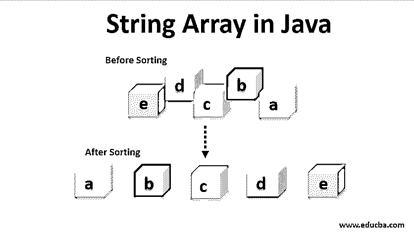
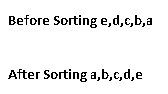
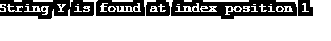

# Java 中的字符串数组

> 原文：<https://www.educba.com/string-array-in-java/>




## Java 中的字符串数组介绍

Java 字符串数组类似于 Java 中的任何其他字符串函数，用于进行字符串操作。顾名思义，数组用于存储同质的数据组，即数组中存储的所有数据要么是字符串类型，要么是双精度类型，要么是整型，等等。因此，字符串数组是 java 中用于存储字符串类型值的数据结构，用于保存固定数量的字符串值。这是 Java 编程语言中最常用的数据结构的基本层次之一。当您谈到 Java main 方法时，甚至该方法也是字符串数组类型的。

### 申报

声明字符串数组是有用的，因为在 java 中没有声明变量；不可能使用它。java 中有多种声明字符串数组的方式，不需要实例化对象，只需要对象引用。

<small>网页开发、编程语言、软件测试&其他</small>

让我们看看字符串数组的声明方式。

```
String [] strArr; //This is declaration of strArr array without specifying size
String[] strArr1 = new String [3]; //This is the declaration of strArr array with specifying string type of size 3
```

在这种情况下，String [] strArr 也可以写成 String strArr[]，但前者更值得推荐，也是处理语法的标准方法。在这两种声明中需要注意的另一点是，前一个值返回值为 null，而后一个值返回值为[null，null，null]，因为大小为 3。

### Java 中字符串类型数组的初始化

一旦变量或数据结构被声明，下一步就是字符串类型数组的初始化。这在初始化固定静态值时很有用。数组也可以动态初始化值，这完全取决于需求。

当要在运行时确定用户输入时，动态分配更有帮助，而如果您是从原型的角度编写程序，或者只是为了体验一下编写的代码，字符串类型数组的静态初始化也可以工作。
让我们试着借助上面两个例子来理解初始化的概念，这两个例子只是在声明数组字符串变量的情况下解释。

**举例:**

```
String [] strArr= {"X", "Y", "Z"};
strArr1[0]="X";
strArr1[1]="Y";
strArr1[2]="Z";
String [] strArr2= new String [] {"X", "Y", "Z"};
```

如果我们在上面的例子中开始比较两个 string 对象值，它们将返回 false 结果。这种行为的原因是数组是对象，object 类利用它作为当前的对象值，因此值为 false。但是另一方面，如果被比较的值是实际值而不是对象，那么将返回 true 的结果。

### 在 Java 中对字符串数组排序

在我们试图理解 Java 中排序是如何完成的之前，让我们首先理解排序实际上意味着什么。排序意味着以特定的方式排列数组的值，可以是升序，也可以是降序。我们可以通过编写自己的自定义排序函数或使用数组类排序方法来实现排序技术。

**举例:**

```
String [] letters= {e, d, c, b, a};
System.out.println("Values before sorting" + Array.toString(letters));
Arrays.sort(letters);
System.out.println("Values after sorting" + Array.toString(letters));
```

**输出:**




在这种情况下需要注意的一点是，string 实现了 comparable 接口，因此这在自然排序的情况下是有效的。Arrays.sort()还可以通过使用比较器以其他方式对数组的值进行排序。编写自定义排序函数也是一种选择，但它应该只在禁止使用已经内置的库排序函数时使用，因为它是编译器密集型的。Java 中两种最流行的排序方法是冒泡排序和 T2 选择排序。我们不会详细讨论这些算法，因为这超出了本文的范围。

### 如何从字符串数组中搜索一个字符串？

如果你想从一个字符串数组中搜索一个特定的字符串，我们可以使用一个循环结构或者子串。当字符串相对小于原始字符串时，可以使用 substring 函数。如果万一字符串比实际的字符串复杂，那么循环结构可以用于在字符串中搜索字符串。

让我们借助一个例子来理解字符串的搜索。

**举例:**

```
import java.io.*;
public class SearchStringEG {
public static void main(String args[]) throws IOException {
String[] strArr = { "X", "Y", "z" };
boolean flag = false;
String s = "Y";
int ind = 0;
int l =strArr.length();
int i;
for (i = 0; i < l; ++i) {
if(s.equalsIgnoreCase(strArr[i])) {
ind = i;
flag = true;
break;
}
}
if(flag==true)
System.out.print ("String " + s +" is found at index position "+ind);
else
System.out.print("String " + s +" is found at index position "+ ind);
}
}
```

**输出:**




在上面的例子中，我们引入了一个新的关键字 break，它确保程序的循环一直保持到 break 关键字被应用。这个关键字既适用于循环，也适用于条件语句，比如 if-else。因此，当我们能够找到我们的字符串时，我们使用 break 关键字退出。在 Java 中用于搜索的两种非常流行的算法是二分搜索法和线性搜索。

### 推荐文章

这是一个 Java 中字符串数组的指南。这里我们讨论 java 中的字符串数组和与之相关的各种排序和搜索方法，以及 java 中字符串类型数组的初始化。您也可以阅读以下文章，了解更多信息——

1.  [Java 中的数组方法](https://www.educba.com/array-methods-in-java/)
2.  [Java 中的插入排序](https://www.educba.com/insertion-sort-in-java/)
3.  [Java 中的 JComponent](https://www.educba.com/jcomponent-in-java/)
4.  [Java 字符串操作符](https://www.educba.com/java-string-operators/)


