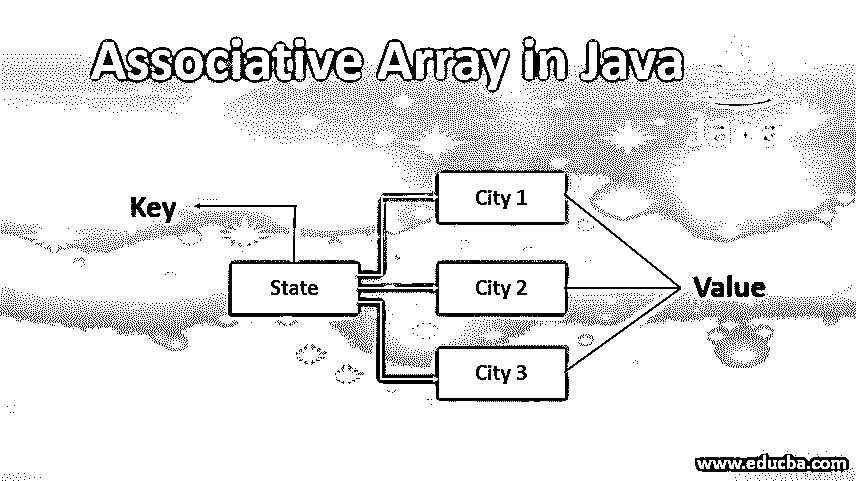
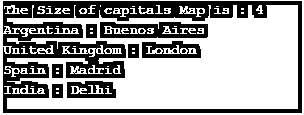
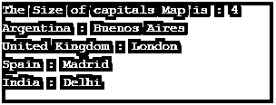
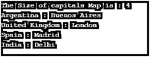

# Java 中的关联数组

> 原文：<https://www.educba.com/associative-array-in-java/>




## Java 中的关联数组介绍

关联数组以(键，值)对的形式存储元素集。关联数组是唯一键和值的集合，其中每个键与一个值相关联。java 中的关联数组数据结构对于各种应用程序都非常有用。像 [Perl 和 PHP](https://www.educba.com/perl-vs-php/) (使用散列变量)，其他编程语言实现了使用关联数组数据结构的功能。由于关联数组以(key，value)对的形式存储元素，所以要从关联数组中访问元素，我们需要调用数组的名称和 passkey(我们要访问它的值)。

例如，我们有一个数组(名为 marks ),用于存储学生的 rollno 和 marks。要访问特定学生的标记，我们应该像这样调用 marks[102]，其中 marks 是一个数组名，102 是一个学生的 rollno，而不是索引号，这在 java 的数组中是不可能的。因此关联数组在技术上不支持 java，但它可以通过使用 java.util.HashMap 类的实例的形式来实现。

<small>网页开发、编程语言、软件测试&其他</small>

**语法:**

```
Map <String, String> map = new HashMap <String, String>( ); // creates Map where keys and values of string type
//method to store elements
map.put( "key1", "value1" );
map.put( "key2", "value2" );
// etc
// method to access value
map.get( "key1" ); // returns "value1" as output
```

### 如何在 Java 中创建一个关联数组？

*   Java 提供了一个 Map [类，也称为 HashMap](https://www.educba.com/hashmap-in-java/) ，可以用作数组的一种类型。映射不是引用索引(例如，1、2、3、4、5 等)，而是引用数组的对象或引用键。所以映射可以作为关联数组的替代。
*   在 map 中，可以使用 put 方法将元素添加到数组中，而访问元素可以使用 pull 方法，或者如果我们想要访问数组的所有值，可以使用 keySet 函数。还有，我们可以用 remove 函数从 map 中移除元素，得到数组的大小；可以使用 size 方法(就像数组中的 length 函数一样)。简而言之，映射用于将一个值与一个键相关联(链接)。

**关联数组的优势**

使用关联数组，我们可以为数组元素的值分配有意义的键，保存更多的元素，并将字符串作为键分配给数组的元素。

### 用 Java 实现关联数组的例子

我们通过下面的示例 java 代码理解了上述方法。为了创建地图，我们需要导入允许使用地图的实用程序。所以我们将导入 Map 和 HashMap 实用程序。以下是在 Java 中实现关联数组的示例:

#### 示例#1

遍历关联数组各种方法

**代码:**

```
import java.util.HashMap;
public class Demo {
public static void main(String[] args ) {
HashMap <String, String> capitals = new HashMap <String, String>();
capitals.put("Spain", "Madrid");
capitals.put("United Kingdom", "London");
capitals.put("India", "Delhi");
capitals.put("Argentina", "Buenos Aires");
System.out.println("The Size of capitals Map is : " + capitals.size());
// Remove an element from the HashMap
capitals.remove("United Kingdom");
// To display size of the hashtmap
System.out.println("The Size of capitals Map is : " + capitals.size());
// Check the existence of key in the Hashmap
String key = "India";
if (capitals.containsKey( key )) {
System.out.println("The capital of " + key + " is: " + capitals.get( key ));
} else {
System.out.println("There is no entry for the capital of " + key);
}
}
}
```

**输出:**


#### 实施例 2

使用迭代器方法遍历关联数组

**代码:**

```
import java.util.HashMap;
import java.util.Iterator;
import java.util.Map;
public class DurationClassDemo {
public static void main(String[] args) {
HashMap<String, String> capitals = new HashMap<String, String>();
capitals.put("Spain", "Madrid");
capitals.put("United Kingdom", "London");
capitals.put("India", "Delhi");
capitals.put("Argentina", "Buenos Aires");
System.out.println("The Size of capitals Map is : " + capitals.size());
Iterator i = capitals.entrySet().iterator();
// Iterate through the hashmap
while (i.hasNext()) {
Map.Entry ele = (Map.Entry)i.next();
System.out.println(ele.getKey() + " : " + ele.getValue());
}
}
}
```

**输出:**




#### 实施例 3

使用 for-each 循环遍历关联数组

**代码:**

```
import java.util.HashMap;
import java.util.Iterator;
import java.util.Map;
public class DurationClassDemo {
public static void main(String[] args) {
HashMap<String, String> capitals = new HashMap<String, String>();
capitals.put("Spain", "Madrid");
capitals.put("United Kingdom", "London");
capitals.put("India", "Delhi");
capitals.put("Argentina", "Buenos Aires");
System.out.println("The Size of capitals Map is : " + capitals.size());
for (Map.Entry ele : capitals.entrySet()) {
String key = (String)ele.getKey();
System.out.println(key + " : " + ele.getValue());
}
}
}
```

**输出:**




#### 实施例 4

使用 hashmap 的 forEach()方法遍历关联数组

**代码:**

```
import java.util.HashMap;
import java.util.Iterator;
import java.util.Map;
public class DurationClassDemo {
public static void main(String[] args) {
HashMap<String, String> capitals = new HashMap<String, String>();
capitals.put("Spain", "Madrid");
capitals.put("United Kingdom", "London");
capitals.put("India", "Delhi");
capitals.put("Argentina", "Buenos Aires");
System.out.println("The Size of capitals Map is : " + capitals.size());
capitals.forEach((k, v) -> System.out.println(k + " : " + v ));
}
}
```

**输出:**




### 结论

简而言之，java 中的关联数组存储 key 中的元素集，关联数组中的值对是唯一键和值的集合，其中每个键与一个值相关联。要创建实现一个关联数组，我们可以使用 java 的 hashMap 内置类，正如我们在上面的例子中已经看到的。

### 推荐文章

这是一个 Java 关联数组的指南。这里我们讨论语法，如何在 java 中创建关联数组，以及例子和优点。您也可以浏览我们的其他相关文章，了解更多信息——

1.  [Java 即时](https://www.educba.com/java-instant/)
2.  [Java 时期](https://www.educba.com/java-period/)
3.  [JavaScript 中的关联数组](https://www.educba.com/associative-array-in-javascript/)
4.  [Java bytearray output stream](https://www.educba.com/java-bytearrayoutputstream/)


