# Java 中的合并排序算法

> 原文：<https://www.educba.com/merge-sorting-algorithms-in-java/>

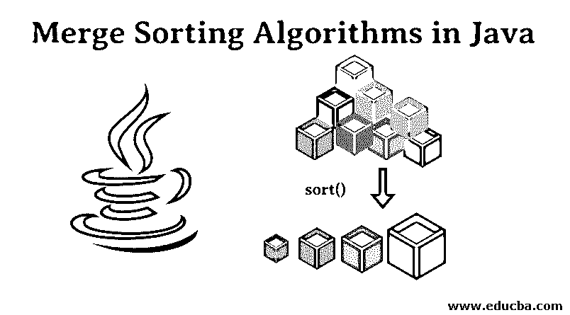


## Java 中的归并排序算法简介

归并排序算法在计算机科学中非常重要。排序的输出是将一个列表的元素按一定的顺序排列(升序或降序)。[合并排序是最有效的排序算法之一，因为它基于分治的概念。顾名思义，先把更大的问题分成小问题，再解决更小的问题，才能解决更大的问题。在本文中，我们将讨论 Java 中的合并排序算法。](https://www.educba.com/merge-sort-in-java/)

从概念上讲，合并排序是两种基本算法 Merge 和 MERGE_SORT 的组合，其工作原理如下:

<small>网页开发、编程语言、软件测试&其他</small>

1.  将未排序列表分成 n 个单项子列表(n 是未排序列表中的元素总数)。
2.  重复地将子列表合并到已排序的子列表中，直到只有一个已排序的列表。

### 合并排序算法在 Java 中的实现

合并算法是将两个有序列表合并成一个有序列表的过程。

**例:**假设有两个列表，即列表 1 {6，3}和列表 2 {3，1，9}。

1.首先，对两个列表进行排序。

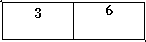


列表 1

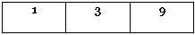


列表 2

现在，我们将应用合并技术。

2.  然后，我们将创建一个大小为 m+n 的新列表，其中 m 是列表 1 中元素的数量，n 是列表 2 中元素的数量。

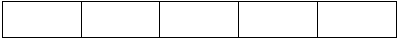


列表 3

在我们的例子中，m=2，n=3，所以 m+n= 5。

3.  现在，我们有一个两分球。第一指针指向列表 1 的第一位置，第二指针指向列表 2 的第一位置。

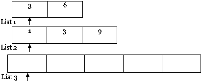


4.然后，我们将比较两个指针的值。对于具有较小值的指针，将该元素复制到列表 3 中，并将指针移动到具有较小值的列表和结果列表(即，列表 1 和列表 3)的右侧。

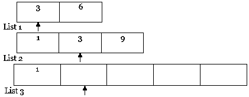


5.类似地，反复执行步骤 4。

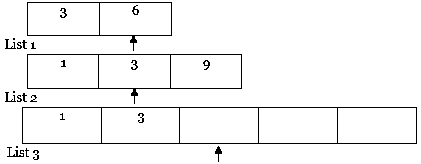


进一步遍历…..

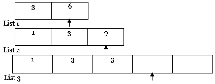


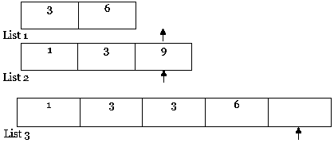


**NOTE:** If one of the lists (i.e. list 1 or list 2) gets fully traversed as in the above case, then copy the entire content of other lists from the pointer to the result list (i.e. list 3) as follows.

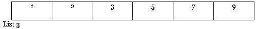


### 算法和伪代码

合并算法中使用的两种算法是:

*   MERGE(ARR，F，M，L)是一个假设如下的过程:

1.  ARR[F …M]和 ARR[M+ 1…L]是排序列表。
2.  将两个排序后的子列表合并成一个 ARR[F…l】。

*   SORT(ARR[]，F，L)//这里 F 是数组的第一个索引，L 是最后一个索引。

如果(L > 1)

1.  找到中间点将列表分成两半:

中间 M = (F +L)/2

2.  前半部分调用合并排序:

调用排序(ARR，1，M)

3.  后半部分调用合并排序:

调用排序(ARR，M+ 1，L)

4.  合并步骤 2 和 3 中排序的两半:

调用 MERGE(ARR，L，M，R)

### 例子

让我们以数组 ARR {10，6，8，5，7，3，4}为例。我们将使用合并算法，通过分治技术对数组进行排序。我们可以看到下图中的数组被递归地分成两半，直到大小变为 1。一旦大小变为 1，我们就回调合并的进程和合并的列表，直到整个列表被合并。

**NOTE: **In the below figure, the numbers in red indicate the order in which the steps are processed to form the Sorted Array.

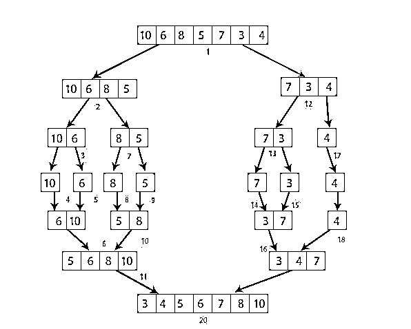


**程序代码:**

```
import java.util.Scanner;
public class mergeSort {
// merges two sublists of arr[].
// first list is arr[l..m]
// second list is arr[m+1..r]
void mergeAlgo(int arr[], int l, int m, int r)
{
// find the sizes of two lists to be merged
int n1 = m - l + 1;
int n2 = r - m;
// create temp array
int L[] = new int [n1];
int R[] = new int [n2];
// copy data to temp arrays
for (int i=0; i<n1; ++i)
L[i] = arr[l + i];
for (int j=0; j<n2; ++j)
R[j] = arr[m + 1+ j];
/* merge the temp arrays */
// initial indexes of first and second list
int i = 0, j = 0;
// initial index of merged sub list
int k = l;
while (i < n1 && j < n2)
{
if (L[i] <= R[j])
{
arr[k] = L[i];
i++;
}
else
{
arr[k] = R[j];
j++;
}
k++;
}
// copy remaining elements of L[] if any
while (i < n1)
{
arr[k] = L[i];
i++;
k++;
}
// copy remaining elements of R[] if any
while (j < n2)
{
arr[k] = R[j];
j++;
k++;
}
}
// main function that sorts arr[l..r] using mergeAlgo()
void sort(int arr[], int l, int r)
{
if (l < r)
{
// find the middle index
int m = (l+r)/2;
// sort first and second halves
sort(arr, l, m);
sort(arr , m+1, r);
// merge the above two sorted halves
mergeAlgo(arr, l, m, r);
}
}
/* A function to print list of size n */
static void printArray(int arr[])
{
int n = arr.length;
for (int i=0; i<n; ++i)
System.out.print(arr[i] + " ");
System.out.println();
}
public static void main(String args[])
{
Scanner myObj = new Scanner(System.in);
System.out.println("Enter the size of list:");
int N = myObj.nextInt();
System.out.println("Enter the elements in list separated by space:");
int arr[] = new int[N];
for(int i=0; i<arr.length; i++) {
arr[i] = myObj.nextInt();
}
mergeSort mg = new mergeSort();
mg.sort(arr, 0, arr.length-1);
System.out.println("\nSorted list:");
printArray(arr);
}
}
```

**输出:**

**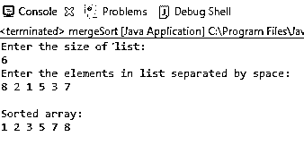

** 

### 结论 Java 中的合并排序算法

合并排序的最佳、最差和平均时间复杂度是相同的，这使它成为一个更有效的算法。它比其他排序技术更快。合并排序可以应用于任何大小的文件。由于使用了分治法，它具有高度的并行性。为了发展计算机科学的坚实基础，建议你彻底理解不同的排序算法。

### 推荐文章

这是一个 Java 中合并排序算法的指南。这里我们讨论合并排序算法在 java 中的实现，并举例说明算法和伪代码。您还可以浏览我们推荐的其他文章——

1.  [Java 中的选择排序](https://www.educba.com/selection-sort-in-java/)
2.  [JavaScript 中的合并排序](https://www.educba.com/merge-sort-in-javascript/)
3.  [Java 中的快速排序算法](https://www.educba.com/quick-sorting-algorithms-in-java/)
4.  [c#中的排序](https://www.educba.com/sorting-in-c-sharp/)


