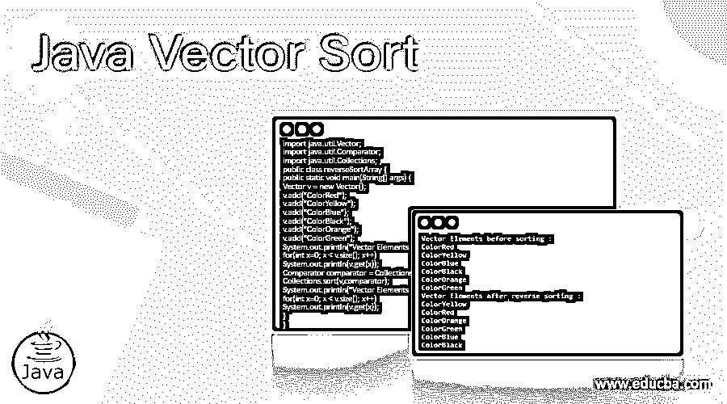
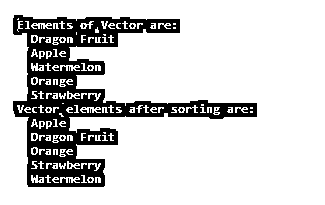
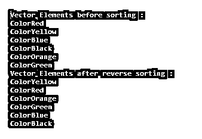
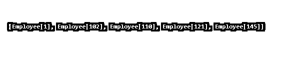
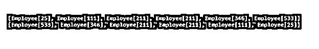

# Java 向量排序

> 原文：<https://www.educba.com/java-vector-sort/>




## Java 向量排序简介

Java Vector Sort 是 Java Vector 类的一种方法，用于按照指定比较器的顺序对向量进行排序。由于 Java 中的 Vector 保持元素的插入顺序，所以 sort(，)方法用于按升序或降序对元素进行排序。Sort()方法是 Collections 类的一部分；向量元素也可以使用 Comparable 和 Comparator 进行排序。像数组一样，Vector 也是一个可增长的对象，包含可以使用整数索引访问的元素。创建向量后，可以通过添加或删除元素来增大或缩小向量的大小。

**语法:**

<small>网页开发、编程语言、软件测试&其他</small>

下面是作为 sort()方法的声明使用的，

```
public void sort(Comparator<? super E> c);
```

强制参数“c”是用于比较矢量元素的比较器。如果方法的返回类型为 void，则返回 nothing

没有例外，这与 Java 1.2 版本和更高版本兼容

### 使用比较器对向量进行排序的步骤

*   创建矢量对象
*   使用 *add* 方法向矢量添加元素(元素 e)
*   使用 Collections.sort 对 Vector 对象排序
*   显示已排序元素的列表

### Java 向量排序的例子

下面举几个例子

#### 示例#1

使用 Collections.sort()的简单向量排序()

**代码:**

```
import java.util.Vector;
import java.util.Collections;
public class SortJavaVectorExample {
public static void main(String[] args) {
Vector vector = new Vector();
vector.add("10");
vector.add("31");
vector.add("52");
vector.add("23");
vector.add("44");
System.out.println("Vector elements before sorting: ");
for(int x=0; x<vector.size(); x++)
System.out.println(vector.get(x));
Collections.sort(vector);
System.out.println("Sorted Vector elements in ascending order: ");
for(int y=0; y<vector.size(); y++)
System.out.println(vector.get(y));
}
}
```

**输出:**


声明向量、向向量添加元素和不排序地打印元素保持相同的插入顺序。使用 for 循环，get(x)从索引 x 获取元素

Collections.sort()对向量元素进行升序排序，并使用 for 循环显示。

#### 实施例 2

字母顺序的向量排序

**代码:**

```
import java.util.*;
public class VectrSort {
public static void main(String arg[]) {
Vector < String > v = new Vector < String > ();
v.add("Dragon Fruit");
v.add("Apple");
v.add("Watermelon");
v.add("Orange");
v.add("Strawberry");
System.out.println("Elements of Vector are: ");
for (String fruit: v) {
System.out.println("  "+fruit);
}
Collections.sort(v);
System.out.println("Vector elements after sorting are: ");
for (String fruit : v) {
System.out.println("  "+fruit);
}
}
}
```

**输出:**




我们将按降序对向量元素进行排序，即必须调用 Collections 类的 reverseOrder()方法，这自然会对向量元素施加逆序。

#### 实施例 3

反向排序向量元素。

**代码:**

```
import java.util.Vector;
import java.util.Comparator;
import java.util.Collections;
public class reverseSortArray {
public static void main(String[] args) {
Vector v = new Vector();
v.add("ColorRed");
v.add("ColorYellow");
v.add("ColorBlue");
v.add("ColorBlack");
v.add("ColorOrange");
v.add("ColorGreen");
System.out.println("Vector Elements before sorting :");
for(int x=0; x < v.size(); x++)
System.out.println(v.get(x));
Comparator comparator = Collections.reverseOrder();
Collections.sort(v,comparator);
System.out.println("Vector Elements after reverse sorting :");
for(int x=0; x < v.size(); x++)
System.out.println(v.get(x));
}
}
```

**输出:**




所以在这里，向量元素是按照字母降序排列的。

让我们看看自定义类对象的向量元素的排序。

上面提到的 Collections.sort()方法只有在 elements 类实现 Comparable 接口时才起作用；如果不实现，我们将面临编译错误。

这里，我们将看到自定义类是如何实现 Comparable 接口的。

#### 实施例 4

自定义类对象的向量排序。

**代码:**

```
import java.util.Collections;
import java.util.Vector;
class Employee implements Comparable<Employee>{
private int empid;
public Employee(int empid){
this.empid = empid;
}
public String toString(){
return "Employee[" + this.empid + "]";
}
public int getempId(){
return this.empid;
}
public int compareTo(Employee otherEmployee) {
return this.getempId() - otherEmployee.getempId();
}
}
public class EmployeeSortVector {
public static void main(String[] args) {
Vector<Employee> vEmp = new Vector<Employee>();
vEmp.add(new Employee(110));
vEmp.add(new Employee(121));
vEmp.add(new Employee(102));
vEmp.add(new Employee(145));
vEmp.add(new Employee(1));
Collections.sort(vEmp);
System.out.println(vEmp);
}
}
```

**输出:**




要对上述元素进行逆序排序，需要使用 reverseComparator。

```
Collections.sort(vEmp, Collections.reverseOrder())
```

我们还可以使用自定义比较器对自定义类对象进行排序。之前，我们看到了 Comparable 接口是如何实现的；现在，我们将为类对象创建一个定制的比较器。

#### 实施例 5

使用自定义比较器的自定义类对象的向量排序。

**代码:**

```
import java.util.Collections;
import java.util.Comparator;
import java.util.Vector;
class Employee{
private int empid;
public Employee(int empid){
this.empid = empid;
}
public String toString(){
return "Employee[" + this.empid + "]";
}
public int getempId(){
return this.empid;
}
}
class EmployeeComparator implements Comparator<Employee>{
public int compare(Employee emp1, Employee emp2) {
return emp1.getempId() - emp2.getempId();
}
}
class EmployeeComparatorDesc implements Comparator<Employee>{
public int compare(Employee emp1, Employee emp2) {
return emp2.getempId() - emp1.getempId();
}
}
public class SortJavaVectorExample {
public static void main(String[] args) {
Vector<Employee> vEmp = new Vector<Employee>();
vEmp.add(new Employee(346));
vEmp.add(new Employee(111));
vEmp.add(new Employee(211));
vEmp.add(new Employee(533));
vEmp.add(new Employee(211));
vEmp.add(new Employee(25));
Collections.sort(vEmp, new EmployeeComparator());
System.out.println(vEmp);
Collections.sort(vEmp, new EmployeeComparatorDesc());
System.out.println(vEmp);
}
}
```

**输出:**




至此，我们将结束我们的主题“Java 向量排序”。我们已经看到了什么是 Java 中的向量排序，以及它是如何实现的。还解释了它的语法和所需的参数。还讨论了如何进行向量排序，并看到了所有类型的示例，使用 Collections.sort()按升序排序，使用 Collections.reverseOrder()方法按降序排序。除此之外，我们还使用 comparable 对自定义类对象进行了排序，并为自定义类对象定制了 Comparable。我希望我们已经讨论了这个话题的最大范围。谢谢！快乐学习！

### 推荐文章

这是一个 Java 向量排序的指南。在这里，我们讨论使用比较器排序向量的步骤和例子，以及代码和输出。您也可以看看以下文章，了解更多信息–

1.  [Java 字典](https://www.educba.com/java-dictionary/)
2.  [Java 格式化程序](https://www.educba.com/java-formatter/)
3.  [Java 别名](https://www.educba.com/java-alias/)
4.  [Java 按值调用](https://www.educba.com/java-call-by-value/)


